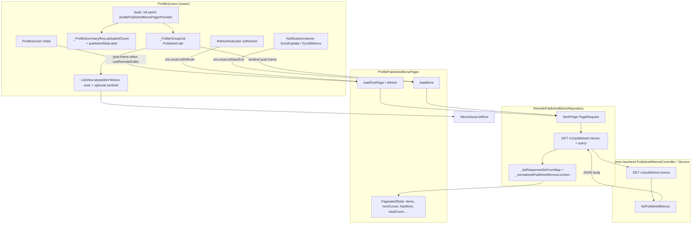

# M17C3 — Own Profile → Published → Monos flow audit

**Scope:** Owner profile, Published tab, Monos sub-tab only. No code changes in this document — audit and plan only.

**Observed phone log (authoritative symptom):**

`RemotePublishedMonoRepository.fetchPage: GET /v1/published-monos {limit: 10, sort: latest}`  
`JSON items=10 parsedDtos=10 hasMore=false nextCursor=null totalCount=null`

That line is emitted **after** the repository parses the HTTP body into a `PageResult` (see `lib/features/profile/data/remote_published_mono_repository.dart` — `fetchPage` debug block). So the **failing contract is already visible at the repository boundary**: the client believes the first page is the **only** page.

---

## 1. Full flow diagram (Own Profile → Published → Monos)

| Step | What happens |
|------|----------------|
| **Widget that builds the surface** | `ProfileScreen` (`lib/features/profile/profile_screen.dart`) builds the Published tab `PageView` child; Published **Monos** list is `_FolderGroupList` when remote drafts are on (same file, Published tab branch). |
| **Provider watched** | `ref.watch(profilePublishedMonoPagerProvider)` for pager state; list rows come from `publishedPager` mapped through `_publishedLooseRowsForUi` / filters. |
| **First page load** | `initState` post-frame callback → `profilePublishedMonoPagerProvider.notifier.loadFirstPage()` (see `profile_screen.dart` ~462–506). |
| **Repository call** | `ProfilePublishedMonoPager.loadFirstPage` → `RemotePublishedMonoRepository.fetchPage(PageRequest(limit: profilePublishedMonoPageLimit))`. |
| **Endpoint** | `GET {apiBaseUrl}/v1/published-monos` with query from `PageRequest.toQueryParameters()` (`limit`, `sort`, optional `cursor`). |
| **Parsed response fields** | After `_normalizedPublishedMonosListJson`, reads `items`, `nextCursor` / `next_cursor` / `next_page_cursor`, `hasMore` / `has_more`, `totalCount` / `total_count`, optional `data` / `pagination` merges (`remote_published_mono_repository.dart` ~89–252). |
| **State fields updated** | `ProfilePublishedMonoPager.loadFirstPage` sets `items`, `nextCursor`, `hasMore`, `totalCount`, clears loading flags (`profile_published_mono_pager.dart` ~40–61). |
| **Row widget** | `MonoStoryListRow` inside `_FolderGroupList` Monos `ListView.separated` itemBuilder (`profile_screen.dart` ~2790–2821). |
| **Published header count** | `_ProfileSummaryRow` `uploadedCount` ← `publishedStatLabel`. When `RemoteBackendConfig.useRemoteDrafts` is true: `formatSocialCount(publishedPagerState.totalCount ?? publishedPagerState.items.length)` unless initial empty loading shows `…` (`profile_screen.dart` ~1560–1568). When remote drafts **false**: `publishedCountLabelForOwnerHeader(...)` (`owner_profile_header_stats.dart`). |

---

## 2. Current page size

| Question | Answer |
|----------|--------|
| **Where defined** | `PaginationDefaults.profilePublishedMonoPageLimit` = **10** (`lib/core/pagination/pagination_defaults.dart` line ~14–15). |
| **Value** | **10** (not 20; `profilePageLimit` / `defaultPageLimit` are separate constants). |
| **Used on real screen path** | **Yes.** `ProfilePublishedMonoPager.loadFirstPage`, `refresh`, and `loadMore` all use `PageRequest(limit: PaginationDefaults.profilePublishedMonoPageLimit)` (`profile_published_mono_pager.dart` ~50–51, ~86–87, ~117–120). |

---

## 3. Header / stat count — what drives “Published = 10”?

**Remote path (`useRemoteDrafts == true`, current repo):**

- Driver: `publishedStatLabel = formatSocialCount(n)` where  
  `n = publishedPagerState.totalCount ?? publishedPagerState.items.length`  
  (`profile_screen.dart` ~1566–1568).

So **Published shows 10** iff:

1. `publishedPagerState.totalCount` is **null** (or absent in state), **and**
2. `publishedPagerState.items.length` is **10**.

That is **not** “remote profile storiesCount” for this label — it is **pager `totalCount` with fallback to loaded list length**.

**Offline / mock path (`useRemoteDrafts == false`):**

- Uses `publishedCountLabelForOwnerHeader` → mock length or `totalCount` / `items.length` / `n+` pattern (`owner_profile_header_stats.dart` ~14–36).

**Why 10 instead of 21:** With the remote branch above, **`totalCount` never reached 21 in state** (it stayed null), so the UI fell back to **`items.length` (10)** after the first page loaded.

---

## 4. Backend contract (repo source — not the phone binary)

**Controller:** `PublishedMonosController.list` → `PublishedMonosService.listPublishedMonos`  
(`nimon-backend/src/modules/published-monos/published-monos.controller.ts`, `published-monos.service.ts`).

**Intended JSON shape (current TypeScript):** top-level object:

- `items` — array  
- `hasMore` — boolean  
- `nextCursor` — string or null  
- `totalCount` — number or null (first catalog page; null on continuation / trash)  
  (`published-monos.dto.ts` ~33–41; service return ~204–209).

**Pagination logic:** `findMany` with `take: limit + 1`, `hasMore = rows.length > limit`, slice to `limit`, cursor from last row (`published-monos.service.ts` ~164–209).

**Why the phone log can still show `hasMore=false nextCursor=null totalCount=null`:**

1. **HTTP body actually lacks those fields or sets them false/null** (legacy proxy, old server build, or middleware stripping). Then the Dart parser yields defaults (see §5).  
2. **Backend is correct but only ≤10 rows match** `ownerId` + `PUBLISHED_MONO_CATALOG_VISIBLE` (e.g. 11+ monos hidden by `hasUnpublishedCoreChanges` on a linked draft). Then `hasMore` is legitimately false and `totalCount` would be **10**, not 21 — unless `totalCount` is also missing from JSON.  
3. **Deployed server ≠ this repo** (stale binary): list contract never updated on the device’s base URL.

The **log line is produced on the Flutter side from parsed values**, not from raw JSON text — so to distinguish (1) vs (2) you need **authenticated raw JSON** from the same base URL the app uses.

---

## 5. Parser contract (`RemotePublishedMonoRepository.fetchPage`)

**Supported shapes (after merge):**

- Top-level: `items`, `hasMore` / `has_more`, `nextCursor` / `next_cursor` / `next_page_cursor`, `totalCount` / `total_count`.  
- Wrapper: merge `data` map when top-level `items` is not a list.  
- Nested: merge `pagination` map keys into root when key missing or null on root.  
  (`remote_published_mono_repository.dart` ~89–252, ~298–301 doc comment.)

**Default when missing:**

- `_hasMoreFromJson`: **false** if key absent or not a recognized bool/string.  
- `_nextCursorFromJson` / `_totalCountFromJson`: **null** if absent.

So **legacy `{ "items": [...] }` only** → exactly the phone log: `hasMore=false`, `nextCursor=null`, `totalCount=null` (documented in `fetchPage` comment ~298–301).

**If backend puts metadata only under unrecognized keys**, the parser still yields the same defaults.

---

## 6. Load-more triggers (what should fire page 2?)

| Mechanism | Role |
|-----------|------|
| **`ProfilePublishedMonoPager.loadMore`** | Only caller that requests page 2+ with `PageRequest(cursor: state.nextCursor, limit: 10)`. Guard: `if (!state.canLoadMore) return` (`paginated_state.dart` `canLoadMore` requires `hasMore && !isLoadingMore && !isInitialLoading && !isRefreshing && error == null`). |
| **Scroll `NotificationListener`** | When `onLooseListNearEnd` non-null, wraps list; on `ScrollUpdateNotification` / `ScrollMetricsNotification`, if `profilePublishedMonosShouldPrefetchNextPage(metrics, hasMoreFromApi: publishedMonoPagerHasMore)` then calls `onLooseListNearEnd` → `loadMore()` (`profile_screen.dart` ~2855–2871, `profile_published_monos_scroll_prefetch.dart`). |
| **Post-frame underscroll prefetch** | `_FolderGroupListState._maybePrefetchPublishedWhenScrollSurfaceShort` uses `ScrollController` + same `profilePublishedMonosShouldPrefetchNextPage` (`profile_screen.dart` ~2020–2037). |
| **Bottom sentinel** | `_ProfilePublishedMonosLoadSentinel` post-frame calls `onRequestLoadMore` (= same `loadMore` callback) when `hasMore && !isLoadingMore` (`profile_screen.dart` ~2744–2775, ~2906–2947). |
| **Pull-to-refresh** | `RefreshIndicator` `onRefresh` → `onLooseListRefresh` → **`refresh()`** on pager, which **re-fetches first page only** (cursor cleared in `refresh`, `fetchPage` with no cursor) — **correct** that it does not load page 2 (`profile_published_mono_pager.dart` ~75–97, `profile_screen.dart` ~1699–1704). |

---

## 7. Why page 2 does not load — root cause (pick from code + log)

**Primary (evidence-based):** **(a) Effective contract after parse is “no more pages”.**

- **Evidence:** Debug log shows `hasMore=false`, `nextCursor=null` after `fetchPage` (`remote_published_mono_repository.dart`).  
- **Effect:** `PaginatedState.canLoadMore` is false (`paginated_state.dart` ~34–39).  
- **Effect:** `ProfilePublishedMonoPager.loadMore` returns immediately at line ~112 (`profile_published_mono_pager.dart`).  
- **Effect:** Scroll/sentinel may still **invoke** `loadMore`, but it **no-ops** — list stays at 10.

**Contributing (header):** **`totalCount` is null in pager state**, so `publishedStatLabel` uses **`items.length`** → **10** (`profile_screen.dart` ~1566–1568).

**(b) Parser drops metadata:** Only if the **true** metadata lives under keys the parser does not merge (not `hasMore`/`has_more`, not `pagination`, not `data.items` with sibling keys merged). The log alone cannot prove this without raw JSON.

**(c) Trigger not firing:** Secondary. If `hasMore` were true, scroll + sentinel + prefetch are wired; with `hasMore` false, triggers are irrelevant.

**(d) Provider not used:** **False** — `ProfileScreen` watches `profilePublishedMonoPagerProvider` and passes pager into Published `_FolderGroupList`.

**(e) Editing filter:** Can **hide rows** from the displayed list but does not explain **`hasMore=false`** in the **repository** log (that log is from **HTTP parse**, before UI filter). Could explain discrepancies between “21 in DB” vs “10 visible” only if the conversation mixes catalog-visible vs raw DB counts.

**(f) Stale backend:** Plausible if the device points at an older server; **this repo’s** `listPublishedMonos` already returns the envelope described in §4.

---

## 8. Correct implementation plan (minimal, ordered)

1. **Prove first-page contract at the wire**  
   With the same base URL + auth as the app: capture raw JSON for `GET /v1/published-monos?limit=10&sort=latest`. Confirm `hasMore`, `nextCursor`, `totalCount` vs row count under `PUBLISHED_MONO_CATALOG_VISIBLE`.

2. **Fix contract until first page parse shows** `hasMore=true`, non-null `nextCursor`, and `totalCount=21` when 21 rows exist for that filter  
   - If raw JSON is wrong → **backend** (`published-monos.service.ts` / deployment).  
   - If raw JSON is right but log wrong → **parser** (`remote_published_mono_repository.dart` normalization / field names).

3. **Header**  
   Ensure `publishedPagerState.totalCount` is **21** after step 2 (already uses `totalCount ?? items.length` on remote path — **no extra “loaded count” fix** if `totalCount` is populated).

4. **Verify `loadMore`**  
   Second and third `GET` include `cursor` query param; pager appends with de-dup (`profile_published_mono_pager.dart` ~124–127).

5. **UI triggers**  
   Only if step 2–4 prove `hasMore` true but pages still stuck, re-audit scroll/sentinel edge cases.

---

## 9. Exact files / methods to edit later (no edits in this audit)

| Area | File | Symbols |
|------|------|-----------|
| First load / refresh wiring | `lib/features/profile/profile_screen.dart` | `initState` post-frame `loadFirstPage`; `_FolderGroupList` Published props `onLooseListNearEnd`, `publishedMonoPagerHasMore`, `onLooseListRefresh`; `publishedStatLabel`; `NotificationListener` / sentinel |
| Pager state | `lib/features/profile/presentation/providers/profile_published_mono_pager.dart` | `loadFirstPage`, `refresh`, `loadMore`, `removeItemsByIds` |
| HTTP + parse | `lib/features/profile/data/remote_published_mono_repository.dart` | `fetchPage`, `_listResponseDtoFromMap`, `_normalizedPublishedMonosListJson`, `_hasMoreFromJson`, `_nextCursorFromJson`, `_totalCountFromJson` |
| Scroll heuristic | `lib/features/profile/presentation/profile_published_monos_scroll_prefetch.dart` | `profilePublishedMonosShouldPrefetchNextPage` |
| Page size constant | `lib/core/pagination/pagination_defaults.dart` | `profilePublishedMonoPageLimit` |
| Pagination state | `lib/core/pagination/paginated_state.dart` | `canLoadMore` |
| Offline header helper | `lib/features/profile/presentation/owner_profile_header_stats.dart` | `publishedCountLabelForOwnerHeader` |
| Backend list | `nimon-backend/src/modules/published-monos/published-monos.service.ts` | `listPublishedMonos` |
| Backend route | `nimon-backend/src/modules/published-monos/published-monos.controller.ts` | `list` |
| Visibility filter | `nimon-backend/src/modules/published-monos/published-mono-visibility.ts` | `PUBLISHED_MONO_CATALOG_VISIBLE` |

---

## 10. Tests needed (checklist)

| Layer | Test file / area | Intent |
|-------|------------------|--------|
| Backend | `nimon-backend/src/modules/published-monos/published-monos.service.spec.ts` | Already covers 21 rows / limit 10 / three pages; keep green when changing service |
| Flutter repo | `test/features/profile/profile_published_pagination_test.dart` | Envelope + `data` + `pagination` + snake_case; three-page cursor mock |
| Owner UI | `test/features/profile/profile_published_monos_owner_ui_pagination_test.dart` | Header **21** while **10** rows; sentinel / scroll → `loadMore`; final **21** ids unique |
| Pager unit | Same file or dedicated test | After first `fetchPage` mock, `profilePublishedMonoPagerProvider` has `totalCount == 21`, `hasMore == true`, `nextCursor != null` |

---

## Summary table (answers 7 + product expectation)

| Expected | Blocked by |
|----------|------------|
| Header 21 | `totalCount` null → fallback `items.length` == 10 |
| List 10 then 10 then 1 | `hasMore` false / `nextCursor` null → `loadMore` no-op |
| PTR reloads page 1 only | By design (`refresh` → `fetchPage` without cursor) |

**Single sentence root cause:** The repository’s first-page `PageResult` reports **`hasMore: false` and no cursor/total count**, so **`canLoadMore` is false**, **`loadMore` never fetches page 2**, and the header falls back to **`items.length` (10)**.
