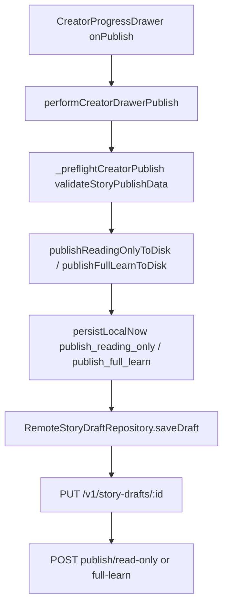

# M21C — Hidden JSON Import Flow (Implementation Report)

**Audit only — no code changes.** Inspects current Flutter creator architecture to plan a **local-only** JSON import path that lands in `CreatorStoryV1`, previews in existing creator UI, and calls the **existing** remote publish APIs only when the user taps Publish.

Related rule matrix: `docs/M21B_CURRENT_RULE_MATRIX_AUDIT.md`.

---

## 1. Current content creation flow

### Entry points

| Entry | Route | Screen | What happens |
|-------|-------|--------|----------------|
| Dock **+ Add** | `/create` | `StoryCreatorAddTabScreen` — `lib/features/create/story_creator_add_tab_screen.dart` | Lists local drafts; **Create new story** → `reset()` → `/create/story/basics` |
| New story basics | `/create/story/basics` | `StoryCreatorBasicsScreen` — `story_creator_basics_screen.dart` | Form → `applyBasicsAndWaitPersist` → `/create/story/sentences?draftId=` |
| Shortcut from Add tab | `/create` + `CreateScreen` — `create_screen.dart` | Same basics form embedded on Add; **Create** calls `reset()` + `applyBasicsAndWaitPersist` → sentences |
| Resume / Processing | `creator_resume_draft.dart` | `resumeCreatorDraft` / `loadDraftById` | Loads persisted draft into session |

Routes defined in `lib/main.dart` (`GoRoute` tree under `/create` and `/create/story/*`). Standalone `/create/story` hub redirects to `/create`; learn deep links redirect to `/create/story/sentences?panel=vocabulary|grammar|quiz|listening`.

### Primary workspace (post-basics)

**`StoryCreatorSentencesScreen`** — `lib/features/create/story_creator_sentences_screen.dart`

- Hosts **storytelling** (plaintext textarea → `applySentences`) and **embedded learn modules** via `?panel=` query param.
- Embeds learn UIs in-place (not separate routes for vocab/grammar/quiz/listening in normal flow).
- Hosts **`CreatorProgressDrawer`** (progress + publish drawer) with `buildStoryReviewDisplayModel(draft)`.

### State management (single source of truth)

| Symbol | Type | File |
|--------|------|------|
| `storyCreatorDraftProvider` | `StateNotifierProvider<StoryCreatorDraftNotifier, StoryCreatorDraftState>` | `story_creator_provider.dart` |
| `storyCreatorDraftDataProvider` | `Provider<CreatorStoryV1>` (convenience: `.draft`) | same |
| `StoryCreatorDraftNotifier` | All mutations: basics, sentences, vocab, grammar, quiz, audio, publish | `story_creator_provider.dart` |
| `storyDraftRepositoryProvider` | `StoryDraftRepository` — local or `RemoteStoryDraftRepository` | `story_draft_repository_provider.dart` |
| `creatorDrawerSessionProvider` | Drawer module / learn mode UI session | `creator_drawer_session.dart` |
| `creatorPublishInProgressProvider` | Publish overlay guard | `creator_publish_status_provider.dart` |

**Domain model:** `CreatorStoryV1` and nested types — `lib/features/create/story_v1_model.dart` (exported via `story_creator_models.dart`).

**Persistence:** Every meaningful edit calls `persistLocalNow` or `persistLocalDebounced` on the notifier, which calls `_drafts.saveDraft(..., remotePublishAfterPut: ...)`.

---

## 2. Current ReadOnly publish flow

### Data model (core / “Read Only”)

Read-only publish is **not** a separate type. It publishes **`CreatorStoryV1`** core:

- `StoryBasics` — title, category, level, description, duration band, cover URL, owner
- `List<StorySentenceItem>` — `japaneseText`, optional `reading`, `furiganaSpans`, `meanings`
- `StoryPublishState` set to `readingOnlyPublished` locally before save

Aggregate: **`CreatorStoryV1`** — `story_v1_model.dart`.

### UI readiness (publish button enable)

- `computeReadOnlyReady` — `lib/features/create/creator_readiness.dart`
- Uses `computeStoryBasicsStatus` + `computeStorySentencesStatus` — `creator_completion_rules.dart`
- Drawer: `isStoryReviewModeAllowed(StoryReviewPublishMode.readingOnly, model)` — `story_creator_review_display.dart`

### Validation before publish (client)

1. **Drawer preflight:** `_preflightCreatorPublish` — `creator_drawer_publish.dart`
   - `storyPublishDataFromCreator(draft)` — `creator_publish_preflight.dart`
   - `validateStoryPublishData(data, ValidationMode.readOnlyPublish)` — `lib/core/validation/publish_validation.dart`
   - Blocking → `showPublishValidationSheet`; warnings → “Publish anyway”
2. **Notifier gate:** `publishReadingOnlyToDisk` requires `computeReadOnlyReady` — `story_creator_provider.dart`
3. **Await pending saves:** `_awaitPendingPersistBeforePublish` before publish intent
4. **Remote:** `saveDraft(..., remotePublishAfterPut: StoryDraftRemotePublishIntent.readOnly)` may throw `StoryDraftValidationFailedException` from Nest

### Backend API call chain (only on user publish)

`StoryCreatorDraftNotifier.publishReadingOnlyToDisk` → `persistLocalNow(reason: 'publish_reading_only')` →  
`RemoteStoryDraftRepository.saveDraft` (when `NIMON_USE_REMOTE_DRAFTS=true`):

1. **Local:** `_local.saveDraft` — `LocalStoryDraftRepository` / `StoryCreatorDraftStorage`
2. **Map:** `StoryDraftMapper.fromDomainRemoteSafe(persisted)` — `story_draft_mapper.dart`
3. **PUT** `PUT /v1/story-drafts/:id` with full draft JSON + `If-Match`
4. **POST** `POST /v1/story-drafts/:id/publish/read-only` with **empty body** `{}` + `If-Match` from PUT response — `_postPublishReadOnlyHttp` — `remote_story_draft_repository.dart`
5. Response DTO mapped back → `StoryDraftMapper.toDomain` → local cache updated

**No separate “read-only DTO”** at publish time: the server validates persisted draft rows after PUT.

---

## 3. Current FullLearn publish flow

### Data model (core + learn)

Same **`CreatorStoryV1`** with:

| Layer | Type | Key fields |
|-------|------|------------|
| Core | `StoryBasics` + `StorySentenceItem[]` | Same as RO |
| Vocabulary | `VocabularyKanjiLayer` → `VocabularyKanjiEntry[]` | `termJapanese`, `type`, `reading`, `glosses`, `examplePairs` |
| Grammar | `GrammarLayer` → `GrammarEntry[]` | `headline`, optional form/meanings/usage/examples |
| Quiz | `QuizLayer` → `QuizEntry[]` | `category`, `prompt`, 4× `options`, `correctIndex` |
| Audio | `AudioLayer` → `StoryAudioAsset?` | `sourceUrl`, local file metadata |
| Workflow | `moduleWorkflowStatuses` | Keys: `vocabulary_kanji`, `grammar`, `quiz`, `audio` → `completed` required for publish gate |

### UI readiness

- `computeFullLearnReady` — `creator_readiness.dart` (basics + sentences + vocab + grammar + quiz + listening UI mins)
- `syncModuleWorkflowWithContent` — auto-sets module `completed` when count thresholds met — `creator_completion_rules.dart`

### Validation before publish

Same stack as RO, but:

- `ValidationMode.fullLearnPublish`
- `fullLearnModulesComplete` in `publish_validation.dart`
- Per-item: `validateVocabularyMeaning`, `validateFurigana`, `validateGrammarPatternTitle`, `validateQuizItem` — `learn_validators.dart`
- JLPT×band count tables in `publish_validation.dart`

### Backend API call chain

`publishFullLearnToDisk` → `persistLocalNow(reason: 'publish_full_learn')` →  
`RemoteStoryDraftRepository.saveDraft(..., remotePublishAfterPut: fullLearn)`:

1. PUT full draft (same as RO)
2. If `publishedMonoId` missing: may chain **read-only publish POST** first (nested in save path)
3. **POST** `POST /v1/story-drafts/:id/publish/full-learn` with `{}` + `If-Match` — `_postPublishFullLearnHttp`
4. Server requires existing `publishedMonoId` for full-learn (`422 published_mono_missing` if absent) — backend `story-drafts.service.ts`

**Prerequisite for import → full learn publish:** User must complete **read-only publish once** (or import must set `publishedMonoId` from server after RO publish — cannot fake locally for remote full learn).

---

## 4. Current draft / local storage flow

### Storage technology

**SharedPreferences** only (no Hive, no SQLite for creator drafts).

- **`StoryCreatorDraftStorage`** — `lib/features/create/story_creator_draft_storage.dart`
  - Index: `nimon_creator_drafts_v1_index`
  - Per draft: `nimon_creator_draft_v1_<id>` JSON + `saved_at` key
  - Legacy single-draft migration supported
- **`StoryCreatorDraftResumeStorage`** (same file) — last active module for resume
- **Remote etags:** `SharedPreferences` in `RemoteStoryDraftRepository._saveEtag` when remote drafts enabled

### Repository abstraction

| Implementation | When | File |
|----------------|------|------|
| `LocalStoryDraftRepository` | `NIMON_USE_REMOTE_DRAFTS=false` (default) | `local_story_draft_repository.dart` |
| `RemoteStoryDraftRepository` | `NIMON_USE_REMOTE_DRAFTS=true` | `remote_story_draft_repository.dart` — always writes local first, then syncs PUT |

### Programmatic create + open

**Yes**, supported today:

```text
ref.read(storyCreatorDraftProvider.notifier).reset();
// mutate state.draft OR load from JSON via custom mapper
await notifier.persistLocalNow(reason: 'import');  // remotePublishAfterPut: none
context.push('/create/story/sentences?draftId=${draft.id}');
```

Or:

```text
await ref.read(storyCreatorDraftProvider.notifier).loadDraftById(id, forceReloadFromDisk: true);
```

`loadDraftById` reads via `StoryDraftRepository.loadDraft` → `StoryCreatorDraftStorage.load`.

**New draft id:** `CreatorStoryV1.empty()` uses `Uuid().v4()` for `basics.storyId` / `id` getter.

---

## 5. Current preview flow

There is **no dedicated full-screen “Review” route** in the active product flow (`CreatorStepId.reviewPublish` exists in `creator_step_id.dart` but hub redirects away from `/create/story/review`).

**Preview = creator workspace + progress drawer:**

| Surface | Role | Data source |
|---------|------|-------------|
| `StoryCreatorSentencesScreen` | Story body + module embeds | `ref.watch(storyCreatorDraftDataProvider)` |
| Learn editor screens (embedded) | Vocab / grammar / quiz / audio lists | Same provider |
| `CreatorProgressDrawer` | Module checklist, readiness, publish mode toggle | `buildStoryReviewDisplayModel(draft)` from live provider state |
| `buildStoryReviewDisplayModel` | Readiness snapshot | `creator_review_display.dart` |

**Not** loaded from backend for unpublished drafts during edit; **in-memory + local JSON** unless user opened from remote-backed resume.

**Publish preview validation:** Drawer shows unmet lines via `storyReviewUnmetForMode`; actual gate on tap is `_preflightCreatorPublish` + `publish*ToDisk`.

---

## 6. Current validation and limitation flow

### Validation files (Flutter)

| File | Role |
|------|------|
| `lib/core/validation/publish_validation.dart` | `validateStoryPublishData`, sentence metrics, module complete, orchestrates publish gate |
| `lib/core/validation/story_validators.dart` | Title, description, `storySentenceLimits` tables |
| `lib/core/validation/learn_validators.dart` | Vocab meaning/furigana, grammar title, quiz item, count limit constants |
| `lib/core/validation/story_duration_band.dart` | `normalizeJlptLevel`, `resolveStoryDurationBand` |
| `lib/core/validation/validation_mode.dart` | `draft`, `readOnlyPublish`, `fullLearnPublish`, … |
| `lib/core/validation/validation_result.dart` | `hasBlockingIssues`, `combineResults` |
| `lib/features/create/creator_completion_rules.dart` | UI readiness mins (`CreatorV1DurationThresholds`) — **different numbers than publish** |
| `lib/features/create/creator_readiness.dart` | `computeReadOnlyReady`, `computeFullLearnReady` |
| `lib/features/create/creator_publish_validation.dart` | **Unused** in `lib/` imports — legacy checklist only |
| `lib/features/create/creator_draft_validation.dart` | `isMeaningfulDraftForProcessing` — processing list filter |
| `lib/features/create/create_story_basics_form.dart` | `ValidationMode.draft` inline for basics |
| `lib/core/validation/text_normalization.dart` | `charLength`, emoji/url/hashtag helpers |

### Count / limit locations

| Limit | Constant / function | File |
|-------|---------------------|------|
| Sentence min/max/chars | `storySentenceLimits` / `extractStorySentenceMetrics` | `story_validators.dart`, `publish_validation.dart` |
| Vocab min/max | `vocabularyLimits` | `learn_validators.dart`, `publish_validation.dart` |
| Grammar min/max | `grammarPatternLimits` | same |
| Quiz min/max | `quizLimits`, `quizGlobalHardMax` (24) | same |
| UI mins (lower) | `CreatorV1DurationThresholds.byBand` | `creator_completion_rules.dart` |

### Japanese-centric publish rules (current)

- Sentence validity: **non-empty Japanese primary text** via `extractJapanesePrimaryText` (`japanese`, `japaneseText`, `jp`, …) — `publish_validation.dart`
- Vocab: `termJapanese`, `validateFurigana` when kanji — `learn_validators.dart`
- Char counts: `charLength` on Japanese body sum — not language-aware

### Candidates to replace for CSV_Prompt / HTML generator rules

| Area | Current | Likely future replacement |
|------|---------|---------------------------|
| Publish gate tables | M13 JLPT×band matrices | New generator rule matrix (M21B) |
| UI readiness mins | `CreatorV1DurationThresholds` | Align to new matrix or deprecate for import-only flow |
| `creator_publish_validation.dart` | Unused | Remove or wire to import validator only |
| Furigana required rules | Kanji-surface based | May relax for English-primary content |
| `extractJapanesePrimaryText` | JP field names | Generalized “primary line” extractor for EN/JP |

---

## 7. Japanese-only assumptions (inventory)

| Location | Assumption | Legacy key OK? | Generalize for English? |
|----------|------------|----------------|-------------------------|
| `StorySentenceItem.japaneseText` | Primary story line | **Yes** — keep wire key; map EN content into field | Add parallel `primaryText` later in API; import can fill `japaneseText` |
| `extractJapanesePrimaryText` | Publish counts JP fields | N/A at rest | **Replace** with language-neutral “primary sentence text” for validation |
| `VocabularyKanjiEntry.termJapanese` | Surface form | **Yes** for wire | EN “term” still maps here |
| `validateFurigana` / reading | Required for kanji | Keep for JP stories | Skip or optional for `type != kanji` English |
| UI labels “Vocabulary / Kanji”, “Japanese” | Product copy | Labels only | Update l10n when product supports EN |
| `story_creator_sentences_screen.dart` | Plaintext storytelling UX copy mentions Japanese | UI | EN mode copy |
| `story_creator_furigana_tokens.dart`, `updateSentenceFurigana` | Furigana spans | Optional fields | No change if unused |
| `StoryDraftMapper` / `storyPublishDataFromCreator` | Emits `japaneseText`, `termJapanese` | **Required** for backend today | Mapper layer can alias EN→these keys |
| `creator_publish_preflight.dart` | Maps `japaneseText` to publish snapshot | Same | Central mapping point for import |
| Learn module id `vocabularyKanji` | Naming | Storage key stable | Display name only |
| Published mono parsers | May expect JP in reader | Runtime | Separate reader path |

**Recommendation:** Import pipeline should target **existing wire keys** (`japaneseText`, `termJapanese`, etc.) for compatibility; introduce a separate **import schema** with logical `primaryLanguage` without changing `CreatorStoryV1` until backend supports bilingual wire.

---

## 8. Existing backend publish API contract

### What gets sent

| Step | Method | Body | Source |
|------|--------|------|--------|
| Sync draft | `PUT /v1/story-drafts/:id` | Full `StoryDraftDto`-shaped JSON (`schemaVersion: 1`, basics, sentences[], vocabularyKanji, grammar, quiz, audio, publishState, moduleWorkflowStatuses) | `StoryDraftMapper.fromDomainRemoteSafe` → `jsonEncode` — `remote_story_draft_repository.dart` |
| Publish RO | `POST .../publish/read-only` | `{}` | Empty; server uses DB draft after PUT |
| Publish FL | `POST .../publish/full-learn` | `{}` | Same |

### DTO alignment

- Backend write shape: `StoryDraftWriteDto` — `nimon-backend/.../dto/story-draft.requests.ts` (class-validator on PUT, **not** re-run on publish POST).
- Flutter domain ↔ wire: **`StoryDraftMapper`** — `story_draft_mapper.dart` (round-trip tested via remote repo).
- Publish preflight uses a **slim snapshot** `StoryPublishData` — `publish_validation.dart` / `storyPublishDataFromCreator` (subset of fields for validation, not identical to PUT payload).

### Transformations before send

- `fromDomainRemoteSafe` strips local-only audio paths (`localFileName`, `localPath`) — audio must be `sourceUrl` for remote.
- Owner id normalized to JWT user — `_normalizeDevOwnerForRemoteSave` — `remote_story_draft_repository.dart`.
- Sentences ordered by `orderIndex` in mapper.
- Publish sets `publishState` on domain **before** PUT (readingOnlyPublished / fullLearnPublished).

**Import implication:** Imported JSON must either include **https `sourceUrl`** for audio/cover or user uploads media before remote publish.

---

## 9. Recommended safe insertion point for JSON import

### Architecture (fits existing patterns)

```text
[Hidden Import Screen]
  → pick file (FilePicker — already used in creator_audio_upload_sheet.dart)
  → parse UTF-8 JSON
  → NimonImportValidator (schema + publish rules optional)
  → NimonImportMapper → CreatorStoryV1
  → syncModuleWorkflowWithContent + resolveV1Thresholds
  → StoryCreatorDraftNotifier: assign state + persistLocalNow(none)
  → go_router: /create/story/sentences?draftId=<id>
  → user reviews in CreatorProgressDrawer
  → performCreatorDrawerPublish (existing — hits backend)
```

### Where to hook UI

| Hook | Why |
|------|-----|
| **New route** `/create/import` or long-press on `StoryCreatorAddTabScreen` | Isolated from production create; gate with `kDebugMode` or hidden flag |
| **Avoid** patching `CreateScreen` / basics form | Reduces risk to manual onboarding |
| **Reuse** `StoryCreatorSentencesScreen` + drawer | Full preview without new review screen |

### Where to hook data

| Hook | Why |
|------|-----|
| **`StoryCreatorDraftNotifier` method** e.g. `importDraftFromMapped(CreatorStoryV1)` | Single mutation + persist entry point; mirrors `loadDraftById` |
| **`LocalStoryDraftRepository` / storage** | Automatic via existing `saveDraft` |
| **Do not** call `RemoteStoryDraftRepository` until user publishes | Matches “local-only until publish” goal |

### Validator placement

- **Phase 1:** Structural JSON → `CreatorStoryV1` (ids, enums, lists).
- **Phase 2:** `validateStoryPublishData` for RO/FL modes user intends (show issues in import result UI).
- **Phase 3 (optional):** Separate from `CreatorV1DurationThresholds` UI mins — use publish gate only for “ready to publish” badge.

---

## 10. Risk report

| Risk | Severity | Mitigation |
|------|----------|------------|
| Breaking manual create (`reset`, `applyBasics`) | Medium | Separate route; no changes to `CreateScreen` submit path |
| Field mismatch import JSON ↔ `CreatorStoryV1` | High | Versioned import schema `nimonImportSchemaVersion`; strict mapper tests |
| Duplicate validation (import + drawer + server) | Low | Reuse `validateStoryPublishData`; single issue model |
| Japanese vs English content in `japaneseText` | Medium | Document mapping; later neutral validator |
| Backend rejects PUT/publish (validation_failed) | High | Run same preflight before marking “ready”; show issues list |
| Audio/cover local-only paths stripped on PUT | High | Import validator requires http URLs or post-import upload step |
| `publishedMonoId` missing for full learn | High | Force RO publish first in UX; disable FL until server returns mono id |
| State stomp (`loadDraftById` vs import) | Medium | `forceReloadFromDisk: false` after import; unique new draft id |
| Remote autosave during import review | Medium | Keep `remotePublishAfterPut: none` on all import persists |
| Etag / 409 on publish | Low | Existing M20F conflict handling in `remote_story_draft_repository.dart` |
| Large JSON blocking UI isolate | Medium | Parse in isolate; progress indicator |

---

## 11. Proposed file map (future — do not create yet)

| Proposed file | Responsibility |
|---------------|----------------|
| `lib/features/create/import/nimon_import_schema.dart` | Import JSON v1 shape (documentation-as-code / json_serializable) |
| `lib/features/create/import/nimon_import_validator.dart` | Structural + optional `validateStoryPublishData` wrapper |
| `lib/features/create/import/nimon_import_mapper.dart` | `Map` / DTO → `CreatorStoryV1` (UUIDs, orderIndex, module statuses) |
| `lib/features/create/import/nimon_import_result.dart` | Success / errors / warnings list for UI |
| `lib/features/create/import/hidden_import_screen.dart` | File picker, validate, preview summary, “Open in editor” CTA |
| `lib/features/create/import/import_route.dart` or `main.dart` route | Register hidden route |
| `lib/features/create/story_creator_provider.dart` (extend) | `importMappedDraft(CreatorStoryV1 draft)` method only |
| `test/features/create/nimon_import_mapper_test.dart` | Round-trip samples |
| `test/features/create/nimon_import_validator_test.dart` | Golden invalid/valid fixtures |
| `docs/M21C_JSON_IMPORT_FLOW_IMPLEMENTATION_REPORT.md` | This document |

**Reuse (no new files):** `performCreatorDrawerPublish`, `storyPublishDataFromCreator`, `StoryDraftMapper`, `StoryCreatorDraftStorage`, `FilePicker` pattern from `creator_audio_upload_sheet.dart`.

---

## Quick reference — publish call graph



---

## Tests to mirror when implementing import

- `test/core/validation/publish_validation_gate_test.dart`
- `test/features/create/m20f_publish_stale_conflict_test.dart`
- `test/features/create/remote_story_draft_full_learn_publish_sequence_test.dart`
- `test/features/create/story_creator_quota_publish_and_draft_test.dart`
