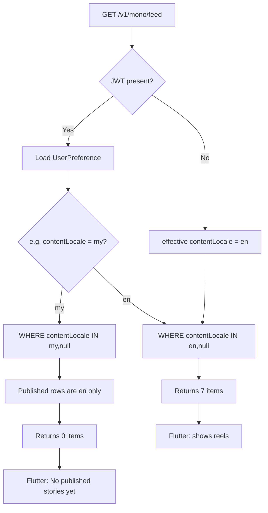

# M22C — Mono Feed Account Empty Investigation

Date: 2026-06-03  
Scope: **Investigation only** (no code changes).  
Environment referenced: `https://nimon-api-global-test.onrender.com`

---

## Executive summary

| Observation | Finding |
|-------------|---------|
| Guest For You (remote) | **Non-empty** — live API returns **7** items (`hasMore: true`). |
| Account For You (symptom) | UI shows **“No published stories yet.”** — consistent with **HTTP 200 + `items: []`**, not a transport error. |
| Most likely root cause | **Content locale mismatch**: catalog rows are stamped **`contentLocale: en`** at publish; authenticated feed applies **`UserPreference.contentLocale`** (often **`my`** after choosing Myanmar in Settings). **`my` filter returns 0 rows** on global-test DB (verified live). |
| Guest vs account request | Same URL for For You; account adds **`Authorization: Bearer …`** → backend loads prefs and changes Prisma `where`, not the path. |
| `following=true` | **Following tab only**; does not affect For You. |
| M22B migration | **Did not change** `contentLocale` / `learningLanguage` columns (only denormalized feed summary fields). |

---

## A. Flutter request/response

### Repository and logging

| Item | Location |
|------|----------|
| For You pager | `lib/features/mono/data/mono_feed_providers.dart` → `MonoFeedPager` |
| HTTP client | `lib/features/mono/data/remote_mono_feed_repository.dart` → `RemoteMonoFeedRepository.fetchFeedPage` |
| Following (separate) | `lib/features/mono/data/remote_following_mono_feed_repository.dart` → adds `following=true`, **requires** auth |

**Current debug logging (For You):**

```dart
// remote_mono_feed_repository.dart ~127-128
if (kDebugMode) {
  debugPrint('RemoteMonoFeedRepository.fetchFeedPage: GET $uri');
}
```

**What is logged today:** request URI only (includes query: `limit`, `cursor`, `sort`, optional `level`, `category`).

**What is not logged today:**

- HTTP status code  
- Response `items.length`  
- `nextCursor` / `hasMore`  
- Whether `Authorization` was sent  
- Response body on error  

**Inferred behavior from code (not from device logs):**

| Field | Behavior |
|-------|----------|
| HTTP status | `_throwIfNotOk` — non-2xx throws `StateError`; empty UI with message **“Could not load the feed.”** |
| Success empty | 200 + `items: []` → `PageResult` with empty list → Mono Home **“No published stories yet.”** |
| `nextCursor` / `hasMore` | Parsed from JSON; not printed in debug |
| Auth (account) | `authHeaderBuilderProvider` → `Authorization: Bearer <accessToken>` when session has tokens (`lib/features/auth/auth_providers.dart`) |
| Auth (guest) | Builder returns `{}` — **no** `Authorization` header (`remote_mono_feed_repository_test.dart` confirms optional merge) |
| Query params | For You sends `limit`, `sort=recent`, optional `level`/`category` — **does not** send `contentLocale` or `learningLanguage` (`PageRequest` has no such fields; M11e doc notes backend owns prefs) |

### UI empty vs error

`lib/features/mono/mono_screen.dart` (`_buildMainMonoVerticalFeed`, For You + remote):

- Loading: `isInitialLoading && items.isEmpty`  
- Error: `error != null && items.isEmpty` → **“Could not load the feed.”**  
- Empty: `!isInitialLoading && items.isEmpty && error == null` → **“No published stories yet.”**  

User symptom matches **successful empty catalog**, not HTTP failure.

### Guest vs account — Flutter

| Aspect | Guest (not signed in) | Signed-in account |
|--------|------------------------|-------------------|
| For You URL | `GET /v1/mono/feed?limit=7&sort=recent` (+ optional `level`/`category`) | **Same** |
| Authorization | Omitted | `Bearer` attached when tokens exist |
| Following URL | Not loaded (`_useRemoteFollowingFeed` requires `_isAuthed`) | `GET …/feed?limit=7&sort=recent&following=true` (separate pager) |
| Remote gate | `NIMON_USE_REMOTE_MONO_FEED=true` + Home `MonoScreen` | Same |
| Mock fallback | If remote flag **false**, guest sees **~51 mock items** (no HTTP) — explains “guest had stories” on builds **without** remote feed define |

### User-reported log lines

```
GET …/v1/mono/feed?limit=7&sort=recent
GET …/v1/mono/feed?limit=7&sort=recent&following=true
```

- First line = **For You** (`MonoFeedPager`).  
- Second = **Following** only (`FollowingMonoFeedPager`); empty Following does **not** clear For You.

---

## B. Backend filter logic

**File:** `nimon-backend/src/modules/mono-feed/mono-feed.service.ts` → `listFeed`  
**Controller:** `mono-feed.controller.ts` — `OptionalJwtUserGuard` (invalid/missing JWT → guest, no 401)

### Preference resolution

| Caller | `userId` | Effective `contentLocale` | Effective `learningLanguage` |
|--------|----------|---------------------------|------------------------------|
| Guest (no JWT) | `null` | **`en`** (constant default) | **`ja`** |
| Authenticated, no query override | from `userPreference` row via `safeStoredContentLocale` / `safeStoredLearningLanguage` | stored or default **`en`** / **`ja`** |
| Query `?contentLocale=` / `?learningLanguage=` | overrides prefs for **any** caller | must be `en`\|`my`\|`ja` / `ja` only |

Invalid stored prefs fall back to **`en`/`ja`** (never 500).

### Prisma `where` (catalog + locale)

Always includes:

1. `PUBLISHED_MONO_CATALOG_VISIBLE` — `trashedAt: null` and no linked draft with `hasUnpublishedCoreChanges: true`  
2. Locale block (legacy null rows **included**):

```typescript
AND: [
  { OR: [{ contentLocale: effectiveContentLocale }, { contentLocale: null }] },
  { OR: [{ learningLanguage: effectiveLearningLanguage }, { learningLanguage: null }] },
]
```

Optional:

- `followingOnly: true` → `ownerId IN (followed user ids)`; **empty follow graph → `items: []` immediately**  
- `writerId`, `level`, `category`, cursor pagination  

**For You:** `followingOnly: false` (no `following` query param).

### Guest vs authenticated — exact filter difference

| Request | `userId` | Locale filter in SQL |
|---------|----------|----------------------|
| A. No `Authorization` | `null` | `contentLocale IN ('en', null)` AND `learningLanguage IN ('ja', null)` |
| B. `Authorization` + prefs `contentLocale: 'my'`, `learningLanguage: 'ja'` | set | `contentLocale IN ('my', null)` AND `learningLanguage IN ('ja', null)` |
| B. `Authorization` + prefs default / missing row | set | Same as guest (`en` / `ja`) |

### Publish stamping (why DB is mostly `en`)

`StoryDraftsService` publish paths set:

- `contentLocale: 'en'`  
- `learningLanguage: 'ja'`  

Migration `20260509120000_m11i_reading_prefs_feed_compat` backfilled NULL → **`en`** / **`ja`**.

So visible catalog rows on global-test are **`en`+`ja`**, not `my`, not human labels (`Myanmar`, `Burmese`).

### M22B impact

Migration `20260603120000_m22b_published_mono_feed_summary` adds/backfills:

`coverImageUrl`, `publishKind`, `hasAudio`, `sentenceCount`, `vocabCount`, `grammarCount`, `quizCount`

**Does not** read or write `contentLocale` / `learningLanguage`. Confirmed safe w.r.t. this bug.

### `following=true`

- Only when query `following=true` (Flutter Following repo).  
- Requires auth (`401` if missing).  
- **Does not** apply to For You list.

---

## C. User preference values

### Cannot read this account’s row from here

`GET /v1/me/preferences` requires the user’s Bearer token. Not available in this investigation run.

### How to verify on device / curl

```http
GET /v1/me/preferences
Authorization: Bearer <access_token>
```

Check:

- `contentLocale` — wire codes **`en` | `my` | `ja`** (Settings label “Myanmar” → **`my`**)  
- `learningLanguage` — V1 **`ja`** only  

### Expected correlation

| `contentLocale` | For You on global-test (all publishes `en`) |
|-----------------|---------------------------------------------|
| `en` (default) | **Should match guest** (~7 items) |
| `my` | **0 items** (confirmed below) |
| `ja` | **0 items** unless rows stamped `ja` |

If account still empty with `contentLocale: en`, secondary checks: linked draft `hasUnpublishedCoreChanges`, `trashedAt`, JLPT `level` query filter.

---

## D. `published_monos` grouped counts

### Direct DB access

Not run against Render Postgres in this session (no credentials in repo).

### Live API proxy (same `where` as guest `en` vs `my`)

Target: `https://nimon-api-global-test.onrender.com`

| Request | Item count | `hasMore` |
|---------|------------|-----------|
| `GET /v1/mono/feed?limit=7&sort=recent` (guest defaults) | **7** | true |
| `GET /v1/mono/feed?limit=7&sort=recent&contentLocale=en` | **7** | true |
| `GET /v1/mono/feed?limit=7&sort=recent&contentLocale=my` | **0** | false |

**Inference for catalog on global-test:**

| Dimension | Inferred distribution |
|-----------|----------------------|
| `contentLocale` | At least **7** visible rows; all match **`en`** (or null treated as compatible with `en` filter); **none** match **`my`** |
| `learningLanguage` | Compatible with **`ja`** filter (publish default + backfill) |
| Human labels | Stored as codes **`en`/`my`/`ja`**, not `Myanmar` or `Burmese` strings |
| M22B columns | Present on deployed API (list returns `publishKind`, `hasAudio`, etc.) |

### Recommended SQL (ops / local DB)

```sql
-- Visible catalog rows only (approximate; mirror PUBLISHED_MONO_CATALOG_VISIBLE in app)
SELECT "contentLocale", COUNT(*) FROM "published_monos"
WHERE "trashedAt" IS NULL
GROUP BY "contentLocale";

SELECT "learningLanguage", COUNT(*) FROM "published_monos"
WHERE "trashedAt" IS NULL
GROUP BY "learningLanguage";

SELECT "level", COUNT(*) FROM "published_monos"
WHERE "trashedAt" IS NULL
GROUP BY "level" ORDER BY COUNT(*) DESC;

SELECT COUNT(*) FILTER (WHERE "trashedAt" IS NOT NULL) AS trashed FROM "published_monos";

-- Per-user prefs (replace :userId)
SELECT "contentLocale", "learningLanguage" FROM "user_preferences"
WHERE "userId" = :userId;

-- Rows that would match user my + ja
SELECT COUNT(*) FROM "published_monos"
WHERE "trashedAt" IS NULL
  AND ("contentLocale" = 'my' OR "contentLocale" IS NULL)
  AND ("learningLanguage" = 'ja' OR "learningLanguage" IS NULL);
```

---

## E. Why guest shows stories but account does not



| Scenario | Why |
|----------|-----|
| Guest + **remote feed off** | Mock data in `MonoScreen` — always has items; no locale filter. |
| Guest + **remote feed on** | Backend defaults **`en`/`ja`** → matches published rows → **7 items**. |
| Account + **`contentLocale: my`** | Backend filters **`my`+null** → published rows are **`en`** (not null-only) → **0 items**, 200 OK. |
| Account + **`contentLocale: en`** | Should behave like guest (plus bookmark/reaction fields). If still empty, investigate draft-dirty hide, trash, or `level` filter. |
| Following tab empty | Separate request; follow graph empty → expected **0**; unrelated to For You empty copy. |

**Primary answer:** Guest catalog query uses **`en`**; account query uses **saved content community** (`my` is the common mismatch for Myanmar learners). Global-test publishes **`en`** only today.

---

## F. Recommended fix options (no implementation)

### 1. Product / data — align publish locale with community (backend)

On publish, set `published_monos.contentLocale` from draft/import **content community** (`my`/`en`/`ja`), not hardcoded `'en'`.  
Requires mapping import meta + creator settings → DB column.

### 2. Feed policy — broaden or relax filter (backend)

Options (pick one consciously):

- Treat `en` catalog as visible to **`my`** readers until `my`-tagged content exists.  
- Drop locale filter for For You until per-community catalog is populated.  
- Include `en` when user pref is `my` (compatibility shim).  

Document intended semantics in M11e follow-up.

### 3. Flutter — pass explicit query params (client)

Send `contentLocale` / `learningLanguage` on feed requests (Settings-driven), or add “show all communities” — only helps if backend policy allows it.

### 4. Flutter — temporary diagnostics (client)

Extend `fetchFeedPage` debug log: status, `items.length`, `hasMore`, `Authorization` present yes/no (not the token). Speeds field confirmation.

### 5. User workaround (no code)

Settings → Content community → **International / English** (`en`) → feed refresh (`UserPreferencesNotifier` already calls `monoFeedPagerProvider.refresh()`).

### 6. Verify account prefs before coding

```bash
curl -s -H "Authorization: Bearer $TOKEN" \
  "$BASE/v1/me/preferences"
curl -s -H "Authorization: Bearer $TOKEN" \
  "$BASE/v1/mono/feed?limit=7&sort=recent"
```

Compare item counts to guest curl in section D.

---

## Appendix — code references

| Topic | Path |
|-------|------|
| Feed service filters | `nimon-backend/src/modules/mono-feed/mono-feed.service.ts` |
| Optional JWT | `nimon-backend/src/modules/auth/optional-jwt-user.guard.ts` |
| Publish locale stamp | `nimon-backend/src/modules/story-drafts/story-drafts.service.ts` |
| Flutter feed HTTP | `lib/features/mono/data/remote_mono_feed_repository.dart` |
| Prefs refresh feed | `lib/features/settings/presentation/providers/user_preferences_notifier.dart` |
| M11e prior report | `docs/M11E_CONTENT_LOCALE_FEED_INTEGRATION_REPORT.md` |
| M22A perf audit | `docs/M22A_HOME_MONO_FOR_YOU_LOADING_AUDIT.md` |

---

## Investigation checklist (for assignee)

- [ ] Confirm `GET /v1/me/preferences` for affected account (`contentLocale`?)  
- [ ] Confirm guest vs authed `GET /v1/mono/feed?limit=7` item counts  
- [ ] Run SQL grouping on target DB  
- [ ] Confirm build uses `NIMON_USE_REMOTE_MONO_FEED=true` (guest mock vs API)  
- [ ] If prefs are `en` but feed still empty, check `hasUnpublishedCoreChanges` / trash / `level` filter  

**No code was modified in this investigation.**
