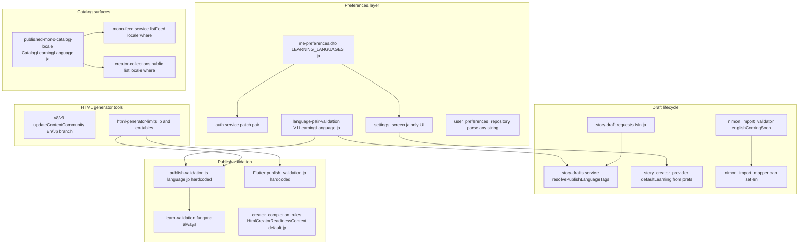
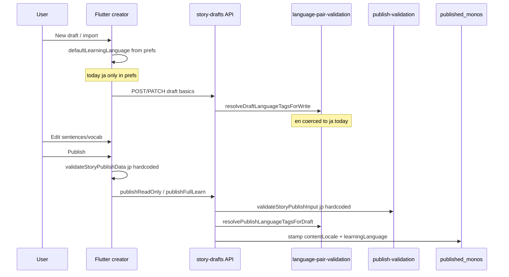

# M23A-1 — English Learning Implementation Planning Audit

**Phase:** M23A-1 (investigation + planning only)  
**Prerequisite:** [`docs/M23A0_LEARNING_ENGLISH_EXPANSION_AUDIT.md`](M23A0_LEARNING_ENGLISH_EXPANSION_AUDIT.md)  
**Constraint:** No code changes, migrations, or test edits in this phase.

**Target product rules**

| Axis | Values | Invariant |
|------|--------|-----------|
| Learning | `ja`, `en` | `learningLanguage !== contentLocale` |
| Community | `en`, `my`, `ja` | Allowed pairs: `ja+en`, `ja+my`, `en+ja`, `en+my` — blocked: `ja+ja`, `en+en` |

**English learning behavior**

- No furigana / ruby requirements  
- No kanji-type requirements  
- EN HTML generator limits and prompts  
- JP: furigana, kanji validation, JP HTML rules unchanged  

**Already shipped (do not re-litigate):** M22D publish stamping fields, M22E public collection catalog filter, M22F collection `contentLocale` + owner badges.

---

## A. Current dependency graph

Legend: **D** = direct `ja` assumption (allow-list, hardcode, or explicit block); **I** = indirect (uses helper that assumes `ja`, or Japanese-only UX without reading `learningLanguage`).

### A.1 Mermaid overview

### A.2 Backend — direct `ja` / English blocked

| File | Role | Assumption |
|------|------|------------|
| `nimon-backend/src/modules/auth/dto/me-preferences.dto.ts` | PATCH/response types | **D** `LEARNING_LANGUAGES = ['ja']` |
| `nimon-backend/src/common/validation/language-pair-validation.ts` | Pair + publish tags | **D** `V1LearningLanguage = 'ja'`; `normalizeV1LearningLanguage` only `ja`; `safeV1LearningLanguage` → default `ja` |
| `nimon-backend/src/modules/story-drafts/dto/story-draft.requests.ts` | Draft write validation | **D** `@IsIn(['ja'])` on `learningLanguage` (create + write basics) |
| `nimon-backend/src/modules/published-monos/published-mono-catalog-locale.ts` | Feed + public collections | **D** `CatalogLearningLanguage = 'ja'`; query + `safeStoredLearningLanguage` |
| `nimon-backend/src/common/validation/publish-validation.ts` | Publish gate | **D** `const language: HtmlLearningLanguage = 'jp'` (~240) |
| `nimon-backend/src/modules/auth/me.profile.controller.spec.ts` | Contract test | **D** PATCH `en` → 400 |

### A.3 Backend — indirect / flows through `ja` helpers

| File | Role | Dependency |
|------|------|------------|
| `nimon-backend/src/modules/auth/auth.service.ts` | Prefs CRUD | **I** `safeV1LearningLanguage` on PATCH; GET uses `resolvePreference` without learning allow-list sanitize |
| `nimon-backend/src/modules/story-drafts/story-drafts.service.ts` | Create/update/publish draft | **I** `resolveDraftLanguageTagsForWrite` / `resolvePublishLanguageTagsForDraft` → `resolvePublishLanguageTags` |
| `nimon-backend/src/common/validation/language-pair-validation.spec.ts` | Tests | **I** no `en+my` / `en+en` cases yet |
| `nimon-backend/src/modules/mono-feed/mono-feed.service.ts` | For You / Following / `writerId` feed | **I** `publishedMonoCatalogLocaleWhere(langCtx)` |
| `nimon-backend/src/modules/mono-feed/mono-feed.controller.ts` | Query params | **I** passes `learningLanguage` to resolver (only `ja` valid today) |
| `nimon-backend/src/modules/creator-collections/creator-collections.service.ts` | Public collections + mono lists | **I** catalog locale where on public paths |
| `nimon-backend/src/modules/creator-collections/public-creator-collections.controller.ts` | HTTP | **I** forwards `learningLanguage` query |
| `nimon-backend/src/modules/published-monos/published-monos.service.ts` | Owner list/detail | **No learning filter** — owner sees all published monos |
| `nimon-backend/src/modules/mono-social/mono-social.service.ts` | Bookmarks | **I** returns `learningLanguage` field; no viewer filter |
| `nimon-backend/src/modules/search/search.service.ts` | Search | **No catalog learning filter** — visibility only; returns `learningLanguage` on rows |
| `nimon-backend/src/common/validation/learn-validation.ts` | Furigana/kanji | **I** not language-aware (always JP rules when term has kanji) |
| `nimon-backend/src/common/limits/html-generator-limits.ts` | Config | **I** has `en` tables; publish path does not use `en` yet |
| `nimon-backend/src/common/validation/publish-validation.spec.ts` | Tests | **I** JP fixtures |
| `nimon-backend/src/common/limits/html-generator-limits.spec.ts` | Tests | **I** mostly `language: 'jp'` |
| `nimon-backend/src/modules/mono-feed/mono-feed.service.spec.ts` | Tests | **I** expects `learningLanguage: 'ja'`; invalid `ko` rejected |
| `nimon-backend/src/modules/published-monos/published-mono-catalog-locale.spec.ts` | Tests | **I** guest/viewer `ja` |
| `nimon-backend/src/modules/creator-collections/creator-collections.service.spec.ts` | Tests | **I** `my+ja` viewer scenarios |
| `nimon-backend/src/modules/published-monos/published-mono-common.ts` | List DTO mapping | **Neutral** — passes through stored tags |
| `nimon-backend/prisma/schema.prisma` | Storage | **Neutral** — `String?` columns |

### A.4 Flutter — direct

| File | Role | Assumption |
|------|------|------------|
| `lib/features/settings/settings_screen.dart` | Settings UI | **D** only `ja` selectable; “More languages” disabled; `_learningLanguageLabel` → always “Japanese” |
| `lib/features/create/import/nimon_import_validator.dart` | Import gate | **D** `englishComingSoon`; HTML rules **skip** when `HtmlLearningLanguage.en` (early return) |
| `lib/core/validation/publish_validation.dart` | Client publish preflight | **D** `HtmlLearningLanguage.jp` hardcoded (~289, 351, 356, 441) |
| `lib/features/create/creator_completion_rules.dart` | Readiness | **D** `HtmlCreatorReadinessContext` default `language = HtmlLearningLanguage.jp`; **does not read** `draft.basics.learningLanguage` |
| `lib/features/create/creator_drawer_publish.dart` | Publish UX | **I** debug preflight uses `HtmlLearningLanguage.jp` |

### A.5 Flutter — indirect

| File | Role | Dependency |
|------|------|------------|
| `lib/features/settings/data/user_preferences_repository.dart` | API client | **I** comment `ja`; parses any `learningLanguage` string from GET |
| `lib/features/settings/presentation/providers/user_preferences_notifier.dart` | Refresh | **I** feed refresh on learning change; no own-profile list refresh |
| `lib/core/settings/language_pair.dart` | Pair UI rule | **Neutral** — generic equality (ready for `en`) |
| `lib/core/settings/content_community.dart` | Community normalize | **Neutral** |
| `lib/features/create/import/nimon_import_enums.dart` | Import enum | **I** `english` → `en` wire exists |
| `lib/features/create/import/nimon_import_mapper.dart` | Map to draft | **I** sets `learningLanguage` from meta |
| `lib/features/create/import/nimon_hidden_json_import_flow.dart` | Orchestration | **I** passes `prefs.learningLanguage` |
| `lib/features/create/story_v1_model.dart` | Domain model | **I** comments V1 `ja`; JP field names |
| `lib/features/create/story_creator_provider.dart` | Draft notifier | **I** `defaultLearningLanguage` from prefs (works once prefs allow `en`) |
| `lib/features/create/data/story_draft_mapper.dart` | DTO map | **Neutral** — strings |
| `lib/features/create/data/dto/story_draft_dto.dart` | Wire | **Neutral** |
| `lib/core/limits/html_generator_limits.dart` | Limits config | **I** EN+JP tables; publish not wired |
| `lib/core/validation/learn_validators.dart` | Furigana | **I** `containsKanji` / `validateFurigana` |
| `lib/features/create/story_creator_sentences_screen.dart` | Editor | **I** furigana UI, “Japanese sentence” copy |
| `lib/features/create/story_creator_vocab_kanji_editor_screen.dart` | LM1 editor | **I** Kanji segment, reading/furigana labels |
| `lib/features/create/story_creator_grammar_editor_screen.dart` | Grammar | **I** `jp` example controllers |
| `lib/features/profile/public_profile_screen.dart` | Public profile | **I** reloads collections on prefs change; monos via feed |
| `lib/features/mono/mono_screen.dart` | Reader | **I** always renders ruby when tokens present — **no** `learningLanguage` check |
| `lib/ui/reading/nimon_ruby_text.dart` | Rendering | **I** shared ruby widget |
| `lib/features/learn/listening_transcript_from_published.dart` | Listening | **I** furigana from published core |

### A.6 HTML generator (tools)

| File | Role | Assumption |
|------|------|------------|
| `tool/html_generator/Json_Generator_ImportReadyPrompt_v8_strict_import_precheck.html` | Primary strict tool | **Branching** — Jp/En select; `updateContentCommunity` disables same-language community |
| `tool/html_generator/Json_Generator_ImportReadyPrompt_v9_json_based_precheck.html` | JSON precheck variant | Same pattern as v8 |
| `tool/html_generator/Json_Generator_ImportReadyPrompt_v7.html` | Older | JP-focused; superseded for EN by v8+ |
| `lib/core/limits/html_generator_limits.dart` | App parity config | **EN+JP** limit maps (config-only until publish wired) |
| `nimon-backend/src/common/limits/html-generator-limits.ts` | Backend parity config | Same |

### A.7 Not `ja`-locked (important for planning)

| Area | Behavior |
|------|----------|
| M22F `collection-content-locale.ts` | **contentLocale only** — correct for `en+my` monos |
| Owner `GET /v1/published-monos` | No viewer learning filter |
| Search `SearchService` | No `publishedMonoCatalogLocaleWhere` — **all** visible monos searchable |
| `language-pair-validation.assertDistinctLanguagePair` | Already generic for `en+en` once types extended |

---

## B. Implementation phases

Recommended rollout (refined from M23A-0; aligns with your example with explicit **why**).

| Phase | Name | Scope | Why this order |
|-------|------|--------|----------------|
| **1** | Preferences + language pair | `LEARNING_LANGUAGES`, `V1LearningLanguage`, Settings UI, hide `en` community when learning `en`, GET sanitize, pair tests | Establishes legal pairs (`en+my`, `en+ja`) without creating content that will be mis-stamped or mis-fed |
| **2** | Draft + import metadata | Draft DTO `en`, remove `englishComingSoon`, import HTML rules run for EN, mapper/validator pair checks | Users can persist `learningLanguage=en` on drafts and import JSON **before** publish path accepts English |
| **3** | Publish stamping | `normalizeV1LearningLanguage`, `resolvePublishLanguageTags`, draft write tags | **Must precede** trusting publish/feed — prevents `en` drafts publishing as `ja` |
| **4** | HTML generator branching (runtime) | `publish-validation.ts` + Flutter `publish_validation.dart` + import validator: derive `HtmlLearningLanguage` from draft/prefs | Gates must match generator tables already present in `html-generator-limits` |
| **5** | Conditional furigana / kanji | `learn-validation`, `learn_validators`, sentence/vocab editors, optional reader ruby suppression | Avoids false blocks for English; avoids showing furigana UX when not learning JP |
| **6** | Feed / catalog / profile refresh | `published-mono-catalog-locale`, mono-feed, public collections; optional own-profile refresh | Surfaces English monos only after stamps and validation are correct |
| **7** | Tests + generator QA | Full matrix below; golden EN import fixtures | Proves no JP regression |

**Phase 1 alone is not user-visible English learning** — use feature flag or keep “More languages” disabled until Phase **≥4** (minimum) or **≥6** (feed-visible).

**Why stamping (3) before feed (6) but after draft (2):** Draft rows can hold `en` in DB strings without migration; stamping fixes **published_monos** truth. Feed filters on published tags — wrong stamp → permanent catalog bugs.

**Why HTML (4) before furigana UI (5):** Publish button and server 422 depend on limits; furigana skip is useless if HTML counts still use JP tables.

**Optional Phase 5b (reader):** `mono_screen` / listening — suppress ruby render when `publishedMono.learningLanguage == 'en'` even if legacy furigana in JSON.

---

## C. Database impact

### Existing columns (no rename required)

| Table | Column | Type | Notes |
|-------|--------|------|-------|
| `user_preferences` | `learningLanguage` | `TEXT` nullable | Store `en` |
| `story_drafts` | `learningLanguage`, `contentLocale` | `TEXT` nullable | M22D-1 |
| `published_monos` | `learningLanguage`, `contentLocale` | `TEXT` nullable | Indexed with `updatedAt` |
| `creator_mono_collections` | `contentLocale` | `TEXT` nullable | M22F — not learning |

### Enums

- **Prisma:** no language enums — **no enum migration**.
- **TypeScript:** `LearningLanguage`, `V1LearningLanguage`, `CatalogLearningLanguage` are **const arrays / union types** — code-only changes.

### Validators / DTOs (application layer, not DB)

| Location | Change type |
|----------|-------------|
| `me-preferences.dto.ts` | `LEARNING_LANGUAGES` → `['ja','en']` |
| `story-draft.requests.ts` | `@IsIn(['ja','en'])` |
| `language-pair-validation.ts` | `V1LearningLanguage` → `'ja' \| 'en'` |
| `published-mono-catalog-locale.ts` | `CatalogLearningLanguage` → `'ja' \| 'en'` |

### Indexes

- Existing: `published_monos_contentLocale_learningLanguage_updatedAt_idx` — **compatible** with `learningLanguage='en'`.
- **No new migration required** for English wire codes.

### Migrations — list only if product chooses optional hardening (not required for V1)

| Optional migration | Purpose |
|--------------------|---------|
| *(none required)* | — |
| `CHECK (learning_language IN ('ja','en'))` on prefs/drafts/published | DB-level guard — **not recommended** until product stable (Prisma does not use CHECK today) |
| Backfill audit script (not migration) | Find rows with invalid `learningLanguage` strings |

### Data compatibility

- All existing rows remain `ja` or `null` (OR-null feed rule still applies).
- New English monos need **correct stamp at publish** (Phase 3) — no backfill of old rows.

---

## D. Draft lifecycle audit

### Flow diagram

### Stage-by-stage: `learningLanguage` flow and `ja` hardcodes

| Stage | Entry | Processing | `ja` hardcode / risk |
|-------|--------|------------|----------------------|
| **Create draft (manual)** | `story_creator_provider` | Sets `basics.learningLanguage` from `defaultLearningLanguage` (prefs) | Prefs **ja** only today |
| **Create draft (API)** | `CreateStoryDraftRequestDto` | `resolveDraftLanguageTagsForWrite` → DB columns | DTO **rejects `en`**; tags coerce `en`→`ja` |
| **Import** | Hidden JSON flow | Validator → mapper → local/remote draft | **`englishComingSoon`**; HTML rules skipped for EN |
| **Edit draft** | PATCH `StoryDraftWriteDto` | Same tag resolution on basics | DTO **ja** only |
| **Local save** | `story_creator_draft_storage` | Persists wire JSON | No allow-list (can store `en` locally) |
| **Publish preflight** | `creator_drawer_publish` | `validateStoryPublishData` | **`HtmlLearningLanguage.jp`** |
| **Publish server** | `story-drafts.service` publish* | `validateStoryPublishInput` then stamp | **`language = 'jp'`**; stamp via `safeV1LearningLanguage` |
| **Read published mono** | Feed / detail / reader | Loads `content` + tags on row | Feed **filters** `learningLanguage=ja`; reader **ignores** tag for furigana |

### Points that must change (checklist)

1. `story-draft.requests.ts` — allow `en`  
2. `resolvePublishLanguageTags` / `normalizeV1LearningLanguage` — accept `en`  
3. `publish-validation.ts` / `publish_validation.dart` — `language` from draft/prefs  
4. `nimon_import_validator.dart` — remove `englishComingSoon`; EN HTML rules active  
5. `creator_completion_rules.dart` — `resolveHtmlCreatorReadinessContext` reads `draft.basics.learningLanguage`  
6. Optional: `story_creator_sentences_screen` / vocab / grammar — branch on `learningLanguage`

---

## E. HTML Generator audit

### Current state

| Artifact | English support |
|----------|-----------------|
| v8 / v9 HTML tools | **Yes** — learning select Jp/En; `updateContentCommunity()` disables Japanese when learning Jp and **English when learning En** |
| `html-generator-limits` (TS + Dart) | **Yes** — parallel JP and EN limit tables |
| Import validator | **Blocks** English at context; **skips** EN HTML checks (no false positives) |
| Publish validation | **Ignores** EN tables — hardcoded `jp` |

### Branching vs separate generator version

| Approach | Pros | Cons |
|----------|------|------|
| **A. Single generator (v8/v9) with branching** (recommended) | Already implemented; one source of truth; shared precheck/import-meta UX | Must keep JP and EN prompt templates in sync when rules change |
| **B. Separate `Json_Generator_English_*.html`** | Isolated prompts | Duplicate limit tables, drift from `html-generator-limits`, double maintenance |

**Recommendation:** **Approach A — extend existing v8/v9 branching**, not a forked generator file. Treat `tool/html_generator/Json_Generator_ImportReadyPrompt_v7.html` as legacy/JP-only reference.

### Runtime wiring (app + backend)

1. Add `resolveHtmlLearningLanguage(wire: string): HtmlLearningLanguage` shared helper (`ja`/`en` → `jp`/`en` config keys).  
2. Pass into `sentenceLimit`, `vocabularyLimit`, `grammarLimit`, `quizLimit`, `selectedFullLearnLimits`.  
3. Import validator: **remove** early return for EN; run same checks as JP with EN limits.  
4. Document EN JSON contract in plan doc / `docs/` (field names may stay `japaneseText` in V1 — product decision §O).

### Generator tests (manual QA checklist)

- [ ] En + Myanmar → export JSON → import precheck passes  
- [ ] En + English community → disabled in UI, precheck fails if forced  
- [ ] Full learn EN AI mode counts match `html-generator-limits` EN row  

---

## F. Furigana audit

| Location | Requires | Creates | Validates | Displays | Classification |
|----------|----------|---------|-----------|----------|----------------|
| `learn-validation.ts` `validateFuriganaReading` | Kanji / kanji type | — | Publish | — | **Branch** — skip when `learningLanguage=en` |
| `learn_validators.dart` `validateFurigana` | Same | — | Publish preflight | — | **Branch** |
| `publish-validation.ts` vocab loop | — | — | Calls furigana | — | **Branch** |
| `publish_validation.dart` vocab loop | — | — | Same | — | **Branch** |
| `story_creator_sentences_screen.dart` | — | User spans | Remap on edit | `NimonJapaneseSentenceLine` | **JP only** UI (hide manage furigana for EN) |
| `story_creator_furigana_tokens.dart` | — | Token split | — | — | **JP only** |
| `story_creator_vocab_kanji_editor_screen.dart` | Reading optional | — | — | Furigana preview style | **JP only** + **Branch** kanji type |
| `readingForVocabSelectionFromDraft` | — | — | — | Pick reading from story | **JP only** |
| `nimon_import_validator.dart` | — | — | — | — | No furigana-specific import gate |
| `mono_screen.dart` / `nimon_ruby_text.dart` | — | — | — | Reader ruby | **Branch** — suppress display for EN mono |
| `listening_transcript_from_published.dart` | — | — | — | Transcript ruby | **Branch** |
| Sentence wire `furiganaSpans` | Optional | Import/manual | Not publish-required | Reader | **Shared** storage; EN leaves empty |
| `story_v1_model.dart` `FuriganaSpan` | Optional | — | Overlap helpers | — | **Shared** model |

**Summary**

- **Must remain JP-only:** furigana tokenization UX, kanji type toggle, kana regex reading validation (when learning `ja`).  
- **Shared:** wire JSON fields (empty for EN).  
- **Needs branching:** publish validators, creator editors, reader/listening render.

---

## G. Feed and profile audit

Target pairs: **`en+my`**, **`en+ja`** (viewer prefs must match published tags for catalog surfaces).

| Surface | Filter mechanism | `en+my` / `en+ja` today | Change needed? |
|---------|------------------|-------------------------|----------------|
| **For You** | `mono-feed` + `publishedMonoCatalogLocaleWhere` | **No** — viewer effective learning → `ja` | **Yes** Phase 6 |
| **Following** | Same as For You + follow graph | **No** | **Yes** Phase 6 |
| **Public profile monos** | `GET /v1/mono/feed?writerId=` + catalog where | **No** | **Yes** Phase 6 |
| **Public profile collections** | M22E `resolveCatalogLanguageContext` on list + mono items | **No** | **Yes** Phase 6 |
| **Owner profile published** | `listPublishedMonos` owner scope, **no** locale filter | **Shows all** owner monos regardless of viewer | **Optional** product: filter by viewer learning? |
| **Workspace / processing drafts** | Owner draft list | Shows `learningLanguage` on DTO (M22F-1) | No catalog filter |
| **Saved / bookmarks** | `mono-social` list | Returns tags; **no** viewer filter | Same as owner — optional |
| **Search** | Visibility only | **Can find** `en` monos even when feed hides | **Product:** add catalog filter for parity? |
| **Collection add** | `contentLocale` only | **Allowed** `en+my` mono → `my` collection | **No** |

**M22 architecture verdict:** Community (`contentLocale`) filtering is done; **learning axis is not ready** for `en` because catalog resolver coerces to `ja`. No M22F collection changes required for English.

**Profile refresh gap:** `user_preferences_notifier` refreshes feed on learning change; **own profile** published/workspace pagers do not — plan optional refresh in Phase 6.

---

## H. Risk analysis

| Area | Rank | Likely regression / failure mode |
|------|------|----------------------------------|
| Publish stamp `en`→`ja` coercion | **Critical** | English content published with `learningLanguage=ja`; wrong feed bucket |
| Publish/HTML limits still JP | **Critical** | EN stories fail publish or pass with wrong counts |
| Flutter/server validation drift | **Critical** | Client allows, server rejects (or reverse) |
| Import `englishComingSoon` removed before prefs | **High** | Users import EN while account still `ja` → mismatch errors (expected) |
| Feed/catalog partial deploy | **High** | Monos visible in search but not feed (current asymmetry worsens) |
| Furigana skip for EN | **High** | JP content on EN draft if user switches learning mid-draft |
| Prefs `en` without UI hide `en` community | **High** | `en+en` if only server blocks |
| `resolvePreference` returns invalid learning on GET | **Medium** | UI shows wrong label |
| Creator readiness still JP limits | **Medium** | Publish button enabled/disabled wrong vs server |
| LM1 Kanji UX for EN | **Medium** | Confusing, not blocking |
| `japaneseText` naming | **Low** | Developer confusion only if documented |
| Legacy `learningLanguage=null` OR in feed | **Low** | English monos compete with null-legacy rows — existing behavior |
| Search without catalog filter | **Medium** | Discovery inconsistency |
| Tests stale `ja` fixtures | **Medium** | False green CI |
| Generator prompt drift v8 vs v9 | **Low** | Import precheck mismatch |

---

## I. Testing plan

Tests must exist **before** enabling English in production Settings (or before removing feature flag).

### Backend (Jest)

| Suite / file | New / updated scenarios |
|--------------|-------------------------|
| `language-pair-validation.spec.ts` | `en+my`, `en+ja` allow; `en+en`, `ja+ja` reject; stamp `en` from draft |
| `me.profile.controller.spec.ts` | PATCH/GET `learningLanguage: 'en'`; reject `en+en` pair |
| `published-mono-catalog-locale.spec.ts` | `safeStoredLearningLanguage('en')`; query `en`; guest defaults unchanged |
| `mono-feed.service.spec.ts` | Feed returns `en+my` mono when prefs `en+my`; hides from `ja` viewer |
| `creator-collections.service.spec.ts` | Public collections `en+ja` viewer; empty when no match |
| `publish-validation.spec.ts` | EN: no furigana required; EN HTML sentence counts; JP regression |
| `learn-validation` / furigana specs | Skip furigana when mode EN (if split) |
| `story-drafts.service.spec.ts` / `basics-validation` | Draft write `learningLanguage: 'en'` |
| `story-drafts` publish integration | Published row stamps `en` |

### Flutter

| Suite | Scenarios |
|-------|-----------|
| `language_pair_test.dart` | `en+my`, `en+en` |
| `user_preferences_notifier_feed_refresh_test.dart` | Learning change with `en` |
| `settings_screen_test.dart` | Pick English; hide `en` community when learning `en` |
| `nimon_import_validator_test.dart` | Remove `englishComingSoon`; EN import happy path |
| `nimon_import_html_rules_validator_test.dart` | EN limits enforced |
| `nimon_import_full_learn_flow_test.dart` | EN full learn fixture |
| `publish_validation_gate_test.dart` | EN publish without furigana |
| `publish_html_rules_validation_test.dart` | EN vs JP limits |
| `creator_html_rules_readiness_test.dart` | Readiness uses draft learning language |
| `story_draft_language_defaults_test.dart` | Defaults follow prefs `en` |
| `html_generator_limits_test.dart` | Already has EN normalize — extend publish wiring tests |
| `collection-content-locale` / add-to-collection | Regression: `en` mono + `my` collection |
| `published_mono_locale_dto_test.dart` | Parse `learningLanguage: 'en'` |

### Import / generator (manual + optional automated)

- Golden JSON: `test/fixtures/import/en_my_read_only_v1.json`  
- Golden JSON: `test/fixtures/import/en_ja_full_learn_v1.json`  
- v8/v9 HTML: export → Flutter hidden import → publish read-only → full learn  

### E2E checklist (QA)

1. Prefs `en` + `my` → feed shows only `en+my` (+ null legacy).  
2. Prefs `ja` + `en` → feed shows `ja+en` monos.  
3. Import EN JSON (matching prefs) → draft → publish → feed visibility.  
4. JP story regression: furigana still required for kanji vocab.  
5. Public profile collections count matches visible monos.  
6. Collection add: `en+my` mono into `my` collection succeeds.  

---

## J. Final recommendation

### Should English learning ship in V1?

**Yes as a V1 capability, but not as an immediate Settings toggle on day one of implementation.**

English learning fits the existing two-axis architecture (M22D–F). Storage and pair rules do not require a v2 platform. The work is **wiring and gating**, not a new subsystem.

### Feature flag vs hidden until complete

**Recommendation: use a staged gate, not a long “coming soon” with partial backend.**

| Stage | User-visible state |
|-------|-------------------|
| During Phases 1–3 | **Internal/dev only** — API may accept `en` behind env flag; Settings still shows only `ja` OR flag enables English radio for QA |
| After Phases 1–4 (+ stamp tests) | **Beta** — enable English in Settings for test accounts |
| After Phase 6 + I | **V1 GA** — remove “More languages” coming soon; enable English for all users |

**Do not** enable English in Settings for general users until **at minimum**:

- Phase 1 (prefs + pair)  
- Phase 2 (draft/import persist)  
- Phase 3 (publish stamp)  
- Phase 4 (HTML publish/import validation)  
- Phase 5 (furigana conditional)  
- Phase 6 (feed/catalog)  
- Phase 7 (tests green)  

Enabling prefs-only (Phase 1 alone) is **unsafe** (feed shows wrong catalog; publish stamps `ja`).

### Alternative rejected: “coming soon” forever with generator-only EN

Generator already supports EN; app blocks import. That creates content debt and support confusion — complete the phased plan instead.

---

## File list (implementation touch set)

Consolidated from M23A-0 §N plus M23A-1 discoveries.

### Backend (required)

- `nimon-backend/src/modules/auth/dto/me-preferences.dto.ts`
- `nimon-backend/src/modules/auth/auth.service.ts`
- `nimon-backend/src/common/validation/language-pair-validation.ts`
- `nimon-backend/src/modules/story-drafts/dto/story-draft.requests.ts`
- `nimon-backend/src/modules/story-drafts/story-drafts.service.ts`
- `nimon-backend/src/common/validation/publish-validation.ts`
- `nimon-backend/src/common/validation/learn-validation.ts`
- `nimon-backend/src/modules/published-monos/published-mono-catalog-locale.ts`
- `nimon-backend/src/modules/mono-feed/mono-feed.service.ts`

### Backend (tests)

- `language-pair-validation.spec.ts`
- `me.profile.controller.spec.ts`
- `published-mono-catalog-locale.spec.ts`
- `mono-feed.service.spec.ts`
- `publish-validation.spec.ts`
- `creator-collections.service.spec.ts`
- `story-drafts.basics-validation.spec.ts`

### Flutter (required)

- `lib/features/settings/settings_screen.dart`
- `lib/features/settings/data/user_preferences_repository.dart`
- `lib/features/settings/presentation/providers/user_preferences_notifier.dart`
- `lib/features/create/import/nimon_import_validator.dart`
- `lib/core/validation/publish_validation.dart`
- `lib/core/validation/learn_validators.dart`
- `lib/features/create/creator_completion_rules.dart`
- `lib/features/create/story_creator_sentences_screen.dart`
- `lib/features/create/story_creator_vocab_kanji_editor_screen.dart`
- `lib/features/mono/mono_screen.dart` (reader branch)

### Flutter (tests)

- See §I table

### Generator (documentation / prompt only)

- `tool/html_generator/Json_Generator_ImportReadyPrompt_v8_strict_import_precheck.html`
- `tool/html_generator/Json_Generator_ImportReadyPrompt_v9_json_based_precheck.html`
- `lib/core/limits/html_generator_limits.dart`
- `nimon-backend/src/common/limits/html-generator-limits.ts`

### Optional / product-dependent

- `nimon-backend/src/modules/search/search.service.ts` (add catalog locale filter)  
- `lib/features/profile/profile_screen.dart` (own-profile refresh)  
- `lib/features/create/story_creator_grammar_editor_screen.dart` (labels)

---

## Open product decisions

1. **V1 GA timing** — ship English learning in same release as technical phases, or beta cohort first?  
2. **Feature flag key** — remote config vs build-time?  
3. **Wire field names** — keep `japaneseText` / `termJapanese` for English in V1?  
4. **LM1** — “Vocabulary” only vs keep internal `vocabulary_kanji` id?  
5. **Grammar module** — reuse JP-shaped schema with English in `jp` fields?  
6. **Search parity** — apply `publishedMonoCatalogLocaleWhere` to search?  
7. **Owner profile** — filter published list by viewer `learningLanguage` or show all?  
8. **Mid-draft language switch** — clear furigana / revalidate modules?  
9. **`en+ja` community** — confirm copy and explanation language for Japanese community learning English.  
10. **Level system** — JLPT/CEFR bands for English stories or separate scale?  

---

## References

- [`docs/M23A0_LEARNING_ENGLISH_EXPANSION_AUDIT.md`](M23A0_LEARNING_ENGLISH_EXPANSION_AUDIT.md) — baseline findings and behavior matrix  
- [`docs/M21B_CURRENT_RULE_MATRIX_AUDIT.md`](M21B_CURRENT_RULE_MATRIX_AUDIT.md) — publish/learn numeric rules  
- [`docs/M22D0_CURRENT_LANGUAGE_FEED_PUBLISH_FLOW_AUDIT.md`](M22D0_CURRENT_LANGUAGE_FEED_PUBLISH_FLOW_AUDIT.md) — feed/stamp architecture  
- [`docs/M22F2_COLLECTION_COMMUNITY_AND_ADD_RULE_REPORT.md`](M22F2_COLLECTION_COMMUNITY_AND_ADD_RULE_REPORT.md) — collection `contentLocale` rules  

---

*M23A-1 complete. Investigation and planning only — no code, migrations, or test changes.*
