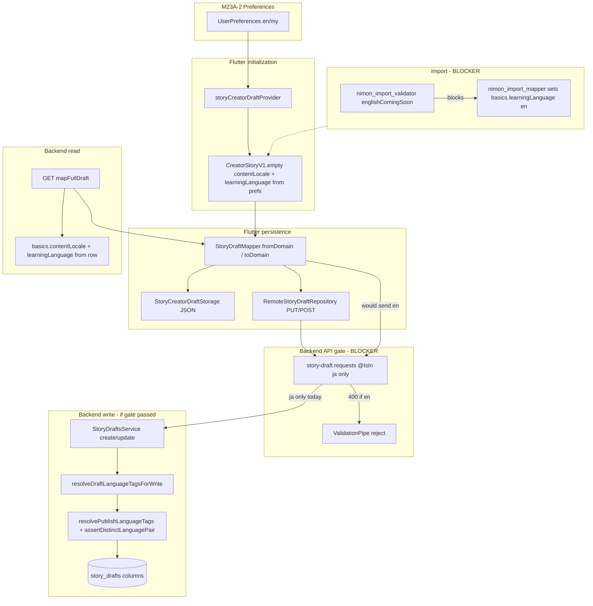

# M23A-2.5 — Draft Layer Audit (After M23A-2 Phase 1)

**Phase:** M23A-2.5 (investigation only)  
**Prerequisites:** [`M23A0_LEARNING_ENGLISH_EXPANSION_AUDIT.md`](M23A0_LEARNING_ENGLISH_EXPANSION_AUDIT.md), [`M23A1_ENGLISH_LEARNING_IMPLEMENTATION_PLAN.md`](M23A1_ENGLISH_LEARNING_IMPLEMENTATION_PLAN.md), [`M23A2_PHASE1_PREFS_AND_LANGUAGE_PAIR_REPORT.md`](M23A2_PHASE1_PREFS_AND_LANGUAGE_PAIR_REPORT.md)  
**Constraint:** No code changes, migrations, or tests.

**Scope:** Story draft persistence, loading, initialization, creator provider, DTOs, draft API, import → draft mapping.  
**Out of scope:** publish, feed, collections, reader, HTML generator, search, recommendation.

---

## Executive answer

If a user sets **Settings → Learning language = English** and **Content community = Myanmar** (`en` + `my`), then creates or saves a draft today:

| Step | `learningLanguage=en` + `contentLocale=my` |
|------|---------------------------------------------|
| In-memory creator session | **Works** — provider seeds from prefs |
| Local SharedPreferences save/reload | **Tags lost** — `contentLocale` / `learningLanguage` not in local JSON |
| Remote `POST`/`PUT` `/v1/story-drafts` | **Fails first** — HTTP **400** (`learningLanguage` `@IsIn(['ja'])`) |
| Hidden JSON import | **Fails earlier** — `import.context.englishComingSoon` (unchanged in M23A-2) |
| Reload from server after remote save | **N/A** — remote save with `en` never succeeds |

**What breaks first (typical strict-remote path):** `PUT /v1/story-drafts/:id` body includes `basics.learningLanguage: "en"` → Nest `ValidationPipe` rejects before `StoryDraftsService` runs.

**What breaks first (import path):** `nimon_import_validator` `_validateAppContext` → `englishComingSoon` (before mapper).

---

## A. Data flow diagram

**Legend**

- **Green path (M23A-2):** prefs → in-memory draft basics can hold `en` / `my`.
- **Red gates:** request DTO `ja`-only; import `englishComingSoon`.
- **Yellow gap:** local storage omits language columns on basics JSON.

---

## B. Draft lifecycle

| Stage | Entry | Language handling | `en` + `my` today |
|-------|--------|-------------------|-------------------|
| **1. New session** | `StoryCreatorDraftNotifier` ctor / `startNewLocalDraft` | `defaultContentLocale` + `defaultLearningLanguage` from `userPreferencesNotifierProvider` (M23A-2 can be `en`) | In-memory **yes** |
| **2. Local create** | `LocalStoryDraftRepository.createNewDraft` | `CreatorStoryV1.empty()` — **no** locale args | basics `contentLocale` / `learningLanguage` **null** |
| **3. Local save** | `StoryCreatorDraftStorage._toJsonBasics` | Persists title, level, etc. — **no** `contentLocale` / `learningLanguage` | Tags **dropped** on disk |
| **4. Local load** | `StoryCreatorDraftStorage._fromJsonBasics` | Does not read locale fields | Reload → **null** tags (content unchanged) |
| **5. Remote save** | `RemoteStoryDraftRepository.saveDraft` → `StoryDraftMapper.fromDomain` | DTO includes `basics.learningLanguage` from domain | **400** if `en` |
| **6. Remote create shell** | `POST /v1/story-drafts` | `resolveDraftLanguageTagsForWrite` over `req.basics` + prefs; pair assert | If body omits tags: uses prefs (`en`+`my` OK). If body sends `en`: **400** at DTO |
| **7. Remote update** | `PUT /v1/story-drafts/:id` | Same tag resolution; overwrites row `contentLocale` / `learningLanguage` | **400** when body has `learningLanguage: en` |
| **8. Remote load** | `GET` → `mapFullDraft` | Returns DB columns on `basics` | Only if row was ever written with `en` (not via current Flutter PUT) |
| **9. Import** | Hidden JSON → validate → map → `importMappedDraft` | Mapper sets `learningLanguage` from meta | **Blocked** at validator |
| **10. List summary** | `DraftListSummaryDto` from domain or API | Pass-through `contentLocale` / `learningLanguage` | Shows tags only if present on loaded domain |

### `resolveDraftLanguageTagsForWrite` (not publish — draft column write)

Used on **create** and **update** only (`story-drafts.service.ts`). Calls `resolvePublishLanguageTags` (shared with publish stamping in later phases):

- Draft basics values used when `normalizeV1LearningLanguage` / `normalizeV1ContentLocale` recognize wire codes.
- After M23A-2, `en` is recognized in **normalization** (foundation), but **HTTP body cannot send `en`** until DTO updated.
- Invalid draft wire → falls back to **user prefs**, then defaults (`en` / `ja`).
- **Pair rule:** `assertDistinctLanguagePair` — would reject `en`+`en` on write if both resolved to `en`.

This is **not** “silent `en` → `ja` coercion” when client sends valid `en`; it is **hard rejection** at validation. Coercion to `ja` happens only for **unrecognized** learning strings via `safeV1LearningLanguage`.

---

## C. Japanese assumptions (draft layer)

### C.1 Request / gate (hard blockers for `en`)

| Location | Assumption |
|----------|------------|
| `story-draft.requests.ts` `CreateDraftBasicsDto` | `@IsIn(['ja'])` on `learningLanguage` |
| `story-draft.requests.ts` `StoryDraftBasicsWriteDto` | `@IsIn(['ja'])` on `learningLanguage` |

### C.2 Draft save validators (backend)

| Validator | Applies on draft save? | Japanese-specific? |
|-----------|------------------------|-------------------|
| `validateStoryTitle` / `validateStoryDescription` | Yes (create/update basics) | Language-agnostic |
| Furigana / kanji / reading | **No** on draft PUT | N/A at draft layer |
| JLPT / HTML sentence limits | **No** on draft PUT | N/A at draft layer |

Sentence/vocab/grammar/quiz bodies are stored as **JSON blobs** without draft-time language branching.

### C.3 Content shape (Japanese-oriented field names)

| Field / module | Storage | Validated on draft save? |
|----------------|---------|-------------------------|
| `japaneseText` | `DraftSentence.content` | No |
| `furiganaSpans`, `reading` | sentence JSON | No |
| `termJapanese`, `reading`, `type: kanji` | vocab JSON | No |
| Grammar `japanese` / example `jp` | grammar JSON | No |
| `level` (JLPT-style e.g. `N5`) | draft row + basics | No format check on draft |
| LM1 id `vocabulary_kanji` | module workflow map | Label only |

English learning can **store** Latin text in `japaneseText` / `termJapanese` today without draft API rejecting content — only **metadata** `learningLanguage=en` is blocked at HTTP.

### C.4 Flutter creator (ignores `learningLanguage` for UX/rules)

| Area | Behavior |
|------|----------|
| `resolveHtmlCreatorReadinessContext` | Default `HtmlLearningLanguage.jp`; does **not** read `draft.basics.learningLanguage` |
| Sentence editor | Furigana UI, “Japanese sentence” copy |
| Vocab / Kanji editor | Kanji segment, furigana reading fields |
| Grammar editor | `jp` text controllers |
| `CreateStoryBasicsForm` | No learning-language control (comes from Settings only) |
| `creator_draft_validation.dart` | Title/category/level only |

### C.5 Import

| Check | English impact |
|-------|----------------|
| `englishComingSoon` | Blocks all English imports |
| HTML rules validator | Early return for `HtmlLearningLanguage.en` (no EN limit checks) |
| Context `learningLanguageMismatch` | Requires import meta learning = prefs (prefs can be `en` after M23A-2, but English meta still blocked by coming-soon) |

---

## D. Safe areas (already compatible structurally)

| Layer | Why safe for `en` metadata |
|-------|----------------------------|
| Prisma `story_drafts.contentLocale` / `learningLanguage` | Nullable `TEXT` — no enum |
| `story-draft.dto.ts` response | `string \| null` on basics |
| `StoryDraftBasicsDto` / `StoryBasics` (Flutter) | Optional strings |
| `story_draft_mapper.dart` | Round-trip `contentLocale` / `learningLanguage` on DTO ↔ domain |
| `mapFullDraft` (backend) | Reads/writes DB columns to `basics` |
| `language-pair-validation` (M23A-2) | `normalizeV1LearningLanguage('en')` → `en`; pair assert generic |
| `DraftListSummaryDto` | Lists tags when present on domain |
| Draft content JSON | Schema-less maps — English sentences fit in existing keys |

---

## E. Required files for M23A-3 (draft + import metadata)

### E.1 Must change (API gate + parity)

| File | Change |
|------|--------|
| `nimon-backend/src/modules/story-drafts/dto/story-draft.requests.ts` | `@IsIn(['ja','en'])` (or import `V1_LEARNING_LANGUAGES`) |
| `lib/features/create/import/nimon_import_validator.dart` | Remove `englishComingSoon`; run EN HTML rules when meta is English |
| `test/features/create/nimon_import_validator_test.dart` | Replace coming-soon expectations with EN happy paths |
| `test/features/create/nimon_import_html_rules_validator_test.dart` | EN limit enforcement |
| `test/features/create/nimon_import_read_only_flow_test.dart` | EN flow |

### E.2 Must change (persistence gap — not in M23A-1 plan explicitly)

| File | Change |
|------|--------|
| `lib/features/create/story_creator_draft_storage.dart` | `_toJsonBasics` / `_fromJsonBasics` persist `contentLocale` + `learningLanguage` |

Without this, **local-only reload loses language tags** even after DTO fix.

### E.3 Should change (tests + docs)

| File | Change |
|------|--------|
| `test/features/create/story_draft_language_defaults_test.dart` | Add `en` round-trip |
| New or extended backend spec | `PUT`/`POST` with `learningLanguage: en`, `en+en` → 400 |
| `nimon-backend/src/modules/story-drafts/story-drafts.service.spec.ts` | Create/update row stamps `en` when basics + prefs allow |

### E.4 Should change (import wiring)

| File | Change |
|------|--------|
| `lib/features/create/import/nimon_import_mapper.dart` | Already maps `en` — verify only |
| `lib/features/create/import/nimon_hidden_json_import_flow.dart` | Context uses prefs `en` — verify after validator open |
| `lib/features/create/story_creator_provider.dart` | No change strictly required for M23A-3 metadata if storage + API fixed |

### E.5 Defer to later phases (document only — do not fix in M23A-3)

| File | Reason |
|------|--------|
| `lib/core/validation/publish_validation.dart` | Publish phase |
| `nimon-backend/src/common/validation/publish-validation.ts` | Publish phase |
| `lib/features/create/creator_completion_rules.dart` | Readiness JP HTML default |
| Creator sentence/vocab/grammar screens | M23A-5 UI branching |
| `published-mono-catalog-locale.ts` | M23A-6 feed |

### E.6 Optional M23A-3 (pair assert on draft body)

| File | Change |
|------|--------|
| `story-drafts.service.ts` | Map `language_pair_same_not_allowed` on `resolveDraftLanguageTagsForWrite` failure (today may surface as generic 500 if pair throws uncaught — verify controller) |

---

## F. Risks

| Risk | Severity | Description |
|------|----------|-------------|
| **DTO `ja`-only** | **Critical** | First hard failure on any remote save with prefs `en` |
| **Import `englishComingSoon`** | **Critical** | No English JSON → draft path |
| **Local storage drops locale tags** | **High** | Reload/workspace list loses `en`/`my` on device-only path |
| **Prefs `en` + remote save** | **High** | User thinks English learning is “on” but draft never syncs |
| **`resolvePublishLanguageTags` on draft write** | **Medium** | After DTO fix, wrong/missing basics + bad prefs could throw pair error — need clear 400 |
| **Readiness still JP** | **Medium** | Misleading progress counts for English drafts (not draft-save blocker) |
| **Field names `japaneseText`** | **Low** | Confusing for authors; not a data-loss issue |
| **Manual DB `en` row + old Flutter** | **Low** | GET returns `en`; PUT from old app still 400 |

### Regression risks for M23A-3

- Removing `englishComingSoon` without HTML EN rules → import false positives/negatives.
- Allowing `en` on DTO without pair check on draft basics → `en`+`en` rows if prefs buggy.
- Fixing storage without migration → old local drafts lack tags until re-saved (acceptable).

---

## G. Recommended implementation order (M23A-3)

Aligns with [`M23A1`](M23A1_ENGLISH_LEARNING_IMPLEMENTATION_PLAN.md) Phase 2, with **local storage** called out explicitly.

| Order | Task | Rationale |
|-------|------|-----------|
| **1** | Extend `story-draft.requests.ts` to `ja` \| `en` | Unblocks remote persistence |
| **2** | Backend tests: POST/PUT `en+my`, reject `en+en` | Lock API contract |
| **3** | Remove `englishComingSoon`; enable EN branch in import HTML validator | Unblocks import |
| **4** | Import tests + fixture JSON (`en` + `my`) | Prevent regressions |
| **5** | Fix `story_creator_draft_storage` basics JSON | Local reload parity |
| **6** | Flutter test: domain `en` survives local save/load | Catches gap (5) |
| **7** | Verify `importMappedDraft` → `saveDraft` E2E with prefs `en` | Confirms stack |

**Do not** in M23A-3: publish validation, catalog feed, furigana UI, readiness JP defaults.

---

## Question-by-question reference

### Which draft fields still assume Japanese-only content?

- **Wire/content keys:** `japaneseText`, `termJapanese`, `furiganaSpans`, vocab `type: kanji`, grammar example `jp`.
- **Module id:** `vocabulary_kanji`.
- **Level:** JLPT-style values expected by readiness/HTML later, not enforced on draft save.

### Which draft validators still assume kana / kanji / furigana / JLPT?

- **On draft create/update (backend):** **None** for furigana/kanji/kana/JLPT.
- **On import (Flutter):** HTML/JLPT rules for **Japanese** meta only; English meta skips HTML rules (early return) and is blocked by `englishComingSoon`.
- **In creator UI:** Furigana/kanji UX always on (not validators).

### DTOs that support English safely

| DTO | Safe? |
|-----|-------|
| `StoryDraftDto` / `StoryDraftBasicsDto` (Flutter) | Yes — optional strings |
| `story-draft.dto.ts` response basics | Yes |
| `DraftListSummaryDto` | Yes |

### DTOs that would silently coerce `en` → `ja`

| Location | Coercion? |
|----------|-----------|
| `story-draft.requests.ts` | **No** — rejects `en` (400), does not coerce |
| `resolvePublishLanguageTags` | Coerces **unknown** codes → default `ja`; valid `en` → `en` |
| `auth.service` GET prefs | Uses `safeV1LearningLanguage` (M23A-2) — invalid → `ja` |
| Flutter `_parsePreferences` | `safeLearningLanguageWireCode` — invalid → `ja` |
| Local `_fromJsonBasics` | **Drops** tags (null), does not coerce to `ja` |

### Creator screens: read vs ignore `learningLanguage`

| Screen / module | Reads `learningLanguage`? |
|-----------------|---------------------------|
| Settings | Yes (prefs) |
| `story_creator_provider` | Seeds new draft from prefs only |
| `CreateStoryBasicsForm` / basics screens | **Ignore** |
| `story_creator_sentences_screen` | **Ignore** |
| `story_creator_vocab_kanji_editor_screen` | **Ignore** |
| `story_creator_grammar_editor_screen` | **Ignore** |
| Quiz / audio editors | **Ignore** |
| `creator_completion_rules` / progress drawer | **Ignore** (JP HTML readiness) |
| Import flow | Uses **prefs** in validation context, not draft |

### Can draft be saved as `learningLanguage=en`, `contentLocale=my` without losing data?

| Path | Save? | Reload? | Content loss? |
|------|-------|---------|---------------|
| In-memory session | Yes | Same session yes | No |
| Local SP | Saves sentences/vocab/etc. | Locale tags **lost** | Language metadata lost locally |
| Remote API | **No** (400) | N/A | N/A |
| Import | **No** (coming soon) | N/A | N/A |

### Same draft reloaded correctly?

- **From GET (server):** Yes **if** row contains `en`/`my` (only via direct DB/API bypass today).
- **From local storage:** **No** for language tags (fields not serialized).
- **From mapper after GET:** Yes — `StoryDraftMapper.toDomain` preserves basics tags.

---

## Final verification (investigation-only)

| Item | Status |
|------|--------|
| Code modified | **None** |
| Migrations | **None** |
| Tests added | **None** |
| Focus | Draft layer only; publish/feed/import behavior described as-is |

---

*M23A-2.5 complete — investigation only.*
