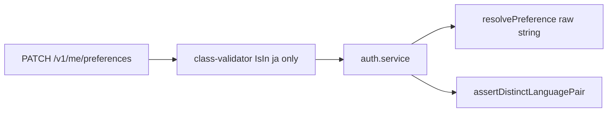
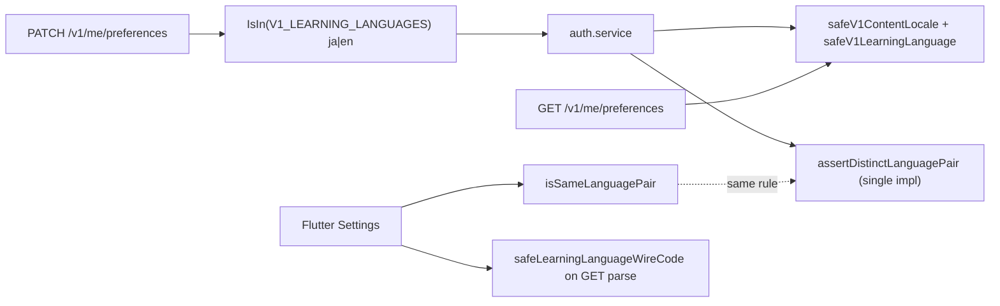

# M23A-2 — Phase 1: Preferences & Language Pair Report

**Phase:** M23A-2 (implementation)  
**Scope:** Preferences + shared language-pair foundation only  
**Prerequisites:** [`M23A0_LEARNING_ENGLISH_EXPANSION_AUDIT.md`](M23A0_LEARNING_ENGLISH_EXPANSION_AUDIT.md), [`M23A1_ENGLISH_LEARNING_IMPLEMENTATION_PLAN.md`](M23A1_ENGLISH_LEARNING_IMPLEMENTATION_PLAN.md)

---

## Investigation summary (pre-change)

| Location | Current (before) | Change | Downstream impact |
|----------|------------------|--------|-------------------|
| `me-preferences.dto.ts` `LEARNING_LANGUAGES` | `['ja']` | Import `V1_LEARNING_LANGUAGES` → `['ja','en']` | PATCH/GET types allow `en` |
| `language-pair-validation.ts` | `V1LearningLanguage = 'ja'` only | Add `en`; export `V1_LEARNING_LANGUAGES` | **Shared** `assertDistinctLanguagePair` / `safeV1LearningLanguage` used by prefs PATCH; `resolvePublishLanguageTags` can now *parse* `en` if present on draft/pref strings — **no publish service edits** |
| `auth.service.ts` GET/PATCH response | `resolvePreference` (raw DB strings) | `safeV1ContentLocale` / `safeV1LearningLanguage` on read paths | Invalid DB values fall back to defaults; `en` returned when stored |
| `settings_screen.dart` | Japanese only + “More languages” disabled | Japanese + English; hide `en` community when learning `en`; block same pair on learning pick | UI only |
| `language_pair.dart` | `isSameLanguagePair` only | Add `safeLearningLanguageWireCode` | Flutter GET parse aligns with backend |
| `user_preferences_repository.dart` | Unsanitized `learningLanguage` pick | `safeLearningLanguageWireCode` on parse | Client state matches server allow-list |

**Intentionally unchanged (Phase 1 non-goals):** draft DTO `@IsIn(['ja'])`, import `englishComingSoon`, `publish-validation` JP hardcode, `published-mono-catalog-locale`, feed services, creator readiness, furigana, reader, collections.

---

## 1. Files changed

### Backend

| File | Change |
|------|--------|
| `nimon-backend/src/common/validation/language-pair-validation.ts` | `V1_LEARNING_LANGUAGES`, `en` in `normalizeV1LearningLanguage` |
| `nimon-backend/src/common/validation/language-pair-validation.spec.ts` | `en+my`, `en+ja`, `en+en`, normalize tests |
| `nimon-backend/src/modules/auth/dto/me-preferences.dto.ts` | `LEARNING_LANGUAGES` from `V1_LEARNING_LANGUAGES` |
| `nimon-backend/src/modules/auth/auth.service.ts` | GET/PATCH response uses `safeV1*` for locale tags |
| `nimon-backend/src/modules/auth/me.profile.controller.spec.ts` | `en` PATCH happy path; `en+en` reject; invalid `ko` |

### Flutter

| File | Change |
|------|--------|
| `lib/core/settings/language_pair.dart` | `safeLearningLanguageWireCode`, `v1LearningLanguageWireCodes` |
| `lib/features/settings/data/user_preferences_repository.dart` | Parse learning via `safeLearningLanguageWireCode` |
| `lib/features/settings/settings_screen.dart` | English option; community hide `en` when learning `en`; pair guard on learning pick |
| `test/core/settings/language_pair_test.dart` | EN pair + sanitize tests |
| `test/features/settings/settings_screen_test.dart` | English UI + patch test |

### Documentation

| File | Change |
|------|--------|
| `docs/M23A2_PHASE1_PREFS_AND_LANGUAGE_PAIR_REPORT.md` | This report |

---

## 2. Validation architecture

### Before



- Pair rule: `assertDistinctLanguagePair` in `language-pair-validation.ts` (backend only on PATCH).
- Flutter: `isSameLanguagePair` in Settings only (client guard).

### After



**Single pair rule (canonical):** `assertDistinctLanguagePair(contentLocale, learningLanguage)` — `contentLocale === learningLanguage` → `BadRequestException('language_pair_same_not_allowed')`.

**Allow-list (canonical):** `V1_LEARNING_LANGUAGES` / `normalizeV1LearningLanguage` / `safeV1LearningLanguage` (backend); `safeLearningLanguageWireCode` (Flutter parse only).

**No duplicate pair validators added.** Flutter `isSameLanguagePair` remains the UX guard before PATCH; backend enforces on PATCH.

---

## 3. Allowed matrix

| learningLanguage | contentLocale | Result |
|------------------|---------------|--------|
| `ja` | `my` | Allowed |
| `ja` | `en` | Allowed |
| `ja` | `ja` | **Rejected** |
| `en` | `my` | Allowed |
| `en` | `ja` | Allowed |
| `en` | `en` | **Rejected** |

---

## 4. Rejected matrix

| Input | Layer | Outcome |
|-------|--------|---------|
| `learningLanguage: 'ko'` (or any not in `ja`/`en`) | DTO `@IsIn` | `400` `learningLanguage_invalid` |
| `learningLanguage: 'en'` + `contentLocale: 'en'` | `assertDistinctLanguagePair` on PATCH | `400` `language_pair_same_not_allowed` |
| `contentLocale: 'ja'` + `learningLanguage: 'ja'` | Same | `400` `language_pair_same_not_allowed` |
| Settings pick English while community is `en` | Flutter `isSameLanguagePair` | Snackbar; no PATCH |
| Settings pick International English while learning is `en` | Option hidden + pick guard | Snackbar if forced via stale state |
| DB `learningLanguage: 'invalid'` on GET | `safeV1LearningLanguage` | Response `ja` (default) |

---

## 5. Migration analysis

| Question | Answer |
|----------|--------|
| Schema migration required? | **No** — `user_preferences.learningLanguage` is already nullable `TEXT`. |
| Prisma enum? | **No** |
| Data backfill? | **No** — existing rows stay `ja` or null. |
| Index impact? | **None** on preferences table. |

Optional future migration (not in Phase 1): CHECK constraint on learning language — not needed for V1.

---

## 6. Tests added

### Backend

| Test | File |
|------|------|
| `allows en + my` | `language-pair-validation.spec.ts` |
| `allows en + ja` | `language-pair-validation.spec.ts` |
| `rejects en + en` | `language-pair-validation.spec.ts` |
| `normalizeV1LearningLanguage accepts en` | `language-pair-validation.spec.ts` |
| `PATCH accepts learningLanguage en when contentLocale is my` | `me.profile.controller.spec.ts` |
| `PATCH rejects en+en language pair` | `me.profile.controller.spec.ts` |
| Renamed: `PATCH rejects invalid learningLanguage wire code` (`ko`) | `me.profile.controller.spec.ts` |

### Flutter

| Test | File |
|------|------|
| `detects en+en as same pair` | `language_pair_test.dart` |
| `allows en+my` / `allows en+ja` | `language_pair_test.dart` |
| `safeLearningLanguageWireCode normalizes en and falls back unknown` | `language_pair_test.dart` |
| `Learning Language selector shows Japanese and English` | `settings_screen_test.dart` |
| `Learning Language English patches learningLanguage en` | `settings_screen_test.dart` |

---

## 7. Tests executed

### Backend

```text
cd nimon-backend
node_modules\.bin\jest.cmd language-pair-validation.spec.ts me.profile.controller.spec.ts --no-cache
```

**Result:** Test Suites: **2 passed**, 2 total — Tests: **38 passed**, 38 total

### Flutter

```text
cd nimon
flutter test test/core/settings/language_pair_test.dart test/features/settings/settings_screen_test.dart
```

**Result:** **18 passed**, 0 failed (7 + 11 tests)

---

## 8. Remaining blockers (end-to-end English learning)

| Blocker | Phase |
|---------|--------|
| Draft API `@IsIn(['ja'])` — cannot save `learningLanguage=en` on drafts | M23A-3 |
| Import `import.context.englishComingSoon` | M23A-3 |
| Publish / import HTML validation hardcoded `HtmlLearningLanguage.jp` | M23A-4 |
| Furigana / kanji validators not conditional | M23A-5 |
| `CatalogLearningLanguage = 'ja'` — feed hides `en` monos | M23A-6 |
| Creator readiness defaults JP HTML context | M23A-5 |
| LM1 “Vocabulary / Kanji” UI; sentence furigana editor | M23A-5 |
| Search without catalog learning filter (asymmetry) | Product / optional M23A-6 |

**Phase 1 note:** Users may set prefs to `en+my` or `en+ja`, but creating/publishing English stories and seeing them in For You still blocked until later phases.

**Foundation side effect:** `resolvePublishLanguageTags` now recognizes wire `en` if it appears on draft/pref inputs. Publish services were **not** modified; draft writes still cannot send `en` via API.

---

## Final verification

### 1. Files changed

Listed in §1 (10 code files + this doc).

### 2. Files intentionally not changed

- `nimon-backend/src/modules/story-drafts/dto/story-draft.requests.ts`
- `nimon-backend/src/modules/published-monos/published-mono-catalog-locale.ts`
- `nimon-backend/src/modules/mono-feed/mono-feed.service.ts`
- `nimon-backend/src/common/validation/publish-validation.ts`
- `lib/features/create/import/nimon_import_validator.dart`
- `lib/core/validation/publish_validation.dart`
- `lib/features/create/creator_completion_rules.dart`
- `tool/html_generator/*`
- All furigana / reader / collection modules

### 3. Out-of-scope code touched?

**No.** Only preferences DTO/auth, shared `language-pair-validation` allow-list (used by existing prefs PATCH path), Settings UI, and related tests.

### 4. Why Phase-1-only?

This phase establishes **legal learning codes** and **pair invariants** in prefs + shared validators without changing catalog filters, publish gates, import, or content editors. That prevents half-enabled English (wrong feed bucket or publish limits) while allowing QA to validate Settings and API for `ja` / `en` pairs per M23A1 Phase 1 plan.

---

## Acceptance criteria checklist

| Criterion | Status |
|-----------|--------|
| Preferences accept `ja` and `en` | Yes |
| Settings UI: Japanese + English (no “More languages” coming soon) | Yes |
| `learningLanguage != contentLocale` enforced | Yes (backend + Flutter UI) |
| Existing Japanese behavior unchanged | Yes (`ja` default; `ja+my` / `ja+en` still valid) |
| No feed changes | Yes |
| No publish changes | Yes (no publish module edits) |
| No import changes | Yes |
| No HTML validation changes | Yes |
| No furigana changes | Yes |
| Affected tests pass | Yes (38 + 18) |

---

*M23A-2 Phase 1 complete.*
