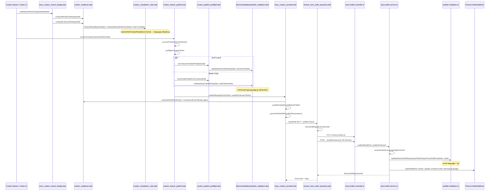
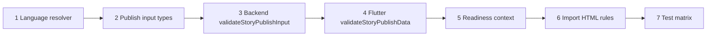

# M23A-3.5 — English Learning Publish Layer Audit (After Draft Foundation)

**Phase:** M23A-3.5 (investigation only)  
**Scope:** Creator readiness → publish preflight → client/server publish validation → PublishedMono stamping  
**Out of scope:** Feed, catalog filtering, collections, search, reader UI, furigana rendering, public profile, home mono  
**Prerequisites:** [`M23A0_LEARNING_ENGLISH_EXPANSION_AUDIT.md`](M23A0_LEARNING_ENGLISH_EXPANSION_AUDIT.md), [`M23A1_ENGLISH_LEARNING_IMPLEMENTATION_PLAN.md`](M23A1_ENGLISH_LEARNING_IMPLEMENTATION_PLAN.md), [`M23A2_PHASE1_PREFS_AND_LANGUAGE_PAIR_REPORT.md`](M23A2_PHASE1_PREFS_AND_LANGUAGE_PAIR_REPORT.md), [`M23A25_DRAFT_LAYER_AUDIT_AFTER_PHASE1.md`](M23A25_DRAFT_LAYER_AUDIT_AFTER_PHASE1.md), [`M23A3_DRAFT_AND_IMPORT_FOUNDATION_REPORT.md`](M23A3_DRAFT_AND_IMPORT_FOUNDATION_REPORT.md)

---

## Executive summary

After **M23A-3**, `learningLanguage=en` drafts **persist and import** correctly. **Publish** still treats every story as **Japanese HTML rules** (`HtmlLearningLanguage.jp` / `'jp'`) at validation time, while **creator readiness** also defaults to **JP** limits because it never reads `draft.basics.learningLanguage`.

**PublishedMono stamping** already writes `contentLocale` and `learningLanguage` from `resolvePublishLanguageTags` — **`en` can survive on the row** if validation passes.

The practical outcome for `learningLanguage=en`, `contentLocale=my`:

| Content profile | Read-only publish | Full Learn publish |
|-----------------|-------------------|-------------------|
| Typical EN import (24 short lines, ~360 chars in `japaneseText`) | May **pass** readiness + validation (JP char band) but is **under EN minimum** if rules were correct | Blocked by JP vocab/quiz/furigana/module gates unless shaped like JP Full Learn |
| Realistic EN prose (e.g. 1200–2000 chars) | **Blocked** locally (`Too many Japanese chars`) before HTTP | Same + learn module mismatches |
| API-only bypass of client readiness | Server still runs `validateStoryPublishInput` with **`language: 'jp'`** | Same |

**M23A-4** must wire **draft/prefs `learningLanguage` → `HtmlLearningLanguage`** through readiness, preflight, and both publish validators. Stamping is largely **ready**; validation and readiness are the blockers.

---

## A. Publish flow diagram

Assumption: author taps **Read Only** or **Full Learn** in the creator drawer with a remote-backed draft.

### File → function map (ordered)

| Step | File | Function(s) |
|------|------|-------------|
| Review snapshot | `lib/features/create/story_creator_review_display.dart` | `buildStoryReviewDisplayModel`, `isStoryReviewModeAllowed` |
| Readiness gate | `lib/features/create/creator_readiness.dart` | `computeReadOnlyReady`, `computeFullLearnReady`, `computeProcessingState` |
| Thresholds / HTML readiness | `lib/features/create/creator_completion_rules.dart` | `resolveHtmlCreatorReadinessContext`, `computeStorySentencesStatus`, `computeVocabularyStatus`, `computeGrammarStatus`, `computeQuizStatus`, `computeListeningStatus`, `computeStoryBasicsStatus` |
| Drawer publish | `lib/features/create/creator_drawer_publish.dart` | `performCreatorDrawerPublish`, `_preflightCreatorPublish` |
| Full Learn preflight | `lib/features/create/creator_publish_preflight.dart` | `runFullLearnPublishPreflight`, `storyPublishDataFromCreator` |
| Client publish validation | `lib/core/validation/publish_validation.dart` | `validateStoryPublishData`, `extractStorySentenceMetrics` |
| Notifier publish | `lib/features/create/story_creator_provider.dart` | `publishReadingOnlyToDisk`, `publishFullLearnToDisk`, `_persistPublishWithConflictRetry`, `_awaitPendingPersistBeforePublish` |
| Remote I/O | `lib/features/create/data/remote_story_draft_repository.dart` | `saveDraft`, `_postPublishReadOnlyHttp`, `_postPublishFullLearnHttp` |
| HTTP | `nimon-backend/src/modules/story-drafts/story-drafts.controller.ts` | `publishReadOnly`, `publishFullLearn` |
| Service | `nimon-backend/src/modules/story-drafts/story-drafts.service.ts` | `publishReadOnly`, `publishFullLearn`, `resolvePublishLanguageTagsForDraft`, `resolveDraftLanguageTagsForWrite` |
| Server publish validation | `nimon-backend/src/common/validation/publish-validation.ts` | `validateStoryPublishInput`, `storyPublishInputFromDraftRow` |
| Limits lookup | `lib/core/limits/html_generator_limits.dart`, `nimon-backend/src/common/limits/html-generator-limits.ts` | `sentenceLimit`, `vocabularyLimit`, `grammarLimit`, `quizLimit`, `selectedFullLearnLimits` |
| Stamp | `nimon-backend/src/modules/story-drafts/story-drafts.service.ts` | `tx.publishedMono.create` / `update` inside publish transactions |
| Pair resolution | `nimon-backend/src/common/validation/language-pair-validation.ts` | `resolvePublishLanguageTags`, `assertDistinctLanguagePair` |

---

## B. English publish failure points (`learningLanguage=en`, `contentLocale=my`)

Trace assumes: prefs `en+my`, draft row tags `en`/`my`, sentences stored in `japaneseText` (V1 field name unchanged).

### Blocker matrix

| ID | Layer | File | Function / line region | Behavior | Severity |
|----|-------|------|------------------------|----------|----------|
| B1 | Readiness | `creator_completion_rules.dart` | `resolveHtmlCreatorReadinessContext` (~117–127) | Never sets `language` from `draft.basics.learningLanguage`; `HtmlCreatorReadinessContext` defaults **`HtmlLearningLanguage.jp`** | **Critical** |
| B2 | Readiness | `creator_completion_rules.dart` | `computeStorySentencesStatus` (~413–475) | Uses `ctx.language` → **JP** sentence/char limits; messages say **"Japanese chars"** | **Critical** |
| B3 | Readiness | `creator_completion_rules.dart` | `computeVocabularyStatus` / `computeGrammarStatus` / `computeQuizStatus` | Learn counts use **JP** `LEARN_LIMITS` branch (EN tables exist but unused) | **High** (Full Learn) |
| B4 | Readiness | `creator_readiness.dart` | `computeReadOnlyReady` / `computeFullLearnReady` | No `learningLanguage` input; gates publish buttons via `story_creator_provider` | **Critical** |
| B5 | Client validation | `publish_validation.dart` | `validateStoryPublishData` (~287–291, 350–445) | **`language: HtmlLearningLanguage.jp`** for all HTML limit lookups | **Critical** |
| B6 | Client validation | `publish_validation.dart` | `extractStorySentenceMetrics` | Counts chars in `japaneseText` (OK for EN text in field) but compares to **JP** `minChars`/`maxChars` | **Critical** |
| B7 | Client validation | `publish_validation.dart` | Full Learn loop (~583–596) | **`validateFurigana`** on vocab with `termJapanese` / kanji rules | **High** |
| B8 | Client validation | `publish_validation.dart` | `fullLearnModulesComplete` | Requires workflow keys `vocabulary_kanji`, `grammar`, `quiz`, `audio` = `completed` | **High** |
| B9 | Preflight data | `creator_publish_preflight.dart` | `storyPublishDataFromCreator` | **`StoryPublishData` has no `learningLanguage`** — cannot pass EN into validator | **Critical** |
| B10 | Preflight debug | `creator_drawer_publish.dart` | `_preflightCreatorPublish` (~79–85) | Debug AI quiz expectations use **`HtmlLearningLanguage.jp`** | Low (debug only) |
| B11 | Server validation | `publish-validation.ts` | `validateStoryPublishInput` (~240) | **`const language: HtmlLearningLanguage = 'jp'`** | **Critical** |
| B12 | Server adapter | `publish-validation.ts` | `storyPublishInputFromDraftRow` (~583+) | Maps draft row **without** `learningLanguage` into validation input | **Critical** |
| B13 | Notifier gate | `story_creator_provider.dart` | `publishReadingOnlyToDisk` / `publishFullLearnToDisk` (~930, 987) | Returns early if `compute*Ready` false | **Critical** (UX) |
| B14 | Import (adjacent) | `nimon_import_validator.dart` | `_validateHtmlRulesForReadOnly` (~303–305) | **`if (learningLanguage == HtmlLearningLanguage.en) return`** — EN imports skip HTML rules (not publish, but shapes drafts) | **Medium** |
| B15 | Messages | `validation_fallback_messages.dart` | `story.sentences.required` | Copy: **"Add at least one Japanese sentence"** | Low |
| B16 | Mis-validation | B5 + B6 | — | Short EN body may **pass JP** char window (e.g. ~360 chars) while failing true EN minimum (~900+) | **High** (data quality) |
| B17 | Mis-validation | B5 + B6 | — | Long EN body **fails** JP max chars → publish blocked with `publish.htmlRules.storyCharsTooMany` | **Critical** |
| B18 | Stamp | `language-pair-validation.ts` | `resolvePublishLanguageTags` | **`en+en` rejected** at stamp (not `en+my`) | **High** (mis-tagged drafts only) |
| B19 | Stamp | — | — | **`en` not coerced to `ja`** on successful publish (M23A-3 verified on draft write; publish uses same resolver) | Ready |

### Coercion / mis-classification summary

| Question | Answer |
|----------|--------|
| Reject `en` at HTTP? | No — DTO and draft row accept `en`. |
| Coerce `en` → `ja` on publish? | **No** on `PublishedMono` when publish completes. |
| Mis-classify EN as JP for rules? | **Yes** — all HTML limit lookups use **`jp`**. |
| Ignore `learningLanguage` on draft? | **Yes** in readiness + `StoryPublishData` + `storyPublishInputFromDraftRow`. |

---

## C. Readiness audit

### Files

| File | Role |
|------|------|
| `lib/features/create/creator_readiness.dart` | Aggregates module completion → `computeReadOnlyReady` / `computeFullLearnReady` |
| `lib/features/create/creator_completion_rules.dart` | HTML limit-driven module status + legacy `CreatorV1DurationThresholds` for duration presence |
| `lib/features/create/creator_publish_preflight.dart` | Publish-time validation only (not readiness) |
| `lib/features/create/story_creator_review_display.dart` | UI snapshot from readiness |

### Questionnaire

| # | Question | Answer |
|---|----------|--------|
| 1 | Does readiness read `learningLanguage`? | **No.** No reference to `draft.basics.learningLanguage` or prefs in readiness files. |
| 2 | Does readiness always assume Japanese? | **Effectively yes.** `HtmlCreatorReadinessContext.language` defaults to **`HtmlLearningLanguage.jp`** and is never overridden. |
| 3 | Are JP sentence limits always used? | **Yes** for sentence count and char count via `HtmlGeneratorLimits.sentenceLimit(..., language: ctx.language)` with `ctx.language == jp`. |
| 4 | Are JP quiz limits always used? | **Yes** for Full Learn readiness. `quizLimit` tables are **not** keyed by `HtmlLearningLanguage` (shared JP/EN quiz table in limits file). Vocab/grammar limits **are** keyed — but readiness passes **`jp`**. |
| 5 | Furigana indirectly enforced? | **Not in readiness.** Furigana is enforced at **publish validation** (Full Learn) via `validateFurigana`, not in `compute*Status`. Sentence `isValidV1` is only non-empty `japaneseText`. |

### Readiness matrix (`learningLanguage=en`, `contentLocale=my`)

| Check | Read-only path | Full Learn path | Uses EN tables? |
|-------|----------------|-----------------|-----------------|
| Basics (title, desc, level, category, duration) | Required | Required | N/A |
| Sentence count vs band | JP AI/manual limits | Same | **No** |
| Story char count | JP min/max (e.g. AI N5 3–5: 350–550) | Same | **No** (EN wants 1200–2100) |
| Vocabulary count | JP `LEARN_LIMITS.jp` | Required | **No** (`LEARN_LIMITS.en` unused) |
| Grammar count | JP branch | Required | **No** |
| Quiz distribution | Shared `QUIZ_LIMITS` | Required | Partial (quiz table has no `en`/`jp` split) |
| Listening / audio | `minListeningAudioItems` | Required | N/A |
| Module workflow `completed` | Not checked in `computeReadOnlyReady` | Checked at publish validation | N/A |

### Legacy thresholds note

`CreatorV1DurationThresholds.byBand` (8/14/20 sentences, etc.) is **not** what drives sentence readiness anymore; **HTML limits** do. Duration band still matters via `resolveV1ThresholdsForDraft` for **basics completeness** only.

---

## D. Publish validation audit

### Flutter — `lib/core/validation/publish_validation.dart`

| Topic | Finding |
|-------|---------|
| JP selection | Every `HtmlGeneratorLimits.sentenceLimit` / `vocabularyLimit` / `grammarLimit` / `selectedFullLearnLimits` call passes **`language: HtmlLearningLanguage.jp`** (lines ~289, 351–356, 441). |
| `StoryPublishData` | No `learningLanguage` / `contentLocale` fields. |
| Sentence presence | `story.sentences.required` if zero non-empty primary text lines. |
| Metrics | `extractJapanesePrimaryText` reads `japaneseText` (and aliases); char count is language-agnostic but compared to **JP** limits. |
| Full Learn extras | Module completion, per-item vocab/grammar/quiz validators, **furigana**. |

### Backend — `nimon-backend/src/common/validation/publish-validation.ts`

| Topic | Finding |
|-------|---------|
| JP selection | **`const language: HtmlLearningLanguage = 'jp'`** (line ~240). |
| Input adapter | `storyPublishInputFromDraftRow` — no `learningLanguage` on `StoryPublishValidationInput`. |
| Parity | Structure mirrors Flutter (HTML rules + learn validators). |

### Questions

| # | Question | Answer |
|---|----------|--------|
| 1 | Which path selects `HtmlLearningLanguage.jp`? | **All publish paths** — hardcoded in both validators; not derived from draft or prefs. |
| 2 | Is English supported in limit tables? | **Yes** — `SENTENCE_LIMITS[*].en` and `LEARN_LIMITS.en` in both Dart and TS limit modules. |
| 3 | Is English reachable at publish? | **No** — publish code never passes `'en'` / `HtmlLearningLanguage.en` into limit functions. |
| 4 | What happens today if `learningLanguage=en`? | Validation still uses **JP** thresholds; stamp may still persist **`en`** if validation passes. |

---

## E. HTML rules audit

### Tables present?

| Rule family | Flutter `html_generator_limits.dart` | Backend `html-generator-limits.ts` | Language split |
|-------------|--------------------------------------|-------------------------------------|----------------|
| Sentence (manual + AI) | `SENTENCE_LIMITS[mode][jp\|en][duration][level]` | `SENTENCE_LIMITS` same shape | **Complete** for EN |
| Vocabulary / Grammar | `LEARN_LIMITS[jp\|en][duration][level]` | `LEARN_LIMITS` | **Complete** for EN |
| Quiz categories | `QUIZ_LIMITS[duration][level]` | `QUIZ_LIMITS` | **No** `en`/`jp` split (shared) |
| Normalization | `normalizeHtmlLanguage` (`en`, `english`, `ja`, …) | `normalizeHtmlLanguage` in TS | Ready but **unused** in publish |

### Example (AI, 3–5 mins, N5/A1) — sentence limits

| Language | minSentences | maxSentences | minChars | maxChars |
|----------|--------------|--------------|----------|----------|
| JP (`jp`) | 24 | 38 | 350 | 550 |
| EN (`en`) | 24 | 38 | **1200** | **2100** |

Source: `lib/core/limits/html_generator_limits.dart` (~386–397) and `nimon-backend/src/common/limits/html-generator-limits.ts` (~343–350).

### Dead vs live code

| Code | Status |
|------|--------|
| EN rows in `SENTENCE_LIMITS` / `LEARN_LIMITS` | **Dead** at publish/readiness — tables exist, callers pass **`jp` only**. |
| `normalizeHtmlLanguage('en')` | **Dead** in publish pipeline. |
| Import validator EN early return | **Live** — skips HTML enforcement for EN imports (`nimon_import_validator.dart` ~303–305, ~399). |

---

## F. Publish stamp audit

### Trace

1. `StoryDraftsService.publishReadOnly` / `publishFullLearn` loads draft row (includes `contentLocale`, `learningLanguage`).
2. `resolvePublishLanguageTagsForDraft(ownerId, draft, tx)` → `resolvePublishLanguageTags` (draft fields override prefs when valid).
3. On first Read-only publish: `tx.publishedMono.create({ contentLocale, learningLanguage, ... })`.
4. Updates: `publishedMono.update` sets same tags (~1242, ~1436).

### Questions

| # | Question | Answer |
|---|----------|--------|
| 1 | Will `en` survive publishing? | **Yes**, if publish transaction completes — tags come from resolver, not from HTML language constant. |
| 2 | Will `en` be converted? | **No** — `normalizeV1LearningLanguage('en')` returns `'en'`; invalid/absent falls back to prefs/defaults, not forced `ja` when draft says `en`. |
| 3 | Will `en` be ignored? | Tags are **not** ignored on mono row; they are **ignored** by **validation** when picking limits. |
| 4 | Fail before stamp? | **Yes** — `assertNoBlockingValidationIssues(validateStoryPublishInput(...))` runs **before** `publishedMono.create`. Client readiness/preflight can block earlier. |

`publishKind` is not a separate DB column; publish mode is expressed via `publishState` on draft and `content` shape on mono (Read-only vs Full Learn).

---

## G. Validation messages (English-unsupported / JP-assumptive)

### Active at publish (blocking) — HTML / story

| Code / messageKey | Typical cause for EN draft |
|-------------------|----------------------------|
| `publish.htmlRules.levelInvalid` | Bad/missing JLPT level string |
| `publish.htmlRules.durationInvalid` | Missing `targetDurationBandKey` |
| `story.sentences.required` | No non-empty `japaneseText` lines |
| `publish.htmlRules.promptModeInvalid` | Bad prompt mode × duration × level |
| `publish.htmlRules.storySentenceTooFew` | Count below **JP** minimum |
| `publish.htmlRules.storySentenceTooMany` | Count above **JP** maximum |
| `publish.htmlRules.storyCharsTooFew` | Chars below **JP** minimum (EN prose often **1200+**) |
| `publish.htmlRules.storyCharsTooMany` | Chars above **JP** maximum (long EN prose) |
| `publish.htmlRules.vocabularyCountMismatch` | Full Learn — JP vocab counts |
| `publish.htmlRules.grammarCountMismatch` | Full Learn — JP grammar counts |
| `publish.htmlRules.quizTotalMismatch` | Full Learn |
| `publish.htmlRules.quizVocabularyMismatch` | Full Learn |
| `publish.htmlRules.quizGrammarMismatch` | Full Learn |
| `publish.htmlRules.quizSentenceMismatch` | Full Learn |

### Active at publish — learn / modules

| Code / messageKey | Notes |
|-------------------|-------|
| `learn.module.vocabulary_kanji.notCompleted` | Module workflow not `completed` |
| `learn.module.grammar.notCompleted` | Same |
| `learn.module.quiz.notCompleted` | Same |
| `learn.module.audio.notCompleted` | Same |
| `learn.module.notCompleted` | Generic |
| Learn validator codes from `validateVocabularyMeaning`, `validateFurigana`, `validateGrammarPatternTitle`, `validateQuizItem` | Furigana **JP-specific** |

### Obsolete / filtered paths

| Code | Status |
|------|--------|
| `learn.count.quiz.range` (and vocab/grammar range) | **Stripped** in `runFullLearnPublishPreflight` via `withoutLegacyFullLearnQuizRangeIssues` — legacy JLPT tables not used for publish gate. |

### Hidden fallback paths

| Path | Behavior |
|------|----------|
| `safeV1LearningLanguage` in stamp resolver | Invalid learning code → **`ja`** default when draft+prefs lack valid `en` — publish stamp only, not HTML rules. |
| `normalizeHtmlLanguage` | Not called from publish — no fallback to EN. |
| Readiness `ctx.language` default | **`jp`** silently. |

---

## H. Existing English infrastructure

### READY (usable without schema change)

| Area | Evidence |
|------|----------|
| Prefs wire | `V1_LEARNING_LANGUAGES = ['ja','en']`, Settings EN option (M23A-2) |
| Draft API / row | `@IsIn([...V1_LEARNING_LANGUAGES])`, draft `learningLanguage` persisted (M23A-3) |
| Import meta | `NimonLearningLanguage.english` → `en`; `englishComingSoon` removed (M23A-3) |
| Local draft JSON | `contentLocale` / `learningLanguage` round-trip (M23A-3) |
| Pair guard | `assertDistinctLanguagePair` / `isSameLanguagePair` |
| Publish stamp resolver | `resolvePublishLanguageTags` accepts `en`; `PublishedMono.learningLanguage` column |
| HTML config | Full **EN** sentence + learn limit tables in Dart + TS |
| Normalizers | `normalizeHtmlLanguage`, `normalizeV1LearningLanguage` |
| DTO mapping | `StoryDraftMapper` / list summaries expose `learningLanguage` |

### BLOCKED (publish-layer)

| Area | Gap |
|------|-----|
| Readiness language branch | `resolveHtmlCreatorReadinessContext` omits `learningLanguage` |
| Client publish validation | Hardcoded `HtmlLearningLanguage.jp` |
| Server publish validation | Hardcoded `'jp'` |
| Publish payload types | `StoryPublishData` / `StoryPublishValidationInput` lack language fields |
| Import HTML enforcement | EN path **returns early** — drafts can be under/over EN limits undetected |
| Furigana / `termJapanese` | Full Learn publish validators unchanged |
| User-facing copy | "Japanese sentence", "Japanese chars" in readiness/unmet strings |
| Feed/catalog | Out of scope here — still filters `learningLanguage` for discovery (later phase) |

---

## I. Phase 4 file list (M23A-4)

Do **not** implement in M23A-3.5 — inventory only.

### Critical (must change for correct EN publish)

| File | Why |
|------|-----|
| `lib/core/validation/publish_validation.dart` | Derive `HtmlLearningLanguage` from draft/prefs; pass into all limit lookups; extend `StoryPublishData` |
| `nimon-backend/src/common/validation/publish-validation.ts` | Same; extend `StoryPublishValidationInput` + `storyPublishInputFromDraftRow` |
| `lib/features/create/creator_completion_rules.dart` | `resolveHtmlCreatorReadinessContext` must map `basics.learningLanguage` → `HtmlLearningLanguage` |
| `lib/features/create/creator_publish_preflight.dart` | Pass language into `StoryPublishData` |
| `lib/features/create/import/nimon_import_validator.dart` | Remove EN early-return in HTML rules (align import with publish) |

### Required (parity, UX, tests)

| File | Why |
|------|-----|
| `lib/features/create/creator_drawer_publish.dart` | Preflight debug + ensure preflight uses language-aware path |
| `lib/core/validation/validation_fallback_messages.dart` | Neutral copy for EN (`story.sentences.required`, etc.) |
| `lib/core/validation/localized_validation_messages.dart` | Same |
| `lib/features/create/creator_readiness.dart` | Optional: EN-specific unmet copy (if not handled in completion rules) |
| `test/core/validation/publish_html_rules_validation_test.dart` | EN matrix cases |
| `test/core/validation/publish_validation_gate_test.dart` | EN publish gate |
| `nimon-backend/src/common/validation/publish-html-rules-validation.spec.ts` | EN cases |
| `nimon-backend/src/common/validation/publish-validation.spec.ts` | `storyPublishInputFromDraftRow` + `en` |
| `test/features/create/creator_html_rules_readiness_test.dart` | Readiness uses EN limits when `learningLanguage=en` |

### Optional (later sub-phases / hygiene)

| File | Why |
|------|-----|
| `lib/core/validation/learn_validators.dart` | Furigana gating when learning ≠ ja (often **M23A-5** per M23A-1) |
| `nimon-backend/src/common/validation/learn-validation.ts` | Server furigana parity |
| `lib/features/create/creator_drawer_publish.dart` | Broader UX |
| `tool/html_generator/Json_Generator_*.html` | Generator QA only |
| `docs/M23A4_*.md` | Phase report |

**Explicitly not required for M23A-4 publish gate:** `published-mono-catalog-locale.ts`, feed services, reader — **Phase 6** in M23A-1.

---

## J. Recommended M23A-4 implementation order

| Step | Work | Why |
|------|------|-----|
| **1** | **Shared resolver** `draft.learningLanguage` / prefs → `HtmlLearningLanguage` (reuse `normalizeHtmlLanguage` + wire `en`↔`HtmlLearningLanguage.en`, `ja`↔`jp`) in **one** small helper used by Flutter + document TS mirror | Single source of truth before touching gates |
| **2** | Extend **`StoryPublishData`** + **`StoryPublishValidationInput`** + **`storyPublishInputFromDraftRow`** with `learningLanguage` (and optionally `contentLocale`) | Adapters must carry language before validators change |
| **3** | **Server** `validateStoryPublishInput` — replace `const language = 'jp'` with resolver from input | Backend is authoritative; prevents EN monos passing with wrong rules |
| **4** | **Flutter** `validateStoryPublishData` — same branching | Client preflight must match server to avoid surprise 400s |
| **5** | **Readiness** — `resolveHtmlCreatorReadinessContext` + unmet strings | Otherwise UI shows Ready/Publish while server rejects (or opposite) |
| **6** | **Import validator** — remove EN HTML early return; use same resolver | Imported EN drafts should match publish expectations |
| **7** | **Tests** — golden fixtures: `en+my` AI N5 3–5 Read-only + Full Learn pass/fail boundaries | Lock JP regression + prove EN tables wired |
| **8** | (Defer) **Furigana / kanji** conditional validation | M23A-1 Phase 5 — avoid blocking EN Full Learn on JP-only learn shape |

---

## Risk matrix (M23A-4)

| Risk | Likelihood | Impact | Mitigation |
|------|------------|--------|------------|
| Client/server mismatch after EN branch | Medium | High | Change TS + Dart validators in same PR; shared spec tests |
| False positive Read-only publish (thin EN passes JP chars) | High today | Medium | Step 5 readiness + Step 4 char limits with `en` |
| False negative (long EN blocked by JP max) | High today | High | Step 3–4 — primary user-visible fix |
| EN Full Learn blocked by furigana | High | Medium | Document; Phase 5 or gate furigana on `learningLanguage==ja` |
| Import opens flood of invalid EN JSON | Medium | Medium | Step 6 + import tests |
| Stamp `en` but feed hidden | Low in M23A-4 | Low | Feed still Phase 6 — document for QA |
| Quiz limits identical JP/EN | Low | Low | Accept V1; note in release notes |

---

## Success criteria checklist (M23A-3.5)

| Criterion | Met |
|-----------|-----|
| Every publish path mapped | ✓ Section A |
| Every English blocker identified | ✓ Section B |
| Every JP-only assumption documented | ✓ Sections C–G |
| Required M23A-4 files listed | ✓ Section I |
| No code changed | ✓ |
| No tests added | ✓ |
| No migrations created | ✓ |

---

## References

- M23A-1 Phase 4 naming: **HTML generator branching (runtime)** — aligns with this audit’s **Critical** file set.
- M23A-3: draft/import foundation complete; publish explicitly unchanged.
- Existing publish gate docs: [`M13B_PUBLISH_VALIDATION_GATE_REPORT.md`](M13B_PUBLISH_VALIDATION_GATE_REPORT.md), [`M21B_CURRENT_RULE_MATRIX_AUDIT.md`](M21B_CURRENT_RULE_MATRIX_AUDIT.md).
