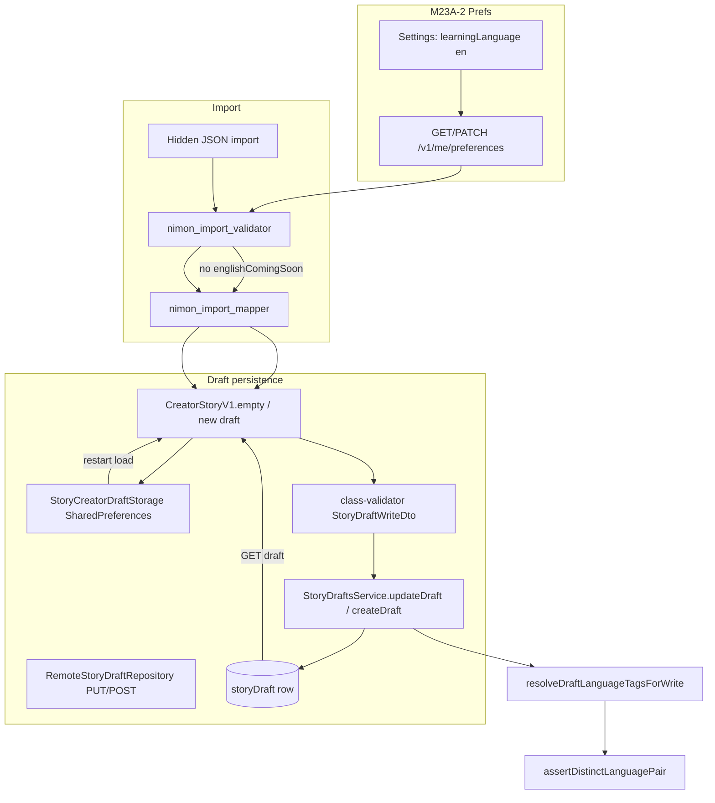

# M23A-3 — Draft + Import Foundation Report

**Phase:** M23A-3 (implementation)  
**Scope:** Draft API validation, persistence, serialization, import acceptance, local draft storage — **no** publish, feed, HTML generator, reader, furigana, or creator readiness changes  
**Prerequisites:** [`M23A0_LEARNING_ENGLISH_EXPANSION_AUDIT.md`](M23A0_LEARNING_ENGLISH_EXPANSION_AUDIT.md), [`M23A1_ENGLISH_LEARNING_IMPLEMENTATION_PLAN.md`](M23A1_ENGLISH_LEARNING_IMPLEMENTATION_PLAN.md), [`M23A2_PHASE1_PREFS_AND_LANGUAGE_PAIR_REPORT.md`](M23A2_PHASE1_PREFS_AND_LANGUAGE_PAIR_REPORT.md), [`M23A25_DRAFT_LAYER_AUDIT_AFTER_PHASE1.md`](M23A25_DRAFT_LAYER_AUDIT_AFTER_PHASE1.md)

---

## Success criteria (this phase)

| Criterion | Status |
|-----------|--------|
| User can select `learningLanguage=en` (prefs — M23A-2) | ✓ (unchanged) |
| Drafts save locally with language tags | ✓ |
| Drafts save remotely with `learningLanguage=en` | ✓ |
| Imports create English drafts when prefs match | ✓ |
| Language metadata survives reload / round-trip | ✓ |
| English publish still blocked | ✓ (out of scope; unchanged) |
| English feed unsupported | ✓ (unchanged) |
| English HTML generation unchanged | ✓ (import still skips EN HTML limits early-return) |

---

## A. Files changed

### Backend

| File | Change |
|------|--------|
| `nimon-backend/src/modules/story-drafts/dto/story-draft.requests.ts` | `learningLanguage` on create/write DTOs: `@IsIn([...V1_LEARNING_LANGUAGES])` (`ja`, `en`) instead of `['ja']` only |
| `nimon-backend/src/modules/story-drafts/story-drafts.service.ts` | `resolveDraftLanguageTagsForWrite()` — wraps `resolvePublishLanguageTags`, maps pair failure to `language_pair_same_not_allowed` via `apiError` |
| `nimon-backend/src/common/validation/language-pair-validation.spec.ts` | `resolvePublishLanguageTags` preserves `en` from draft |
| `nimon-backend/src/modules/story-drafts/story-drafts.language-metadata.spec.ts` | **New** — `en+my`, `en+ja` update persistence; `en+en` rejected |

### Flutter

| File | Change |
|------|--------|
| `lib/features/create/import/nimon_import_validator.dart` | Removed `import.context.englishComingSoon` gate in `_validateAppContext` |
| `lib/features/create/story_creator_draft_storage.dart` | `_toJsonBasics` / `_fromJsonBasics` persist `contentLocale` and `learningLanguage`; load uses `normalizeContentLocaleWireCode` / `safeLearningLanguageWireCode` (null when absent — no legacy default to `ja`) |
| `test/features/create/nimon_import_validator_test.dart` | EN import with `en+my` context; mismatch when prefs still `ja` |
| `test/features/create/nimon_import_read_only_flow_test.dart` | EN accepted with `en+my` context; notifier ctor defaults for compile |
| `test/features/create/nimon_import_html_rules_validator_test.dart` | Test J: no `englishComingSoon` |
| `test/features/create/story_draft_language_defaults_test.dart` | `en+my` DTO round-trip |
| `test/features/create/story_creator_draft_storage_language_test.dart` | **New** — local round-trip, no `en→ja` coercion, legacy null tags |

### Documentation

| File | Change |
|------|--------|
| `docs/M23A3_DRAFT_AND_IMPORT_FOUNDATION_REPORT.md` | This report |

---

## B. Draft lifecycle diagram



**Language tag sources on write (remote):**

1. Request body `basics.contentLocale` / `basics.learningLanguage` (must pass DTO `@IsIn`).
2. `StoryDraftsService.resolveDraftLanguageTagsForWrite` → `resolvePublishLanguageTags` (draft fields override prefs when normalized valid).
3. Persisted on `storyDraft.contentLocale` / `storyDraft.learningLanguage`.

**Local:** tags stored in basics JSON blob only when non-null on save.

---

## C. API validation changes

| Endpoint / DTO | Before | After |
|--------------|--------|-------|
| `CreateDraftBasicsDto.learningLanguage` | `@IsIn(['ja'])` | `@IsIn([...V1_LEARNING_LANGUAGES])` → `ja`, `en` |
| `StoryDraftBasicsWriteDto.learningLanguage` | `@IsIn(['ja'])` | Same |
| `contentLocale` on both | `@IsIn(['en','my','ja'])` | Unchanged |
| Service write path | `resolvePublishLanguageTags` (already supported `en` after M23A-2) | Explicit `resolveDraftLanguageTagsForWrite` + `language_pair_same_not_allowed` HTTP body |

**Audit:** No other `story-drafts` validators hardcode `learningLanguage` to `['ja']` only. Shared pair logic remains in `language-pair-validation.ts`.

---

## D. Import changes

| Item | Before | After |
|------|--------|-------|
| `import.context.englishComingSoon` | Blocked all English meta before mapper | **Removed** |
| `import.context.learningLanguageMismatch` | Unchanged | Still enforced vs `NimonImportValidationContext` |
| `import.context.contentCommunityMismatch` | Unchanged | Still enforced |
| EN HTML generator limits in validator | Early return when `HtmlLearningLanguage.en` | **Unchanged** (M23A-3 scope: no HTML rule expansion) |

English JSON can enter the draft pipeline when user prefs are `learningLanguage=en` and import meta matches (e.g. `English` + `Burmese` → `en` + `my`).

---

## E. Local storage changes

| Function | Behavior |
|----------|----------|
| `_toJsonBasics` | Writes `contentLocale` / `learningLanguage` when non-empty on `StoryBasics` |
| `_fromJsonBasics` | Reads optional keys; missing keys → `null` (not defaulted to `ja`) |
| `_learningLanguageFromBasicsJson` | `safeLearningLanguageWireCode` only when key present; invalid wire → `ja` (sanitize invalid data, not valid `en`) |

**Requirement met:** Local save → app restart → `load()` preserves `contentLocale` and `learningLanguage` for English drafts.

---

## F. Coercion audit (draft layer only)

| Path | `en` behavior |
|------|----------------|
| Remote DTO `@IsIn` | Invalid codes rejected at HTTP 400 — **not** coerced |
| `resolvePublishLanguageTags` on draft write | Valid draft `learningLanguage=en` **stored as `en`** |
| `safeV1LearningLanguage` fallback to `ja` | Only when draft **and** pref lack a valid learning code |
| Flutter `StoryCreatorDraftStorage` load | Missing key → `null`; present `en` → `en` |
| Flutter `StoryDraftMapper` | Round-trip preserves tags |
| Import validator | No `englishComingSoon`; mismatch errors only |

**Not changed (later phases):** publish stamping, `publish-validation` JP defaults, catalog locale filters, creator readiness ignoring `draft.basics.learningLanguage`.

---

## G. Tests added / updated

| ID | Requirement | Test location |
|----|-------------|---------------|
| A | `en` + `my` draft save | `story-drafts.language-metadata.spec.ts` (updateDraft persists `en`/`my`); `story_draft_language_defaults_test.dart` (DTO round-trip) |
| B | `en` + `ja` draft save | `story-drafts.language-metadata.spec.ts` |
| C | English import accepted | `nimon_import_validator_test.dart`; `nimon_import_read_only_flow_test.dart`; `nimon_import_html_rules_validator_test.dart` (J) |
| D | Local storage round-trip | `story_creator_draft_storage_language_test.dart` |
| E | Remote DTO accepts `en` | `story_draft_language_defaults_test.dart`; backend language-metadata spec |
| F | No silent `en` → `ja` | `story_creator_draft_storage_language_test.dart`; `language-pair-validation.spec.ts` (`resolvePublishLanguageTags preserves en`) |

---

## H. Exact pass counts

Commands (Windows PowerShell):

```powershell
cd nimon-backend
node_modules\.bin\jest.cmd "language-pair-validation.spec" "story-drafts.language-metadata.spec" --no-cache
```

```powershell
cd ..
flutter test test/features/create/story_draft_language_defaults_test.dart test/features/create/story_creator_draft_storage_language_test.dart test/features/create/nimon_import_validator_test.dart test/features/create/nimon_import_read_only_flow_test.dart test/features/create/nimon_import_html_rules_validator_test.dart
```

| Suite | Result |
|-------|--------|
| Jest `language-pair-validation.spec.ts` + `story-drafts.language-metadata.spec.ts` | **14 passed** (2 suites) |
| Flutter M23A-3 targeted files | **38 passed** |

---

## I. Remaining blockers before English publishing works

These were **intentionally not modified** in M23A-3:

| Blocker | Area | Notes |
|---------|------|-------|
| `publish-validation` / HTML limits | Publish | JP-centric sentence/vocab/quiz rules; `HtmlLearningLanguage` publish path |
| `creator_completion_rules` / `creator_readiness` | Creator UI | May still assume Japanese learning for module gates |
| `published-mono-catalog-locale` / feed services | Discovery | English monos not listed in community feeds |
| Import EN HTML rules | Import | Validator still **skips** EN HTML limit checks (early return) — separate from coming-soon removal |
| Reader / furigana | Learn | Japanese furigana behavior unchanged |
| Collections / search | Catalog | No EN collection semantics |

**After M23A-3:** Users with `learningLanguage=en` can create, import, save locally, and save remotely as **drafts**. Publish, feed, and full EN content rules remain later-phase work (per M23A-1 plan).

---

## Regression matrix (phase boundary)

| Action | `learningLanguage=en` |
|--------|------------------------|
| PATCH prefs `en` | ✓ M23A-2 |
| POST/PUT draft | ✓ M23A-3 |
| Hidden JSON import | ✓ M23A-3 (prefs-aligned) |
| Local draft reload | ✓ M23A-3 |
| Publish read-only / full learn | ✗ Still blocked downstream |
| Home / community feed EN stories | ✗ Unchanged |
