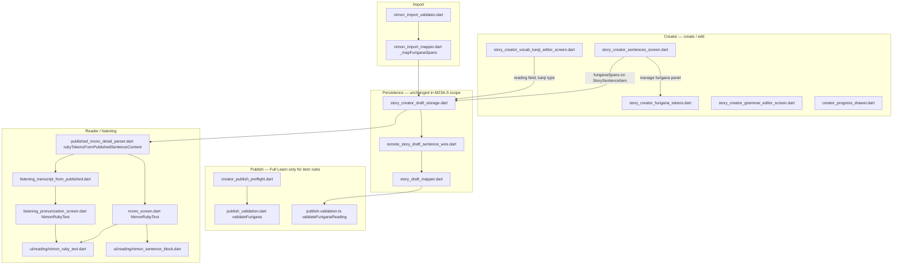
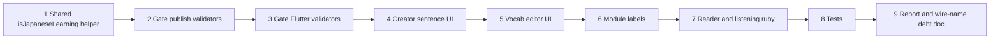

# M23A-5.0 — Conditional Furigana / Kanji / English Creator UX Audit

**Phase:** M23A-5.0 (investigation only)  
**Scope:** Furigana, kanji, reading/kana validation, ruby rendering, creator learn editors, import furigana handling, Full Learn per-item publish rules  
**Out of scope:** Feed/catalog, collections, search, settings, draft persistence, publish HTML limits, HTML generator source files  
**Prerequisites:** [`M23A0_LEARNING_ENGLISH_EXPANSION_AUDIT.md`](M23A0_LEARNING_ENGLISH_EXPANSION_AUDIT.md), [`M23A1_ENGLISH_LEARNING_IMPLEMENTATION_PLAN.md`](M23A1_ENGLISH_LEARNING_IMPLEMENTATION_PLAN.md), [`M23A3_DRAFT_AND_IMPORT_FOUNDATION_REPORT.md`](M23A3_DRAFT_AND_IMPORT_FOUNDATION_REPORT.md), [`M23A35_PUBLISH_LAYER_AUDIT_AFTER_DRAFT_FOUNDATION.md`](M23A35_PUBLISH_LAYER_AUDIT_AFTER_DRAFT_FOUNDATION.md), [`M23A4_PUBLISH_AND_READINESS_HTML_LANGUAGE_BRANCHING_REPORT.md`](M23A4_PUBLISH_AND_READINESS_HTML_LANGUAGE_BRANCHING_REPORT.md)

---

## Executive summary

After **M23A-4**, English drafts use **EN HTML limits** for readiness, import sentence/char rules, and publish gates. **Furigana, kanji reading rules, and ruby UX remain Japanese-oriented** and are **not gated** on `draft.basics.learningLanguage`.

| Layer | English impact today |
|-------|----------------------|
| **Full Learn publish** | `validateFurigana` / `validateFuriganaReading` still run for every vocab row with non-empty `termJapanese` |
| **Readiness** | Does not check furigana; only HTML counts |
| **Creator UI** | Furigana editor always available when editing sentences; vocab screen is **Vocabulary / Kanji** with Kanji type toggle |
| **Reader / listening** | Renders ruby whenever `furiganaSpans` → tokens exist; **no** `learningLanguage` check |
| **Import** | Preserves `furiganaSpans`; does not require them for English |

**M23A-5** should add a shared **`isJapaneseLearning(learningLanguage)`** (or equivalent) and branch **validators**, **creator UI**, and **reader ruby** — without renaming wire fields (`japaneseText`, `termJapanese`, `vocabulary_kanji`).

---

## A. Japanese-specific flow map

### Touchpoint → functions / files

| Touchpoint | Primary files | Key symbols |
|------------|---------------|-------------|
| **Create/edit sentence** | `story_creator_sentences_screen.dart` | `_managingFurigana`, `_buildFuriganaManagePanel`, `_remapFuriganaSpans`, `_overlapsAny`, `updateSentenceTextAndFurigana`, `canManageFurigana` |
| **Furigana tokenization** | `story_creator_furigana_tokens.dart` | Kanji-token segmentation for span editor |
| **Vocabulary / Kanji editor** | `story_creator_vocab_kanji_editor_screen.dart` | `Reading / furigana`, `VocabularyKanjiEntryType.kanji`, `readingForVocabSelectionFromDraft` |
| **Grammar editor** | `story_creator_grammar_editor_screen.dart` | `GrammarExample.japanese`, hint “Usually Japanese from your story” |
| **Progress / LM1 label** | `creator_progress_drawer.dart`, `story_v1_model.dart` `LearnModuleIdLabels` | Drawer chip **Vocabulary**; `displayTitle` **Vocabulary / Kanji** |
| **Import JSON** | `nimon_import_mapper.dart` | `_mapFuriganaSpans` |
| **Import validation** | `nimon_import_validator.dart` | No furigana-specific import errors (shape only) |
| **Publish validation** | `publish_validation.dart`, `publish-validation.ts` | `validateFurigana`, `validateFuriganaReading` in Full Learn loops |
| **Published reader** | `published_mono_detail_parser.dart`, `mono_screen.dart` | `rubyTokensFromPublishedSentenceContent`, `NimonRubyText` |
| **Listening transcript** | `listening_transcript_from_published.dart`, `listening_pronunciation_screen.dart` | `rubyTokens` on line → `NimonRubyText` |

---

## B. Backend validation audit

### Files inspected

| File | Role |
|------|------|
| `nimon-backend/src/common/validation/learn-validation.ts` | `containsKanji`, `validateFuriganaReading`, vocab/grammar/quiz band tables (legacy JLPT — not used by HTML publish gate) |
| `nimon-backend/src/common/validation/publish-validation.ts` | Full Learn: `validateVocabularyMeaning`, `validateFuriganaReading`, `validateGrammarPatternTitle`, `validateQuizItem` |
| `nimon-backend/src/common/validation/publish-validation.spec.ts` | `full learn: invalid furigana for kanji vocab` |

### Questionnaire

| # | Question | Answer |
|---|----------|--------|
| 1 | Which validators are Japanese-specific? | **`validateFuriganaReading`** (kana-only reading, required when `kind === 'kanji'` or `containsKanji(surface)`). **`containsKanji`** helper. Quiz category label mapping treats `kanji` quiz rows as vocabulary bucket — JP product shape. |
| 2 | Which run regardless of `learningLanguage`? | All Full Learn per-item validators in `validateStoryPublishInput` — **no `learningLanguage` branch today**. HTML limits (M23A-4) branch; furigana does not. |
| 3 | Which should run only when `learningLanguage=ja`? | **`validateFuriganaReading`** for publish. Optionally stricter checks if `type === 'kanji'` is disallowed for EN later (product: hide type, not reject import). |
| 4 | Which fields optional for `en`? | `reading` on vocab (skip kana validation). `furiganaSpans` on sentences (optional, not validated on publish). `type: kanji` — preserve in JSON but should not drive EN requirements. |
| 5 | What errors would English Full Learn hit today? | See table below. |

### Backend validator table

| Validator | JP-specific? | Runs for `en` today? | Gate when `en`? |
|-----------|------------|----------------------|-----------------|
| `validateStoryTitle` / `validateStoryDescription` | No | Yes | Keep |
| HTML sentence/vocab/grammar/quiz limits | Language-aware (M23A-4) | Yes | Keep |
| `validateVocabularyMeaning` | No (generic text rules) | Yes | Keep |
| `validateFuriganaReading` | **Yes** | **Yes** | **Skip** |
| `validateGrammarPatternTitle` | No (any script in headline) | Yes | Keep |
| `validateQuizItem` | No | Yes | Keep |
| `fullLearnModulesComplete` | No | Yes | Keep |

### English Full Learn failure modes (today)

| Scenario | Likely issue code |
|----------|-------------------|
| Vocab `type: kanji` without kana reading | `learn.vocab.reading.required` |
| Vocab surface contains CJK, empty reading | `learn.vocab.reading.required` |
| Author fills English gloss in `reading` field | `learn.vocab.reading.invalidChars` (kana regex) |
| Latin term, no kanji | Usually **passes** furigana (no reading required) |
| Grammar headline in English | **Passes** `validateGrammarPatternTitle` |
| Accidental `furiganaSpans` in published JSON | **No publish-time span validation** |

**Note:** Sentence-level `furiganaSpans` are **not** validated in `publish-validation.ts` (overlap/invalid span codes exist in Flutter l10n but are editor-local).

---

## C. Flutter validation audit

### Files inspected

| File | Role |
|------|------|
| `lib/core/validation/learn_validators.dart` | `containsKanji`, `validateFurigana`, `validateVocabularyMeaning`, `validateGrammarPatternTitle`, `validateQuizItem` |
| `lib/core/validation/publish_validation.dart` | Full Learn loop calls `validateFurigana` per vocab row |
| `lib/core/validation/localized_validation_messages.dart` | `learn.furigana.*`, `validationLearnModuleLabelVocabularyKanji` |
| `lib/core/validation/validation_fallback_messages.dart` | Same message keys |

### Questionnaire

| # | Question | Answer |
|---|----------|--------|
| 1 | Japanese-specific? | **`validateFurigana`** (+ `containsKanji`, `_furiganaAllowed` kana regex). |
| 2 | Still run for `en`? | **Yes** — `publish_validation.dart` ~583–601, unconditional on `input.learningLanguage`. |
| 3 | Must gate on `ja`? | **`validateFurigana`** only (M23A-5). |
| 4 | Can remain generic? | `validateVocabularyMeaning`, `validateGrammarPatternTitle`, `validateQuizItem`, HTML limit blocks (M23A-4). |

### Client vs server parity

| Check | Flutter | Backend | M23A-5 action |
|-------|---------|---------|---------------|
| Furigana on vocab publish | `validateFurigana` | `validateFuriganaReading` | Gate both on `ja` |
| Sentence span overlap | UI only (`_overlapsAny`) | Not in publish gate | Optional: EN hide editor |

---

## D. Creator UI audit

### Does the editor know `draft.basics.learningLanguage`?

| Screen / widget | Reads `learningLanguage`? |
|-----------------|---------------------------|
| `story_creator_sentences_screen.dart` | **No** |
| `story_creator_vocab_kanji_editor_screen.dart` | **No** |
| `story_creator_grammar_editor_screen.dart` | **No** |
| `creator_progress_drawer.dart` | **No** |
| `story_creator_review_display.dart` | **No** (readiness only) |

Branching must be introduced via **`ref.watch(storyCreatorDraftDataProvider)`** / `draft.basics.learningLanguage` or a small helper from `lib/core/settings/language_pair.dart`.

### UI elements — hide / relabel for English

| UI element | Location | Recommendation for `en` |
|------------|----------|-------------------------|
| **Manage furigana** panel | `story_creator_sentences_screen.dart` (`canManageFurigana`, `_managingFurigana`) | **Hide / disable** |
| Furigana on sentence cards | Same file (`spans: s.furiganaSpans`) | **Preserve but ignore display** — show plain `japaneseText` only |
| “No kanji tokens available for furigana editing” | Furigana panel copy | N/A if panel hidden |
| **Vocabulary / Kanji** app bar title | `story_creator_vocab_kanji_editor_screen.dart` | **Relabel → Vocabulary** |
| **Kanji** segmented button | Vocab entry editor | **Hide** (vocabulary-only type) |
| **Reading / furigana (optional)** field | Vocab entry editor | **Hide** or relabel **Pronunciation / notes (optional)** without kana validation |
| Pick-from-story with furigana reading | `readingForVocabSelectionFromDraft` | **Skip** auto-reading for `en` |
| Example preview with furigana | `_JapaneseExampleWithFurigana` | Plain text for `en` |
| How-to: “Choose Vocabulary or Kanji” | Sentences + vocab how-to | **Vocabulary only** copy |
| Quiz how-to “Kanji: …” | `story_creator_sentences_screen.dart` | Hide kanji quiz line or relabel |
| Grammar example field label **Japanese** | `story_creator_grammar_editor_screen.dart` | **Relabel** → “Source sentence” / “Story line” |
| Progress drawer LM1 title | `creator_progress_drawer.dart` uses **Vocabulary** already | Align `LearnModuleIdLabels.displayTitle` |
| `PublishMissingItem.vocabKanji` label | `creator_publish_validation.dart` | **Vocabulary** for `en` |

### LM1 (Learn module 1) display

| Source | Current label |
|--------|---------------|
| `LearnModuleIdLabels.displayTitle` | **Vocabulary / Kanji** |
| `creator_progress_drawer.dart` chip | **Vocabulary** |
| Module route | `LearnModuleId.vocabularyKanji` / storage `vocabulary_kanji` (unchanged wire) |

**Target for English:** User-visible **Vocabulary** everywhere; internal id stays `vocabularyKanji`.

### Where to branch (recommended)

1. **`lib/core/settings/language_pair.dart`** (or new `creator_learning_language.dart`) — `bool isJapaneseLearningDraft(CreatorStoryV1 d)` / wire helper.
2. **Sentence screen** — gate `canManageFurigana`, furigana preview widgets.
3. **Vocab editor** — title, type toggle, reading field, pick-from-story.
4. **`LearnModuleIdLabels.displayTitle`** — parameterize or switch on draft language.
5. **`creator_publish_validation.dart`** / l10n — module missing labels.

`story_creator_review_display.dart` — no logic change unless displaying module titles from `LearnModuleIdLabels`.

---

## E. Reader / ruby display audit

### Files

| File | Behavior |
|------|----------|
| `lib/ui/reading/nimon_ruby_text.dart` | Renders per-token ruby when `reading != null` |
| `lib/ui/reading/nimon_sentence_block.dart` | Uses `NimonRubyText` if `tokens != null`, else plain text |
| `lib/features/profile/data/published_mono_detail_parser.dart` | `rubyTokensFromPublishedSentenceContent` — builds tokens from `furiganaSpans` |
| `lib/features/mono/mono_screen.dart` | Published + demo content via `NimonRubyText` / `_lineToLayoutTokens` |
| `lib/features/learn/listening_transcript_from_published.dart` | Copies `sl.tokens` to transcript lines |
| `lib/features/learn/listening_pronunciation_screen.dart` | `NimonRubyText` when `rubyTokens` non-empty |

### Questionnaire

| # | Question | Answer |
|---|----------|--------|
| 1 | Always render ruby when spans exist? | **Yes.** Parser emits tokens; UI prefers ruby path when list non-empty. |
| 2 | Should English monos suppress ruby? | **Yes (product rule).** Use `publishedMono.learningLanguage == 'en'` (or content on mono model) to force **plain text** path. |
| 3 | Safe ignore `furiganaSpans` for `en`? | **Yes.** Skip tokenization in parser or pass `tokens: null` + `plainJapanese` only. |
| 4 | Crash on accidental furigana? | **Unlikely.** Parser skips invalid indices and overlapping spans (`continue`); empty tokens → plain text fallback. Worst case: odd ruby over Latin letters, not a crash. |

**Gap:** `mono_screen.dart` does **not** read `learningLanguage` today (grep: no matches under `lib/features/mono`). `published_mono_dto.dart` **does** expose `learningLanguage` — wire exists for M23A-5 reader branch.

---

## F. Import furigana audit

| # | Question | Answer |
|---|----------|--------|
| 1 | Require furigana for English? | **No.** Import validator has **no** furigana span rules. |
| 2 | Preserve if present? | **Yes.** `nimon_import_mapper.dart` `_mapFuriganaSpans` maps JSON → `FuriganaSpan` list on sentences. |
| 3 | Reject vs ignore vs preserve? | **Preserve but ignore for display (V1 safest):** do not reject EN imports with spans; strip or skip ruby at read time; optional future import warning. |
| 4 | Safest for V1? | **Preserve + ignore** — avoids breaking generator output and round-trips; reader/publish gating handles UX. |

Full Learn import still validates vocab **shape** (examples, glosses) — not furigana-specific.

---

## G. Product decision matrix

| Behavior | Recommendation | Notes |
|----------|----------------|-------|
| **Sentence furigana spans** | **ja:** Keep · **en:** Preserve but ignore | Storage unchanged; hide editor; reader plain text |
| **Vocab reading field** | **ja:** Keep · **en:** Skip validation; hide or optional non-kana field | Avoid `invalidChars` on Latin |
| **Vocab kanji type** | **ja:** Keep · **en:** Hide UI; treat as vocabulary | Wire `kanji` may exist in old JSON |
| **LM1 label** | **ja:** Vocabulary / Kanji · **en:** **Vocabulary** | `LearnModuleId.vocabularyKanji` id unchanged |
| **Reader ruby display** | **ja:** Keep · **en:** Suppress | Use `learningLanguage` on mono DTO |
| **Listening ruby display** | **ja:** Keep · **en:** Suppress | Same transcript builder branch |
| **Grammar Japanese labels** | **ja:** Keep · **en:** **Rename/relabel** | Field name `japanese` in model can stay |
| **`termJapanese` wire field** | **Defer** rename | V1 compatibility |
| **`japaneseText` wire field** | **Defer** rename | V1 compatibility; holds English body text |
| **Publish `validateFurigana`** | **ja:** Keep · **en:** **Skip** | Critical for EN Full Learn |
| **Import furigana** | **Preserve but ignore for en** | No `englishComingSoon`-style block |
| **Sentence furigana overlap UI** | **ja:** Keep · **en:** N/A | Editor hidden |
| **Quiz category kanji** | **ja:** Keep · **en:** **Defer** product rules | Counted in totals; EN HTML tables shared |

---

## H. M23A-5 implementation file list

Do **not** implement in M23A-5.0 — inventory only.

### Critical

| File | Change |
|------|--------|
| `lib/core/validation/publish_validation.dart` | Skip `validateFurigana` when `learningLanguage != ja` |
| `nimon-backend/src/common/validation/publish-validation.ts` | Skip `validateFuriganaReading` when not `ja` |
| `lib/core/settings/language_pair.dart` (or new helper) | `isJapaneseLearningWireCode` / draft helper |

### Required

| File | Change |
|------|--------|
| `lib/features/create/story_creator_sentences_screen.dart` | Hide furigana manage UI; plain sentence display for `en` |
| `lib/features/create/story_creator_vocab_kanji_editor_screen.dart` | Title, kanji toggle, reading field, previews |
| `lib/features/create/story_v1_model.dart` | `LearnModuleIdLabels` — language-aware `displayTitle` |
| `lib/features/profile/data/published_mono_detail_parser.dart` | Optional: skip ruby token build when mono is `en` |
| `lib/features/mono/mono_screen.dart` | Suppress `NimonRubyText` when `learningLanguage=en` |
| `lib/features/learn/listening_transcript_from_published.dart` | Omit `rubyTokens` for English monos |
| `lib/features/learn/listening_pronunciation_screen.dart` | Fallback plain `Text` when no ruby (already exists) |

### Optional

| File | Change |
|------|--------|
| `lib/features/create/story_creator_grammar_editor_screen.dart` | Relabel Japanese hints |
| `lib/features/create/creator_publish_validation.dart` | `PublishMissingItem` labels |
| `lib/features/create/creator_progress_drawer.dart` | Ensure consistent **Vocabulary** chip (may already be OK) |
| `lib/core/validation/localized_validation_messages.dart` | Only if new copy keys added |
| `lib/l10n/app_*.arb` | Module label variants |

### Copy-only

| File | Change |
|------|--------|
| `lib/core/validation/validation_fallback_messages.dart` | Module / field strings if parameterized |
| `lib/features/create/story_creator_sentences_screen.dart` | How-to strings, char label “Japanese chars” (readiness — separate from M23A-5 or tiny neutral copy) |

### Tests (M23A-5 implementation phase)

| File | Change |
|------|--------|
| `test/core/validation/publish_validation_gate_test.dart` | EN full learn skips furigana |
| `nimon-backend/src/common/validation/publish-validation.spec.ts` | EN: no furigana block |
| New widget/readiness tests | Furigana hidden when `learningLanguage=en` |

**Explicitly out of M23A-5 file list:** feed, catalog, collections, `tool/html_generator/*`, Prisma schema, `resolvePublishLanguageTags`.

---

## I. Risk matrix

| Risk | Severity | Mitigation |
|------|----------|------------|
| **JP regression** — furigana still required for JA publish | **Critical** | Gate validators/UI on `ja` only; keep JP tests (`publish-validation.spec.ts` furigana case) |
| **EN false publish failures** — kana reading on Latin | **Critical** | Skip `validateFurigana*` for `en` |
| **EN author enters reading** — triggers `invalidChars` | **High** | Skip validator + hide field |
| **Broken reader** — ruby over English prose | **High** | Suppress tokens when `learningLanguage=en` |
| **Import compatibility** — stripping furigana | **Medium** | Preserve JSON; ignore at display |
| **UI confusion** — dual labels Vocabulary vs Vocabulary/Kanji | **Medium** | Centralize `LearnModuleIdLabels` |
| **Mixed-script vocab** — `containsKanji` on EN story with loanwords | **Medium** | Skip furigana validator for `en` entirely |
| **Wire name debt** — `japaneseText` holds English | **Low** | Document; defer rename |
| **Quiz kanji category** on EN imports | **Low** | Defer unless product bans |

---

## J. Recommended M23A-5 implementation order

| Step | Work | Why |
|------|------|-----|
| **1** | `isJapaneseLearningWireCode` / `isJapaneseLearningDraft` in one module | Single predicate for validators + UI + reader |
| **2** | Backend `publish-validation.ts` — skip furigana when not `ja` | Server is authoritative |
| **3** | Flutter `publish_validation.dart` — same | Preflight parity with server |
| **4** | Sentence screen — hide furigana manage + ruby previews for `en` | Stops authors adding JP-only metadata |
| **5** | Vocab editor — hide kanji type + reading/furigana field for `en` | Prevents invalid kana readings |
| **6** | `LearnModuleIdLabels` + `creator_publish_validation` copy | LM1 shows **Vocabulary** |
| **7** | `published_mono_detail_parser` / mono + listening — suppress ruby for `en` | Reader matches learning language |
| **8** | Tests: JA furigana still blocks; EN publish with Latin vocab passes | Lock regression |
| **9** | `docs/M23A5_*_REPORT.md` — document wire field debt (`japaneseText`, `termJapanese`) | Clear follow-up for V2 rename |

**Defer to later:** feed/catalog (M23A-6), field renames, import-side furigana warnings, sentence-span publish validation.

---

## Success criteria checklist (M23A-5.0)

| Criterion | Met |
|-----------|-----|
| Every furigana/kanji path identified | ✓ Sections A–F |
| Every Japanese-only validator documented | ✓ Sections B–C |
| Every English blocker listed | ✓ B, C, executive summary |
| Every UI label debt listed | ✓ Section D |
| M23A-5 file list complete | ✓ Section H |
| No code changed | ✓ |
| No tests added | ✓ |
| No migrations created | ✓ |

---

## References

- M23A-4 left furigana unchanged: [`M23A4_PUBLISH_AND_READINESS_HTML_LANGUAGE_BRANCHING_REPORT.md`](M23A4_PUBLISH_AND_READINESS_HTML_LANGUAGE_BRANCHING_REPORT.md) §J  
- Prior furigana matrix: [`M21B_CURRENT_RULE_MATRIX_AUDIT.md`](M21B_CURRENT_RULE_MATRIX_AUDIT.md)  
- Expansion plan Phase 5: [`M23A1_ENGLISH_LEARNING_IMPLEMENTATION_PLAN.md`](M23A1_ENGLISH_LEARNING_IMPLEMENTATION_PLAN.md)
