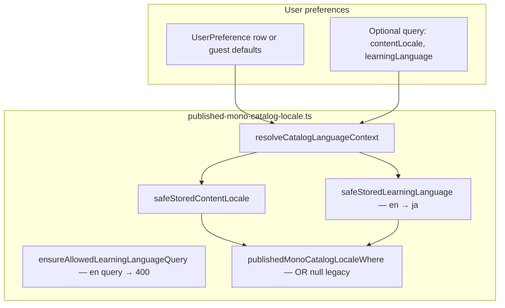

# M23A-6.0 — Learning Language Discovery / Feed / Profile Audit

Date: 2026-06-03  
Role: Principal Architect investigation (read-only)  
Prerequisites: M23A-0 through M23A-5B complete (settings, draft/import, publish/readiness, conditional furigana, English creator UI + reader ruby).  
Out of scope: creator editors, publish validation, furigana, HTML generator, schema migrations, import validation.

---

## Executive answer — `en+my` mono after publish

After M23A-5B, a published mono stamped **`learningLanguage=en`**, **`contentLocale=my`** behaves as follows **today**:

| Surface | Visible? | Why |
|---------|----------|-----|
| Home **For You** (`GET /v1/mono/feed`) | **No** | Catalog helper treats viewer `learningLanguage=en` as **`ja`**; mono `en` ≠ effective `ja` (and is not `null`). |
| **Following** feed | **No** | Same catalog filter as For You. |
| **Public profile → Monos** (`feed?writerId=`) | **No** | Same catalog filter; Flutter sends no locale query params. |
| **Public profile → Collections** (list + monos) | **No** / empty | Collections with only `en+my` items get **itemCount 0** for viewer lens and are **hidden**; collection monos list filters items out. |
| **Owner Published** (`GET /v1/published-monos`) | **Yes** | Owner list: `ownerId` + catalog visibility only — **no** `contentLocale` / `learningLanguage` filter. |
| **Owner collection detail** (`GET /v1/me/creator-collections/:id/monos`) | **Yes** | Owner path: `PUBLISHED_MONO_CATALOG_VISIBLE` only. |
| **Saved / bookmarks** (`GET /v1/me/bookmarks`) | **Yes** | No locale filter; returns `contentLocale` + `learningLanguage` on items. |
| **Search** (`GET /v1/search/monos`) | **Yes** | No locale filter; keyword + visibility only. |
| **Direct detail** (`GET /v1/mono/:id`) | **Yes** | No viewer-lens filter; only `PUBLISHED_MONO_CATALOG_VISIBLE`. Reader uses `learningLanguage` (M23A-5B). |
| **Add to collection** (owner) | **Yes** (if `collection.contentLocale=my`) | Rule is **contentLocale-only**; `learningLanguage` not checked. |

**Critical gap:** English-learning users who set prefs to `en+my` still browse the catalog as **`ja+my`** because `safeStoredLearningLanguage()` coerces any non-`ja` stored value (including `en`) back to **`ja`**. Their own `en+my` publishes are invisible in discovery surfaces that use the catalog helper, while **search and saved still show them**.

---

## Section A — Discovery flow map

### A.1 Global preference → catalog lens (backend)

**Guest defaults:** `contentLocale=en`, `learningLanguage=ja` (`DEFAULT_CATALOG_*`).

**Authenticated:** loads `UserPreference`; query overrides apply **after** safe-stored prefs (only `ja` allowed for learning query).

### A.2 Per-surface end-to-end flows

| UI surface | Flutter entry | HTTP | Backend service | Prisma filter | Response DTO | Flutter model | UI notes |
|------------|---------------|------|-----------------|---------------|--------------|---------------|----------|
| Home For You | `monoFeedPagerProvider` → `RemoteMonoFeedRepository` | `GET /v1/mono/feed` | `MonoFeedService.listFeed` | `PUBLISHED_MONO_CATALOG_VISIBLE` + **catalog locale where** | `MonoFeedSummaryItemDto` (no locale fields on wire) | `MonoFeedItem` (no `learningLanguage`; `contentLocale` usually null from feed) | Cards lack learning badge from feed |
| Following | `followingMonoFeedPagerProvider` → `RemoteFollowingMonoFeedRepository` | `GET /v1/mono/feed?following=true` | same | same + `ownerId in followed` | same | same | Auth required |
| Public profile Monos | `publicProfileMonosProvider` → `RemotePublicCreatorProfileRepository.fetchCreatorMonoPage` | `GET /v1/mono/feed?writerId={id}` | same | same + `ownerId` | same | same | **Does not** refresh on prefs change (Collections tab does) |
| Public profile Collections | `fetchPublicCollections` | `GET /v1/users/:id/creator-collections` | `CreatorCollectionsService.listPublicForUser` | Counts/items use **catalog-visible mono where** | `CreatorMonoCollectionDto` | `CreatorMonoCollection` | Hides collections with 0 visible items |
| Public collection monos | `fetchPublicCollectionMonos` | `GET /v1/users/:id/creator-collections/:cid/monos` | `listPublicCollectionMonos` | Items joined to **catalog-visible mono where** | `PublishedMonoListItemDto` (+ locale fields) | `PublishedMonoListItemDto` → feed mapper | No locale query params from Flutter |
| Owner Published | `remote_published_mono_repository` | `GET /v1/published-monos` | `PublishedMonosService.listPublishedMonos` | `ownerId` + visible only | List item + **locale fields** | `PublishedMonoListItemDto` | All owner published monos |
| Owner collections list | `fetchMyCollections` | `GET /v1/me/creator-collections` | `listMine` | **No** viewer lens; counts all catalog-visible items | DTO + `itemCount` | `CreatorMonoCollection` | Full counts |
| Owner collection monos | `fetchMyCollectionMonos` | `GET /v1/me/creator-collections/:id/monos` | `listMineCollectionMonos` | Visible only, **no** locale filter | List item + locale fields | DTO | Shows `en+my` and `ja+my` together |
| Saved | `profile_saved_mono_pager` → `RemoteMonoSocialRepository` | `GET /v1/me/bookmarks` | `MonoSocialService.listMyBookmarks` | Visible only, **no** locale filter | Bookmark rows + mono locale fields | `MonoFeedItem` (+ `contentLocale`) | Saved tab shows community badge |
| Search | `RemoteMonoSearchRepository` | `GET /v1/search/monos` | `SearchService.searchPublishedMonos` | Visible + keywords, **no** locale filter | Search list DTO + locale fields | `MonoSearchResult` | Global vs feed not aligned |
| Mono detail / reader | `RemoteMonoFeedRepository.fetchMonoDetail` | `GET /v1/mono/:id` | `MonoFeedService.getPublicMonoById` | Visible only, **no** lens | `PublishedMonoDetailDto` + social | `PublishedMonoDetailDto` | Reader ruby off when `en` (M23A-5B) |
| Collection add | Owner POST items | `POST .../items` | `addItemMine` | N/A | — | `add_to_collection_locale_policy` | **contentLocale** match only |

### A.3 Preference refresh (Flutter)

| Provider | Refreshes on `contentLocale` / `learningLanguage` change? |
|----------|-----------------------------------------------------------|
| `monoFeedPagerProvider` | **Yes** (`user_preferences_notifier`) |
| `followingMonoFeedPagerProvider` | **Yes** |
| `publicProfileMonosProvider` | **No** |
| Public collections (`public_profile_screen`) | **Yes** (Collections tab only) |
| Saved pager | **No** |
| Search | **No** (no prefs coupling) |

---

## Section B — Backend catalog helper audit

**File:** `nimon-backend/src/modules/published-monos/published-mono-catalog-locale.ts`

| # | Question | Answer |
|---|----------|--------|
| 1 | Supports `learningLanguage=en`? | **No** — `CatalogLearningLanguage = 'ja'` only. |
| 2 | Coerces `en` → `ja`? | **Yes** — `safeStoredLearningLanguage`: only explicit `ja` kept; **`en` → `ja`**. |
| 3 | Uses viewer preferences? | **Yes** when `viewerUserId` set; guest uses defaults. |
| 4 | Accepts query override? | `contentLocale`: yes (`en`/`my`/`ja`). `learningLanguage`: **`ja` only**; `en` → **`400 learningLanguage_invalid`**. |
| 5 | Includes null legacy rows? | **Yes** — `publishedMonoCatalogLocaleWhere` ORs `{ contentLocale: null }` and `{ learningLanguage: null }`. |
| 6 | Shared by feed + public collections? | **Yes** — `MonoFeedService.listFeed`, `CreatorCollectionsService.listPublicForUser` / `listPublicCollectionMonos`. |
| 7 | Search uses same helper? | **No** — `SearchService` does not import or call catalog locale helpers. |

**Consumers**

| Service | Uses catalog helper? |
|---------|---------------------|
| `mono-feed.service.ts` | **Yes** — `listFeed` only (not `getPublicMonoById`) |
| `creator-collections.service.ts` | **Yes** — public list + public collection monos; **not** `listMine` / `listMineCollectionMonos` |
| `search.service.ts` | **No** |
| `published-monos.service.ts` | **No** (owner list) |
| `mono-social.service.ts` | **No** (bookmarks) |

**Note:** Feed list select includes `contentLocale` / `learningLanguage` columns (`MONO_FEED_LIST_PUBLISHED_MONO_SELECT`) but **`mapRowToSummary` does not expose them** on the feed JSON DTO.

---

## Section C — Surface-by-surface behavior matrix

**Legend:** *Expected (future)* = product standard from M23A-6 brief. *Current* = code today.  
**Effective lens:** For authenticated users with prefs `learningLanguage=en`, catalog currently resolves to **`ja`** (coercion).

### Case 1 — Match `en+my` / `en+my`

| | |
|--|--|
| **Viewer** | `learningLanguage=en`, `contentLocale=my` |
| **Mono** | `learningLanguage=en`, `contentLocale=my` |
| **Expected (future)** | **Show** in feed, public profile, collections (viewer lens `en+my`) |
| **Current** | **Hide** from For You, Following, public Monos, public Collections. Effective viewer lens **`ja+my`**; mono `learningLanguage=en` excluded. Still **visible** in search, saved, owner lists, direct detail. |

### Case 2 — Viewer `en+my`, mono `ja+my`

| | |
|--|--|
| **Expected (future)** | **Hide** from feed |
| **Current** | **Show** in catalog-filtered surfaces (effective **`ja+my`** matches mono). **Also show** in search/saved regardless. |

### Case 3 — Viewer `ja+my`, mono `en+my`

| | |
|--|--|
| **Expected (future)** | **Hide** from feed |
| **Current** | **Hide** from catalog-filtered surfaces (`en` ≠ `ja`). **Show** in search, saved, owner published, direct detail. |

### Case 4 — Viewer `en+ja`, mono `en+ja`

| | |
|--|--|
| **Expected (future)** | **Show** |
| **Current** | **Hide** from catalog-filtered surfaces: viewer coerced to **`ja+ja`** (learning `en`→`ja`, content `ja` OK) but mono `learningLanguage=en` fails `ja` filter. Search/saved/detail still work. |

### Case 5 — Guest default `ja+en`, mono `en+my`

| | |
|--|--|
| **Expected (future)** | **Hide** |
| **Current** | **Hide** from catalog-filtered surfaces: guest lens **`ja+en`** — `contentLocale=my` fails `en` (unless mono `contentLocale` null); `learningLanguage=en` fails `ja`. **Show** in search and direct detail. |

### Case 6 — Owner profile (`en+my` + `ja+my` published)

| | |
|--|--|
| **Product question** | Show all with badges vs filter by current lens? |
| **Current** | **Show all** on owner `GET /v1/published-monos` and owner collection monos. **No** learning/content filter. DTOs include `contentLocale` / `learningLanguage`; feed cards on owner UI may not surface learning badges consistently. **Public** view of same owner hides `en+my` in Monos/Collections tabs. **Mismatch:** owner `listMine` **itemCount** uses unfiltered visible monos; public counts use viewer lens → **public count < owner count** for mixed-language collections. |

### Case 7 — Search: `en+my` mono, viewer `ja+my`

| | |
|--|--|
| **Product question** | Search parity with feed vs global search? |
| **Current** | **Search shows** mono (no locale filter). Feed **hides** it. **Parity broken.** |

### Case 8 — Saved: user saved `en+my` + `ja+my`, viewer `ja+my`

| | |
|--|--|
| **Product question** | Show all saved vs filter by current lens? |
| **Current** | **Show all** saved bookmarked monos (no locale filter). Saved tab can show **community badge** via `contentLocale`; **no** learning-language badge policy documented in UI. |

---

## Section D — Flutter request audit

| Repository / provider | Auth | Sends `learningLanguage`? | Sends `contentLocale`? | Relies on backend prefs? | Refreshes on pref change? | Parses `learningLanguage`? | UI uses field? |
|----------------------|------|---------------------------|-------------------------|--------------------------|---------------------------|------------------------------|----------------|
| `remote_mono_feed_repository.dart` | Optional | **No** | **No** | **Yes** (if JWT) | Via pager refresh | Detail only | Reader yes; feed cards no |
| `remote_following_mono_feed_repository.dart` | **Required** | **No** | **No** | **Yes** | Yes | Detail via nested repo | Same as feed |
| `remote_public_creator_profile_repository.dart` (`fetchCreatorMonoPage`) | Optional | **No** | **No** | **Yes** | **No** (monos tab) | **No** (feed summary) | No |
| `remote_creator_collections_repository.dart` (`fetchPublicCollections`, `fetchPublicCollectionMonos`) | Optional | **No** | **No** | **Yes** | Collections tab only | List items yes | Community badge on saved/collections; learning weak |
| `remote_creator_collections_repository.dart` (owner `/v1/me/...`) | Required | **No** | **No** | N/A (owner) | No | List items yes | Owner sees all |
| `remote_published_mono_repository.dart` | Required | **No** | **No** | N/A | No | **Yes** | Depends on published tab UI |
| `remote_mono_social_repository.dart` (bookmarks) | Required | **No** | **No** | N/A | No | **Yes** | Saved: `contentLocale` badge |
| `remote_mono_search_repository.dart` | Optional | **No** | **No** | **No** | No | **Yes** (in `MonoSearchResult`) | Search results UI |
| `mono_feed_pager_provider` / `followingMonoFeedPagerProvider` | — | — | — | — | **Yes** | — | — |
| `public_profile_monos_provider` | — | — | — | — | **No** | — | — |
| `add_to_collection_locale_policy.dart` | — | — | — | — | — | **No** (contentLocale only) | Picker disables wrong **community** |

**`PageRequest.toQueryParameters()`** does not include `learningLanguage` or `contentLocale` keys (only `limit`, `sort`, `cursor`, filters, `ownerId`, etc.).

---

## Section E — Backend query audit (endpoints)

| Endpoint | Auth guard | Viewer preference source | Query params (locale) | `contentLocale` filtered? | `learningLanguage` filtered? | Null legacy included? | Full `content` JSON? | M22B summary fields |
|----------|------------|--------------------------|------------------------|-------------------------|------------------------------|------------------------|----------------------|------------------------|
| `GET /v1/mono/feed` | `OptionalJwtUserGuard` | `resolveCatalogLanguageContext` (prefs + optional query) | `contentLocale`, `learningLanguage`, `following`, filters | **Yes** (effective + null) | **Yes** (effective **`ja` only** + null) | **Yes** | **No** — `MONO_FEED_LIST_PUBLISHED_MONO_SELECT` (denormalized cover, `publishKind`, `hasAudio`, etc.) | **Yes** |
| `GET /v1/mono/:id` | Optional JWT | **None** for lens | — | **No** | **No** | N/A | **Yes** — full `content` | Detail mapper + content root fallback |
| `GET /v1/users/:id/creator-collections` | Optional JWT | Catalog resolver | `contentLocale`, `learningLanguage` | Via visible mono counts | Via visible mono counts | **Yes** (on mono join) | N/A | Collection metadata only |
| `GET /v1/users/:id/creator-collections/:cid/monos` | Optional JWT | Catalog resolver | `contentLocale`, `learningLanguage`, `cursor`, `limit` | **Yes** | **Yes** | **Yes** | **No** — `PUBLIC_COLLECTION_MONO_SELECT` summary | **Yes** |
| `GET /v1/published-monos` | Owner JWT | **None** | — | **No** | **No** | All visible rows | **Yes** (list includes `content`) | List mapper |
| `GET /v1/me/bookmarks` | Owner JWT | **None** | `cursor`, `limit` | **No** | **No** | All visible bookmarked | **Yes** | From row + content |
| `GET /v1/search/monos` | Optional JWT | **None** | `q`, `level`, `category`, `sort`, `cursor`, `limit` | **No** | **No** | All matching visible | **Yes** | List mapper + locale columns |
| `GET /v1/me/creator-collections` | Owner JWT | **None** | — | **No** (counts) | **No** | All visible in collection | N/A | Derived cover from visible monos |
| `GET /v1/me/creator-collections/:id/monos` | Owner JWT | **None** | `cursor`, `limit` | **No** | **No** | All visible in collection | **Yes** (`include: publishedMono`) | List mapper |

**Publish stamping (post-M23A-4):** `story-drafts` publish path persists draft `learningLanguage` / `contentLocale` onto `published_monos` (including `en+my`). Discovery gap is **filtering**, not missing DB values.

---

## Section F — Owner surface policy audit

| Surface | Filtered by current settings? | Shows all owner content? | Badges sufficient? | M23A-6 change now? | Safest V1 English |
|---------|--------------------------------|--------------------------|--------------------|--------------------|-------------------|
| Own Published → Monos | **No** | **Yes** | Locale fields on DTO; UI may not show learning pair clearly | **Defer** filter; **add** badges/copy | Show **all** with **learning + community** badges so owners see `en+my` publishes |
| Own Published → Collections | **No** (counts unfiltered) | **Yes** | `contentLocale` on collection; mixed EN/JA monos in same MY collection possible | Defer filter; fix **count parity** doc for owners | Keep all; clarify collection is **community**-scoped only |
| Workspace (drafts) | Draft prefs (out of scope) | — | — | — | — |
| Saved | **No** | All bookmarks | Community badge only | **Product decision** | V1: show **all saved**; optional lens filter later |
| Owner collection detail | **No** | All items in collection | Same as above | Defer | Show all |

**Recommendation:** Do **not** hide owner-published `en+my` from owner surfaces in V1. Align **public** discovery first. Optionally add **non-blocking** warnings when public visibility is zero for current global lens.

---

## Section G — Collection add rule impact

**Rule (M22F):** `collection.contentLocale == mono.contentLocale` (`assertCollectionContentLocaleCompatible`); legacy `collection.contentLocale == null` skips check. **`learningLanguage` is not part of the rule.**

| # | Question | Answer |
|---|----------|--------|
| 1 | `collection.contentLocale=my`, mono `en+my` allowed? | **Yes** — only `contentLocale` compared. |
| 2 | Blocked by `learningLanguage`? | **No**. |
| 3 | Stay contentLocale-only? | **Recommend yes** for V1 — collections remain **community** buckets; multiple learning targets can share one community collection. |
| 4 | UI confusion (MY collection with JA- and EN-learning monos)? | **Possible** — picker uses `add_to_collection_locale_policy.dart` (community only). Recommend **learning badge** on mono rows in owner collection UI when M23A-6 exposes locale on more surfaces. |

---

## Section H — PublishedMono detail / reader fetch

| # | Finding |
|---|---------|
| 1 | **Detail endpoint** returns `learningLanguage` (and `contentLocale`) via `publishedMonoDetailFromRow` / content root. |
| 2 | **Flutter** `RemoteMonoFeedRepository.fetchMonoDetail` parses `learningLanguage` into `PublishedMonoDetailDto`. |
| 3 | **Reader** uses it after M23A-5B (`published_mono_detail_parser`, listening screens) to suppress ruby when `en`. |
| 4 | **Direct link** ignores viewer feed lens — any catalog-visible mono loads. |
| 5 | **Recommendation:** Allow direct detail even when feed hides (deep links, shares, saved). Optionally show a **“not in your current learning feed”** banner later — product decision. |

---

## Section I — Search parity audit

| # | Finding |
|---|---------|
| 1 | Filters `contentLocale`? | **No** |
| 2 | Filters `learningLanguage`? | **No** |
| 3 | Uses catalog helper? | **No** |
| 4 | `en+my` for `ja+my` viewer? | **Yes**, if keyword matches |
| 5 | Policy recommendation | **Default:** align search with **feed lens** for authenticated users (reuse `resolveCatalogLanguageContext` + `publishedMonoCatalogLocaleWhere`) so results match For You. **Guest** keeps global visible catalog or guest defaults. Document **“outside your learning language”** only if product chooses global search with badges. |

---

## Section J — Risk matrix

| Risk | Severity | Notes |
|------|----------|-------|
| `en+my` published but **invisible** in For You / Following / public profile | **Critical** | Coercion `en→ja` + strict `ja` filter; primary discovery broken for English learning |
| Wrong-language monos in feed (viewer `en+my` sees `ja+my`) | **High** | Caused by coercion until helper supports `en` |
| Search **leaks** other learning languages | **High** | No locale filter; opposite of feed |
| Owner thinks publish failed (public empty, owner list full) | **High** | Owner/public asymmetry |
| Public profile **collection count mismatch** | **Medium** | Owner unfiltered counts vs public lens-filtered |
| Guest **`ja+en`** default vs `en+my` content | **Medium** | Guest lens not aligned with product “hide en+my” examples |
| Legacy **`null`** rows appear under all lenses | **Medium** | OR-null inclusion may show pre-stamp monos broadly |
| Public profile Monos tab **stale** after prefs change | **Medium** | No `ref.listen` refresh (Collections tab has it) |
| Feed DTO **omits** locale fields | **Low** | UI cannot badge feed cards without detail fetch |
| Saved shows cross-lens bookmarks | **Low** | Product ambiguity, not data corruption |

---

## Section K — M23A-6 implementation file list

### Critical (backend catalog + feed/collections parity)

| File | Why |
|------|-----|
| `nimon-backend/src/modules/published-monos/published-mono-catalog-locale.ts` | Allow `en`, stop coercion, extend `publishedMonoCatalogLocaleWhere` |
| `nimon-backend/src/modules/published-monos/published-mono-catalog-locale.spec.ts` | Matrix tests for `en`/`ja` pairs + null legacy |
| `nimon-backend/src/modules/mono-feed/mono-feed.service.ts` | Consumes helper (verify after type change) |
| `nimon-backend/src/modules/mono-feed/mono-feed.service.spec.ts` | Feed cases for `en+my` |
| `nimon-backend/src/modules/creator-collections/creator-collections.service.ts` | Public list/counts parity |
| `nimon-backend/src/modules/creator-collections/creator-collections.service.spec.ts` | Public collection visibility tests |

### Required (Flutter refresh / optional explicit params)

| File | Why |
|------|-----|
| `lib/features/settings/presentation/providers/user_preferences_notifier.dart` | Refresh public profile monos (if provider wired) |
| `lib/features/profile/public_profile_screen.dart` | `ref.listen` → refresh Monos tab on lens change |
| `lib/features/profile/presentation/providers/public_profile_monos_notifier.dart` | Hook refresh |
| `lib/core/pagination/page_request.dart` | Optional: add `contentLocale` / `learningLanguage` query keys |
| `lib/features/mono/data/remote_mono_feed_repository.dart` | Optional explicit query mirror of prefs |
| `lib/features/profile/data/remote_public_creator_profile_repository.dart` | Same for `writerId` feed |
| `lib/features/profile/data/remote_creator_collections_repository.dart` | Pass locale query params for public collections |

### Product decision (implement after policy lock)

| File | Decision driver |
|------|-----------------|
| `nimon-backend/src/modules/search/search.service.ts` | Feed-aligned vs global search |
| `nimon-backend/src/modules/search/search.controller.ts` | Optional locale query params |
| `lib/features/search/data/remote_mono_search_repository.dart` | Wire search policy |
| `nimon-backend/src/modules/mono-social/mono-social.service.ts` | Saved lens filter or not |
| `lib/features/profile/presentation/profile_saved_remote_tab.dart` | Saved UX + badges |
| `nimon-backend/src/modules/published-monos/published-monos.service.ts` | Owner filter or not |
| `lib/features/mono/data/mono_feed_summary_dto.dart` | Expose locale on feed wire for badges |
| `nimon-backend/src/modules/mono-feed/mono-feed.service.ts` | `mapRowToSummary` include locale fields |

### Optional / UX

| File | Why |
|------|-----|
| `lib/features/profile/presentation/add_to_collection_locale_policy.dart` | Learning-aware copy only |
| `lib/ui/widgets/community_badge.dart` | Learning language badge variant |
| `lib/features/mono/mono_feed_models.dart` | `learningLanguage` on `MonoFeedItem` |
| `docs/M22E1_PUBLIC_PROFILE_COLLECTIONS_LANGUAGE_FILTER_FIX_REPORT.md` | Update after behavior change |

---

## Section L — Recommended M23A-6 implementation order

1. **Backend catalog helper** — Extend `CatalogLearningLanguage` to `'ja' | 'en'`, remove `en→ja` coercion, allow `learningLanguage=en` query, add pair-validity guard if needed (invalid `ja+ja` rows already blocked at publish).
2. **Backend tests** — Feed + following + `writerId` feed + public collections list/counts + public collection monos (`en+my` / `ja+my` matrix).
3. **Flutter preference propagation** — Refresh **public profile Monos** on lens change; optionally send explicit query params (debuggable, matches backend override contract).
4. **Search policy** — Product lock then either wire catalog helper or document global search + badges.
5. **Owner / Saved policy** — Badges first; defer filtering unless product requires lens on owner/saved.
6. **Feed DTO locale fields** (optional) — Enable learning/community badges on cards without N+1 detail fetches.
7. **Manual QA** — Matrix from Section C on device: prefs `en+my`, publish `en+my`, verify For You + public profile + search + saved + owner + deep link.

**Why this order:** Steps 1–2 fix **Critical** invisibility without UI changes. Step 3 fixes stale public profile. Steps 4–5 avoid rework from unsettled product rules. Step 6 is polish.

---

## Section M — Product decisions needed

1. **Owner profile:** Show all published monos vs filter by current learning/community lens?
2. **Saved tab:** Show all bookmarks vs filter by current lens?
3. **Search:** Follow feed lens (recommended for consistency) vs global catalog with badges?
4. **Direct mono detail:** Always allow when visible in catalog regardless of feed lens? (Recommend **yes**.)
5. **Collection counts on public profile:** Keep viewer-filtered counts (current) vs show owner totals with “N visible to you”?
6. **Guest defaults:** Remain `contentLocale=en`, `learningLanguage=ja` or change for English-discovery marketing?
7. **Legacy null `contentLocale` / `learningLanguage` rows:** Appear for all lenses (current OR-null) — migrate, exclude from `en` lens, or stamp on read?
8. **Invalid pairs (`ja+ja`, `en+en`):** Already blocked at publish in M23A-4 — confirm discovery never needs to handle them.
9. **Feed cards:** Require learning-language badge when multiple targets share a community collection?

---

## References

| Doc | Relevance |
|-----|-----------|
| `docs/M23A0_LEARNING_ENGLISH_EXPANSION_AUDIT.md` | Terminology / expansion scope |
| `docs/M23A1_ENGLISH_LEARNING_IMPLEMENTATION_PLAN.md` | Phase plan |
| `docs/M23A2_PHASE1_PREFS_AND_LANGUAGE_PAIR_REPORT.md` | Prefs + pair validation |
| `docs/M23A3_DRAFT_AND_IMPORT_FOUNDATION_REPORT.md` | Draft/import locale |
| `docs/M23A4_PUBLISH_AND_READINESS_HTML_LANGUAGE_BRANCHING_REPORT.md` | Publish stamping |
| `docs/M23A5A_CONDITIONAL_FURIGANA_VALIDATION_REPORT.md` | Out of scope |
| `docs/M23A5B_ENGLISH_CREATOR_UI_AND_READER_RUBY_REPORT.md` | Reader detail; no feed changes |
| `docs/M22D0_CURRENT_LANGUAGE_FEED_PUBLISH_FLOW_AUDIT.md` | Historical; pre-M23A-4 publish stamping |
| `docs/M22E0_PUBLIC_PROFILE_COLLECTIONS_FLOW_AUDIT.md` | Public collections flow |
| `docs/M22E1_PUBLIC_PROFILE_COLLECTIONS_LANGUAGE_FILTER_FIX_REPORT.md` | Viewer lens on collections |
| `docs/M22F2_COLLECTION_COMMUNITY_AND_ADD_RULE_REPORT.md` | contentLocale-only add rule |

---

## Success criteria checklist

- [x] Every discovery surface mapped (Section A, C)
- [x] Every backend endpoint classified (Section E)
- [x] Every Flutter request path classified (Section D)
- [x] Current `en+my` visibility documented (Executive + Section C)
- [x] Search parity risks documented (Section I, J)
- [x] Owner surface policy options documented (Section F, M)
- [x] M23A-6 implementation file list (Section K)
- [x] No code changed, no tests added, no migrations

---

*Investigation only — M23A-6.0.*
