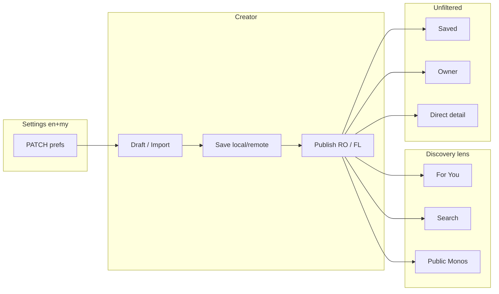

# M23A-7 — English Learning End-to-End QA + Release Readiness Audit

**Role:** Principal Architect + Release QA Lead  
**Mode:** Investigation and QA planning only — **no code, tests, or migrations changed**  
**Date:** 2026-06-03  
**Scope:** English Learning V1 release behind normal V1 settings (`learningLanguage` + `contentLocale` prefs)

---

## Executive summary

M23A phases **2 → 6D-3** implement English Learning across prefs, drafts, import, publish/readiness, furigana branching, creator UI, reader ruby suppression, catalog discovery (`en` preserved), Flutter lens refresh, search feed-alignment, and dual language badges on discovery/owner/saved surfaces.

**Code posture:** Feature-complete for V1 English Learning behind standard Settings (no separate English beta flag in codebase).

**Release posture:** **Ready — conditional on Section H manual device QA** against a backend build that includes **M23A-6A through M23A-6D-3**. Automated coverage is strong at unit/integration layers; **no full scripted E2E** ties prefs → publish → discovery → reader in one CI job.

**Top residual risks:** Japanese regression (furigana/publish), owner vs public collection count mismatch under mixed-language collections, legacy `null` locale rows, default Flutter builds without remote flags (`NIMON_USE_REMOTE_*` false).

---

## Section A — End-to-End User Journeys

### Primary journey: `learningLanguage=en`, `contentLocale=my`

| Step | Action | Expected | Automated coverage | Manual required |
|------|--------|----------|-------------------|-----------------|
| 1 | Settings → Learning **English**, Community **Myanmar** | PATCH succeeds; `en+my` stored | M23A-2 prefs tests (38 BE + 18 FL) | Verify UI labels on device |
| 2 | Create English draft manually | Basics carry `learningLanguage=en`; furigana UI hidden | M23A-3 draft defaults; M23A-5B creator UI | Tap through Add → Basics → Sentences |
| 3 | Import English JSON | Import accepted; EN HTML limits; community match | M23A-3 import tests; M23A-4 HTML rules | Real EN HTML generator export file |
| 4 | Save draft locally | Local storage retains `en` + `my` | `story_creator_draft_storage_language_test` | Offline save/reopen |
| 5 | Save draft remotely | `PUT` draft with language tags; pair validated | `story-drafts.language-metadata.spec` | Requires `NIMON_USE_REMOTE_DRAFTS=true` |
| 6 | Reopen draft | Tags round-trip | Draft language defaults tests | Device reopen |
| 7 | Publish Read Only | EN limits; no furigana gate | M23A-4 + M23A-5A publish tests | Device publish + snackbar |
| 8 | Publish Full Learn | EN full learn without furigana requirement | M23A-5A furigana conditional tests | Device publish |
| 9a | **Home For You** | `en+my` mono visible when viewer `en+my` | M23A-6A/6D-3 feed lens + DTO tests | Device scroll + badge `EN · MY` |
| 9b | **Following** | Same lens if following owner | M23A-6A following lens test | Follow creator + check |
| 9c | **Public Profile Monos** | Visible under viewer lens | M23A-6B refresh + 6D-3 badge test | Switch prefs; tab refresh |
| 9d | **Public Profile Collections** | Collection visible if ≥1 lens-visible mono | M23A-6A creator-collections spec | Count vs owner (known mismatch) |
| 9e | **Search** | Feed-aligned: `en+my` only | M23A-6D-1 (23 BE + 21 FL) | Search title; switch prefs |
| 9f | **Saved** | **All** bookmarks; dual badge | M23A-6D-2 saved mapping test | Bookmark + badge |
| 9g | **Owner Published** | **All** owner monos; dual badge | M23A-6D-2 owner row | Owner tab |
| 9h | **Owner Collections** | All monos in collection; dual badge on rows | M23A-6D-2 collection detail | Card still `MY` community badge |
| 9i | **Direct Detail** | Opens regardless of viewer lens | M23A-6C policy | Deep link / saved open |
| 10 | Reader | Plain text; **no ruby** | `published_mono_ruby_suppression_test` | Open EN mono reader |
| 11 | Listening transcript | Plain text; **no ruby** | Same test file (EN listening case) | Listening module screen |

### Journey diagram



---

## Section B — Pair Matrix QA

### Valid pairs

| Pair | Settings | Draft create | Import | Publish | Feed | Search | Public Monos | Badge | Reader |
|------|----------|--------------|--------|---------|------|--------|--------------|-------|--------|
| **ja+my** | ✓ tested | ✓ legacy default | ✓ JP rules | ✓ furigana required FL | ✓ lens | ✓ lens | ✓ lens | `JA · MY` | Ruby on |
| **ja+en** | ✓ tested | ✓ | ✓ | ✓ | ✓ guest default | ✓ | ✓ | `JA · EN` | Ruby on |
| **en+my** | ✓ M23A-2 | ✓ M23A-3 | ✓ EN limits | ✓ no furigana FL | ✓ M23A-6A | ✓ 6D-1 | ✓ | `EN · MY` | Plain |
| **en+ja** | ✓ M23A-2 | ✓ | ✓ | ✓ | ✓ | ✓ | ✓ | `EN · JA` | Plain |

### Invalid pairs

| Pair | Settings UI | PATCH API | Draft write | Import meta | Publish |
|------|-------------|-----------|-------------|-------------|---------|
| **ja+ja** | Blocked (`isSameLanguagePair`) | `400 language_pair_same_not_allowed` | Blocked via pair assert | Community mismatch / pair rules | N/A |
| **en+en** | Blocked (hide `en` community when learning `en`) | `400` | Blocked | Blocked | N/A |

**Gap:** No single matrix test file runs all four valid pairs through publish → feed in one integration suite. Coverage is **per-layer** (prefs, draft, publish, catalog, search).

---

## Section C — Surface QA Checklist

### Settings

| Check | Status (code) | Test ref |
|-------|---------------|----------|
| English selectable | ✓ M23A-2 | `me.profile.controller.spec`, `settings_screen_test` |
| Same-language pair blocked | ✓ | `language-pair-validation.spec`, `language_pair_test` |
| Community options update when learning `en` | ✓ | `settings_screen_test` |

### Creator

| Check | Status | Test ref |
|-------|--------|----------|
| EN: Vocabulary label (not Kanji) | ✓ M23A-5B | `m23a5b_english_creator_ui_test` |
| EN: Furigana / kanji / reading hidden | ✓ | same |
| JA: unchanged | ✓ | M23A-5B regression (30 tests) |

### Import

| Check | Status | Test ref |
|-------|--------|----------|
| English JSON accepted | ✓ M23A-3 | `nimon_import_*` suite |
| EN HTML limits enforced | ✓ M23A-4 | `nimon_import_html_rules_validator_test` |
| FuriganaSpans preserved, ignored at read | ✓ M23A-5B | ruby suppression tests |
| Invalid content community blocked | ✓ | `nimon_import_validator_test` |

### Publish

| Check | Status | Test ref |
|-------|--------|----------|
| EN → EN HTML limits | ✓ M23A-4 | `publish_html_rules_validation_*` (40 BE + 42 FL) |
| JA → JP HTML limits | ✓ | same |
| EN full learn: no furigana required | ✓ M23A-5A | `publish_furigana_learning_language_test` |
| JA full learn: furigana still required | ✓ | same |

### Discovery (post M23A-6)

| Surface | Lens / filter | Badge | Refresh on prefs |
|---------|---------------|-------|------------------|
| For You | Feed-aligned | `LanguagePairBadge` footer | ✓ M23A-6B |
| Following | Feed-aligned | Same | ✓ M23A-6B |
| Search | Feed-aligned (6D-1) | Dual (6D-2) | ✓ 6D-1 screen listen |
| Public Monos | Feed-aligned | Dual (6D-3) | ✓ M23A-6B public profile |
| Public Collections | Lens on counts/items | `CommunityBadge` on cards | ✓ M23A-6B |
| Saved | **Show all** | Dual (6D-2) | **No** prefs refresh |
| Owner Published | **Show all** | Dual (6D-2) | N/A |
| Owner Collection detail | **Show all** | Dual (6D-2) | N/A |
| Direct detail | **Allow** (no lens) | N/A | N/A |

### Badges

| Label | Surfaces | Test ref |
|-------|----------|----------|
| `EN · MY` | Search, Saved, Owner, Home, Following, Public Monos | `language_pair_badge_*`, row tests |
| `JA · EN` | Same | same |
| `JA · MY` | Same | same |
| `EN · JA` | Same | same |
| Legacy `—` / partial `— · MY` | Owner/Search rows | `language_pair_badge_labels_test` |
| Feed legacy both-null | **Hidden** on vertical cards | `mono_feed_footer_locale_chip_test` |

### Reader

| Check | Status | Test ref |
|-------|--------|----------|
| EN: ruby suppressed | ✓ | `published_mono_ruby_suppression_test` |
| JA: ruby visible | ✓ | same |
| Listening EN plain | ✓ | same (listening cases) |

---

## Section D — Backend Endpoint QA

| Endpoint | Auth | Uses catalog lens? | Returns `contentLocale`? | Returns `learningLanguage`? | Filter policy | Tests exist? | Gaps |
|----------|------|-------------------|--------------------------|----------------------------|---------------|--------------|------|
| `GET /v1/me/preferences` | JWT | N/A | ✓ | ✓ | N/A | ✓ `me.profile.controller.spec` | — |
| `PATCH /v1/me/preferences` | JWT | N/A | ✓ | ✓ | Pair validation | ✓ | — |
| `POST /v1/story-drafts` | JWT | N/A | ✓ body | ✓ body | Pair on write | ✓ `story-drafts.language-metadata` | — |
| `PUT /v1/story-drafts/:id` | JWT | N/A | ✓ | ✓ | Pair on write | ✓ | — |
| `POST …/publish/read-only` | JWT | N/A | stamps | stamps | Publish validation | ✓ `publish-validation.spec` | E2E publish→DB |
| `POST …/publish/full-learn` | JWT | N/A | stamps | stamps | + furigana branch | ✓ M23A-5A specs | E2E publish→DB |
| `GET /v1/mono/feed` | Optional JWT | **Yes** | ✓ summary DTO (6D-3) | ✓ summary DTO | Feed-aligned + null OR | ✓ 34 `mono-feed.service.spec` | Controller HTTP e2e |
| `GET /v1/mono/:id` | Optional JWT | **No** | ✓ detail | ✓ detail | Visible only | Partial detail tests | Lens absence explicit test |
| `GET /v1/search/monos` | Optional JWT | **Yes** (6D-1) | ✓ list item | ✓ list item | Feed-aligned + keywords | ✓ 23 `search.service.spec` | Controller HTTP e2e |
| `GET /v1/users/:id/creator-collections` | Optional JWT | **Yes** (public) | ✓ collection | N/A (collection-level) | Lens on visibility | ✓ `creator-collections.service.spec` (80 total w/ 6A) | — |
| `GET /v1/users/:id/creator-collections/:id/monos` | Optional JWT | **Yes** | ✓ list item | ✓ list item | Lens on items | ✓ | — |
| `GET /v1/published-monos` | JWT owner | **No** | ✓ | ✓ | Owner all visible | ✓ `published-mono-locale-fields` | — |
| `GET /v1/me/bookmarks` | JWT | **No** | ✓ | ✓ | All saved visible | ✓ `mono-social.service.spec` | — |
| `GET /v1/me/creator-collections` | JWT | **No** | ✓ | N/A | Owner counts unfiltered | ✓ | Public vs owner count parity |
| `GET /v1/me/creator-collections/:id/monos` | JWT | **No** | ✓ | ✓ | All in collection | ✓ | — |

**Guest defaults (catalog):** `contentLocale=en`, `learningLanguage=ja` (`ja+en` product notation).

---

## Section E — Flutter Route / Screen QA

| Screen / route | Language-aware? | Badge-aware? | Prefs refresh? | Tests? | Gaps |
|--------------|-----------------|--------------|----------------|--------|------|
| `/settings` | ✓ pair + EN option | N/A | N/A (source) | ✓ settings tests | — |
| Home `/mono` (For You) | ✓ lens query | ✓ footer chip | ✓ feed pager | Partial (repo/pager) | Full `mono_screen` widget |
| Following tab | ✓ | ✓ | ✓ | Partial | Full widget |
| `/create`, `/create/story/*` | ✓ EN/JA UI branch | N/A | Reads prefs on new draft | ✓ M23A-5B | Navigation E2E |
| Sentences / Vocab / Grammar / Quiz / Audio | ✓ EN gates | N/A | Per-draft | ✓ creator tests | — |
| `/mono-reader` | ✓ ruby branch | N/A | N/A | ✓ ruby suppression | Full reader widget |
| Listening | ✓ transcript ruby | N/A | N/A | ✓ in ruby test | Screen widget |
| Search | ✓ lens + refresh | ✓ dual badge | ✓ 6D-1 | ✓ 21 search tests | — |
| `/profile/public` Monos | ✓ lens | ✓ dual badge | ✓ M23A-6B | ✓ public profile test | Full screen widget |
| `/profile/public` Collections | ✓ lens | Community only | ✓ | Partial | — |
| Owner Published | Show all | ✓ dual | No | Partial | Widget with remote define |
| Saved tab | Show all | ✓ dual | **No** | ✓ bookmark locale | Prefs change behavior |
| Collection detail (owner/public) | Public lens / owner all | Dual on mono rows | Public: lens | Partial | — |

**Default build flags:** `NIMON_USE_REMOTE_DRAFTS=false`, `NIMON_USE_REMOTE_MONO_FEED=false` — many widget/integration paths **skipped** unless dart-defines set (documented in M14/M17 reports).

---

## Section F — Regression Risk Audit

| Risk | Severity | Notes | Mitigation |
|------|----------|-------|------------|
| Japanese furigana / full-learn publish regression | **Critical** | EN path must not weaken JA gates | M23A-5A regression suite; manual JA publish |
| English publish false pass (missing EN limit) | **Critical** | Wrong HTML table | M23A-4 M–P cases; import validator |
| English publish false fail (furigana still required) | **High** | Blocks EN FL | M23A-5A conditional furigana |
| Feed vs search mismatch | **High** | Was pre-6D-1 issue | **Fixed** 6D-1; verify manual step 7–8 in §H |
| Public profile vs owner visibility mismatch | **Medium** | By design (lens vs show-all) | QA script explains; badges orient user |
| Owner vs public **collection itemCount** mismatch | **Medium** | M23A-6.0 known | Document in support; optional future fix |
| Legacy `null` locale rows in lens feeds | **Medium** | OR-null inclusion | Spot-check legacy mono in feed/search |
| Local draft migration / `en` tag on old drafts | **Medium** | Defaults + safe parsers | Open old local draft after app update |
| Import JSON shape / `contentCommunity` wire | **Medium** | Multiple normalizers | Real generator file in manual QA |
| Wire name debt (`japaneseText` for EN body) | **Low** | Cosmetic / docs | No release blocker |
| UI copy debt (“Japanese” labels in shared strings) | **Low** | Partial 5B sweep | Optional polish |
| Remote flags off in production build | **High** if misconfigured | English path needs remote for real publish | Release checklist for dart-defines |
| Saved not refreshing on prefs change | **Low** | By design (show all) | None for V1 |

---

## Section G — Test Coverage Map

### Mapped automated coverage (from phase reports)

| Feature area | Backend tests (reported) | Flutter tests (reported) | Phase |
|--------------|-------------------------|--------------------------|-------|
| Prefs + pair | 38 (2 suites) | 18 | M23A-2 |
| Draft + import foundation | 14 | 38 | M23A-3 |
| Publish + HTML branching | 40 | 42 | M23A-4 |
| Conditional furigana | 27 | 34 | M23A-5A |
| Creator UI + reader ruby | — | 15 (+30 regression) | M23A-5B |
| Catalog `en` discovery | 80 | — | M23A-6A |
| Flutter lens + refresh | — | 31 | M23A-6B |
| Search feed lens | 23 | 21 | M23A-6D-1 |
| Dual badges (search/saved/owner) | — | 11 | M23A-6D-2 |
| Feed summary DTO + discovery badges | 34 | 20 | M23A-6D-3 |

**Approximate M23A-targeted totals:** ~**256 backend** + **~230 Flutter** unit/integration tests across phases (some overlap/regression bundles).

### Notable existing tests (outside phase reports)

- `published_mono_ruby_suppression_test.dart` — reader + listening EN/JA
- `nimon_import_*` — full import matrix
- `creator-collections.service.spec.ts` — public lens + locale
- `published-mono-catalog-locale.spec.ts` — resolver + `en` query

### Missing / weak coverage (gaps)

| Gap | Priority |
|-----|----------|
| Single HTTP e2e: prefs PATCH → publish → feed contains mono | High |
| Manual device matrix all four pairs × discovery surfaces | High (§H) |
| `mono_screen` widget test with `LanguagePairBadge` in footer | Medium |
| Search screen widget test (badge visible) | Medium |
| Saved tab: prefs change does **not** refetch (documented behavior test) | Low |
| Owner vs public collection count discrepancy | Low (product) |
| `GET /v1/mono/:id` explicit “no lens” contract test | Low |
| EN listening **screen** widget test (logic covered in parser test) | Low |
| Cross-locale following feed with real JWT + seed data | Medium |
| HTML generator tool authoring QA (not app code) | Medium (ops) |

---

## Section H — Manual QA Script (real device)

### Prerequisites

1. Backend running with M23A-6A–6D-3 deployed (Postgres seeded with at least one `en+my` and one `ja+my` published mono).
2. Flutter dev build with remote flags:

```powershell
cd nimon
flutter run `
  --dart-define=NIMON_API_BASE_URL=http://<LAN-IP>:3000 `
  --dart-define=NIMON_PUBLIC_WEB_BASE_URL=http://<LAN-IP>:3000 `
  --dart-define=NIMON_USE_REMOTE_DRAFTS=true `
  --dart-define=NIMON_USE_REMOTE_MONO_FEED=true
```

Android emulator host loopback: `http://10.0.2.2:3000`

Optional strict mode (surfaces API errors): `--dart-define=NIMON_STRICT_REMOTE_DRAFTS=true`

### Script

| # | Step | Pass criteria |
|---|------|----------------|
| 1 | **Login** | Authenticated session; prefs load |
| 2 | **Settings:** Learning **English**, Community **Myanmar** | Save succeeds; no same-pair error |
| 3 | **Create** new story OR **import** EN JSON (`en+my` meta) | Draft opens; no furigana UI on sentences |
| 4 | Add sentences + vocabulary; **save** (remote) | No error; reopen draft — tags still `en`/`my` |
| 5 | **Publish Read Only** then (separate draft) **Full Learn** | Success; no furigana block on EN FL |
| 6 | **Home For You** | Published `en+my` appears; footer shows **`EN · MY`** chip |
| 7 | **Search** same title | Result appears; row badge **`EN · MY`** |
| 8 | **Public profile** (own or test creator) Monos tab | Mono listed with dual badge |
| 9 | **Bookmark** the mono → **Saved** | Still visible after step 10; badge **`EN · MY`** |
| 10 | **Settings:** switch to Learning **Japanese**, Community **Myanmar** | Save succeeds |
| 11 | **Home + Search + Public Monos** | `en+my` mono **gone** from discovery surfaces |
| 12 | **Saved + Owner Published** | `en+my` mono **still visible** with badge |
| 13 | Open mono from **Saved** (direct detail) | Reader opens; **plain text, no ruby** |
| 14 | If Full Learn: open **Listening** | Transcript plain; no ruby |
| 15 | **Japanese control:** publish or open `ja+my` mono | Furigana visible in reader; JA publish FL still enforces furigana |
| 16 | Try invalid pair in Settings (`ja+ja` if UI allows) | Blocked before save |

**Record:** device OS, API URL, mono IDs, screenshots of badges on Home / Search / Saved.

---

## Section I — Release Decision

### Recommendation

```text
Ready — conditional on Section H manual QA sign-off
```

**Reasoning:**

- All planned M23A implementation phases for English Learning V1 are **shipped** in code (prefs through discovery badges).
- Catalog discovery correctly preserves `learningLanguage=en` (M23A-6A).
- Search is feed-aligned (M23A-6D-1); badges cover discovery + owner/saved (6D-2/6D-3).
- Publish/readiness/furigana branching has dedicated regression tests for JA and EN.
- **No separate English beta flag** is required — English is selectable in normal Settings alongside Japanese.

**Conditions before production / store:**

1. Complete **Section H** on at least one physical device against staging/LAN API.
2. Confirm release build uses **`NIMON_USE_REMOTE_DRAFTS=true`** and **`NIMON_USE_REMOTE_MONO_FEED=true`** (or product-equivalent flavor) for creator/discovery features.
3. Backend deployment includes **M23A-6A + 6D-1** (catalog `en` + search lens).

**Not blockers for internal / staged release:**

- Optional direct-detail banner
- Global search toggle
- Owner/public collection count alignment
- Wire-field rename / copy polish

**Would upgrade to unconditional `Ready` after:** one signed-off manual run of §H + smoke JA regression (step 15).

**Would downgrade to `Not ready` if:** manual QA finds feed/search mismatch, EN publish blocked by furigana, or ruby shown on EN reader.

---

## Section J — Remaining Optional Work

| Item | Notes |
|------|-------|
| Direct-detail outside-feed banner | Informational when mono outside current lens (M23A-6C) |
| Global “All languages” search toggle | Post V1 discovery lock |
| Saved filter chips by language | Show all + badge is V1 |
| Owner filter chips | Show all + badge is V1 |
| Wire field rename (`japaneseText` → neutral) | Tech debt |
| HTML generator authoring QA | Ops: EN/JP prompt parity with app limits |
| UI copy polish | “Japanese” in shared module strings |
| Owner vs public collection count parity | Mixed-language collections |
| Saved prefs refresh | Intentionally omitted V1 |
| Consolidated E2E CI job | prefs → publish → feed HTTP |

---

## Success criteria checklist

- [x] All English Learning end-to-end paths mapped (Section A)
- [x] All valid language pairs covered (Section B)
- [x] All discovery surfaces covered (Section C)
- [x] All listed backend endpoints classified (Section D)
- [x] All listed Flutter screens classified (Section E)
- [x] Test coverage gaps identified (Section G)
- [x] Manual QA script provided (Section H)
- [x] Release recommendation explicit (Section I)
- [x] No code changed
- [x] No tests added
- [x] No migrations created

---

## References

| Doc | Topic |
|-----|-------|
| M23A-0 | Expansion audit |
| M23A-1 | Implementation plan |
| M23A-2 | Prefs + pair |
| M23A-3 | Draft + import |
| M23A-4 | Publish + HTML branching |
| M23A-5A | Conditional furigana |
| M23A-5B | Creator UI + reader ruby |
| M23A-6A | Backend catalog English |
| M23A-6B | Flutter discovery refresh |
| M23A-6C | Discovery policy lock |
| M23A-6D-1/2/3 | Search lens + badges |
